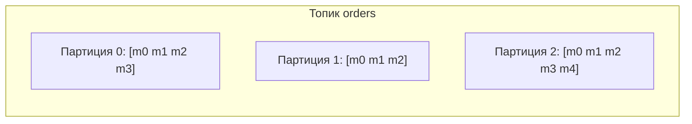

# Устройство

Чтобы уверенно говорить про Kafka, нужно понимать её базовые единицы: топик,
партиция, offset, брокер и как это даёт масштаб и порядок.

## Основные понятия

- **Топик** — именованный поток событий («orders»). Аналог «канала».
- **Партиция** — топик разбит на партиции; именно партиция — единица
  параллелизма и хранения. Сообщение попадает в одну из партиций.
- **Offset** — порядковый номер сообщения **внутри партиции**. Консьюмер
  запоминает, до какого offset он дочитал.
- **Брокер** — сервер Kafka. Кластер из нескольких брокеров хранит партиции.
- **Продюсер / консьюмер** — кто пишет / кто читает.

## Партиции = масштаб и порядок

- **Масштаб**: партиции распределены по брокерам и читаются параллельно разными
  консьюмерами — так растёт пропускная способность.
- **Порядок**: гарантируется **только внутри партиции**. Между партициями
  порядка нет. Поэтому события, которым важен порядок (по одному счёту),
  направляют в одну партицию — через **ключ**.

## Ключ сообщения

У сообщения есть опциональный **ключ**. Kafka по хэшу ключа выбирает партицию,
поэтому все события с одним ключом попадают в **одну** партицию и
обрабатываются по порядку. Нет ключа — распределяется равномерно (round-robin).
Пример ключа: `accountId` — все операции по счёту идут по порядку.

## Репликация и надёжность

- Каждая партиция реплицируется на несколько брокеров (**replication factor**).
- Одна реплика — **лидер** (через неё идут запись/чтение), остальные —
  фолловеры, догоняющие лидера.
- **ISR (in-sync replicas)** — реплики, успевающие за лидером. Если лидер
  падает, новым становится одна из ISR — данные не теряются.
- Координацию кластера ведёт ZooKeeper или встроенный **KRaft** (в новых
  версиях).

## Retention

Сообщения хранятся заданное время или до предела по размеру (**retention**), а
не до прочтения. Пока не истёк срок — их можно перечитать, сбросив offset.

## Как ответить на интервью

Коротко: топик — это поток событий, разбитый на партиции; партиция — единица
параллелизма и хранения, а offset — позиция сообщения в партиции. Партиции
распределены по брокерам кластера и читаются параллельно — отсюда масштаб.
Порядок гарантируется только внутри партиции, поэтому связанные события шлют в
одну партицию через ключ (например `accountId`). Надёжность — за счёт
репликации партиций: у каждой есть лидер и фолловеры (ISR), и при падении
лидера его заменяет синхронная реплика. Сообщения хранятся по retention, а не
до прочтения.
