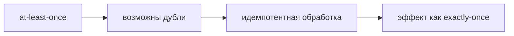

# Гарантии доставки

Один из самых частых вопросов про Kafka: какие бывают гарантии доставки и как
получить «ровно один раз». Важно понимать, что гарантия — это свойство **всей
цепочки** (продюсер → брокер → консьюмер), а не одной настройки.

## Три уровня

- **At-most-once (не более одного раза)** — сообщение либо доставлено, либо
  потеряно, но дублей нет. Получается, если коммитить offset **до** обработки
  или слать с `acks=0`. Подходит, где потеря терпима, а дубли — нет.
- **At-least-once (хотя бы один раз)** — сообщение точно не потеряется, но
  может обработаться повторно. Самый частый режим: `acks=all` + коммит
  **после** обработки. Требует **идемпотентной** обработки.
- **Exactly-once (ровно один раз)** — ни потерь, ни дублей. Дороже и сложнее.

## Как достигают exactly-once

- **На записи в Kafka** — идемпотентный продюсер (отбрасывает дубли) +
  транзакции продюсера (атомарная запись в несколько партиций).
- **В сценарии «read-process-write»** (читаю из топика → обрабатываю → пишу в
  топик) — Kafka-транзакции связывают чтение (коммит offset) и запись в одну
  транзакцию: либо всё, либо ничего.
- **Но** когда обработка = запись во **внешнюю** систему (БД, вызов API),
  сквозного exactly-once «из коробки» нет — там всё равно нужна
  **идемпотентность** на стороне потребителя.

## Практический вывод

Чаще всего на проде живут с **at-least-once + идемпотентная обработка** — это
проще и надёжнее, чем гоняться за настоящим exactly-once. Идемпотентность
делают через ключ операции: запомнить обработанные id (в БД/Redis), повтор —
пропустить.

## Как ответить на интервью

Коротко: три гарантии — at-most-once (можно потерять, без дублей: коммит до
обработки), at-least-once (не потеряем, но возможны дубли: `acks=all` + коммит
после обработки) и exactly-once (ни потерь, ни дублей). Exactly-once внутри
Kafka достигается идемпотентным продюсером и транзакциями в сценарии
read-process-write, но при записи во внешнюю БД сквозного exactly-once нет.
Поэтому на практике берут at-least-once и делают обработку идемпотентной —
запоминают обработанные id и пропускают повторы, получая эффект «ровно один
раз».
