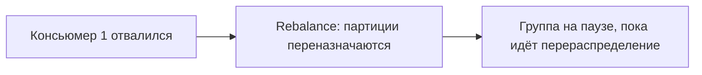

# Проблемы и ограничения

Kafka мощная, но не «серебряная пуля». На интервью полезно показать, что понимаешь не
только плюсы, но и **типичные проблемы** при работе с ней и её **ограничения** — это
признак реального понимания.

## Типичные проблемы

### Дубликаты сообщений

По умолчанию Kafka даёт гарантию **at-least-once** — «хотя бы один раз». Значит,
сообщение может прийти консьюмеру **повторно** (например, консьюмер обработал, но не
успел зафиксировать offset и перезапустился). Поэтому обработчик обязан быть
**идемпотентным** — уметь распознать повтор и не выполнить действие дважды. См.
[гарантии доставки](delivery-guarantees.md).

### Rebalance (перебалансировка) группы

Консьюмеры одной группы делят партиции между собой. Когда консьюмер добавляется или
отваливается, происходит **rebalance** — партиции перераспределяются. На это время
обработка в группе **приостанавливается** («stop-the-world»). Частые rebalance
(из-за долгих обработок, коротких таймаутов) заметно бьют по пропускной способности.



### Consumer lag (отставание консьюмера)

Если консьюмер читает медленнее, чем продюсер пишет, он **отстаёт** — растёт разрыв
между последним записанным offset и прочитанным. Сообщения копятся, свежие данные
обрабатываются с задержкой. **Lag** — ключевая метрика здоровья: за ней следят и по
ней алертят.

### «Ядовитое» сообщение (poison message)

Если одно сообщение стабильно **падает** при обработке, консьюмер может застрять на
нём и повторять бесконечно, блокируя партицию. Лечится отправкой таких сообщений в
**dead letter queue** (отдельный топик для «неберущихся») и ограничением числа
попыток.

### Горячая партиция (hot partition)

Если ключ выбран неудачно и большинство сообщений идёт с одним ключом — они попадают
в **одну** партицию. Она перегружена, остальные простаивают, параллелизм теряется.
Важно выбирать ключ так, чтобы нагрузка распределялась равномерно.

### Нарушение порядка при нескольких партициях

Порядок гарантируется **только внутри партиции**. Если связанные события ушли в разные
партиции (не задали общий ключ), они могут обработаться **не по порядку**.

## Ограничения

- **Порядок — только в пределах партиции.** Глобального порядка по всему топику нет.
- **Консьюмеров в группе не больше, чем партиций.** Партиция читается **одним**
  консьюмером группы. Если консьюмеров больше, чем партиций — лишние **простаивают**.
  Уровень параллелизма ограничен числом партиций.

```mermaid
flowchart LR
    subgraph Топик "3 партиции"
        PA["Партиция 0"]
        PB["Партиция 1"]
        PC["Партиция 2"]
    end
    PA --> K1["Консьюмер 1"]
    PB --> K2["Консьюмер 2"]
    PC --> K3["Консьюмер 3"]
    K4["Консьюмер 4 — простаивает, партиций не хватило"]
```

- **Число партиций легко увеличить, но не уменьшить.** И увеличение ломает
  привязку «ключ → партиция» (старые ключи начнут попадать в другие партиции) —
  планировать нужно заранее.
- **Размер сообщения ограничен** (по умолчанию ~1 МБ). Kafka не для передачи больших
  файлов — для них кладут файл в хранилище (S3), а в Kafka шлют ссылку.
- **Не для запрос-ответ.** Kafka — про односторонний поток событий. Синхронный
  «спросил — сразу получил ответ» — это про REST/gRPC, а не про Kafka.
- **Эксплуатация сложнее**, чем у простой очереди: кластер, партиции, реплики,
  мониторинг lag, настройка retention.

## Что запомнить

- Проблемы: **дубликаты** (at-least-once → нужна идемпотентность), **rebalance** (пауза
  при изменении группы), **lag** (консьюмер отстаёт), **poison message** (застревание
  на битом сообщении → DLQ), **горячая партиция** (плохой ключ), нарушение порядка
  между партициями.
- Ограничения: порядок только в партиции; консьюмеров в группе ≤ числа партиций;
  партиции нельзя уменьшить; лимит размера сообщения; не для request-response.
