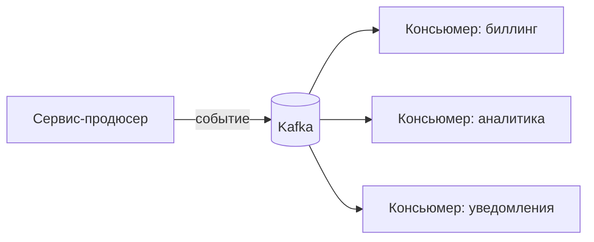

# Что такое Kafka и зачем

Kafka — распределённый **брокер сообщений** и лог событий. Сервисы пишут в неё
события, другие сервисы их читают — асинхронно, не завися друг от друга во
времени. Это основа событийной архитектуры и развязки сервисов.

## Проблема, которую решает

При прямых синхронных вызовах сервис A зовёт B по HTTP и **ждёт** ответа. Если
B упал или тормозит — падает и A; добавить нового потребителя события =
дописать вызов в A. Это жёсткая связанность.

Kafka разрывает эту связь: A просто **публикует событие** («заказ создан»), не
зная, кто его прочитает. Потребители читают в своём темпе; можно добавить
новых, не трогая A.

## Ключевые свойства

- **Асинхронность и развязка** — продюсер и консьюмер не знают друг о друге и
  не должны быть онлайн одновременно.
- **Персистентность** — сообщения пишутся на диск и хранятся заданное время
  (retention); их можно перечитать.
- **Высокая пропускная способность** — рассчитана на большие потоки событий.
- **Масштабируемость** — партиции и группы консьюмеров дают горизонтальное
  масштабирование.
- **Порядок** — гарантируется в пределах партиции.

## Очередь vs лог

Классическая очередь (RabbitMQ) обычно **удаляет** сообщение после обработки.
Kafka — это **лог**: сообщение остаётся до истечения retention, а каждый
консьюмер держит свою позицию (offset). Поэтому одно событие могут независимо
прочитать много разных консьюмеров, и можно перечитать историю.

## Где применяют

- Интеграция сервисов через события, event-driven архитектура.
- Потоковая обработка, сбор метрик/логов, аналитика.
- Паттерны надёжности: transactional outbox, event sourcing.

## Как ответить на интервью

Коротко: Kafka — распределённый брокер и лог событий для асинхронной связи
сервисов. Она разрывает жёсткую связанность синхронных вызовов: продюсер
публикует событие, не зная о потребителях, а те читают в своём темпе, и новых
можно добавлять, не трогая продюсера. В отличие от классической очереди Kafka
не удаляет сообщение после чтения — это лог с retention, где каждый консьюмер
держит свой offset, поэтому событие могут читать многие и историю можно
перечитать. Главное — развязка, персистентность, высокая пропускная способность
и порядок в пределах партиции.
