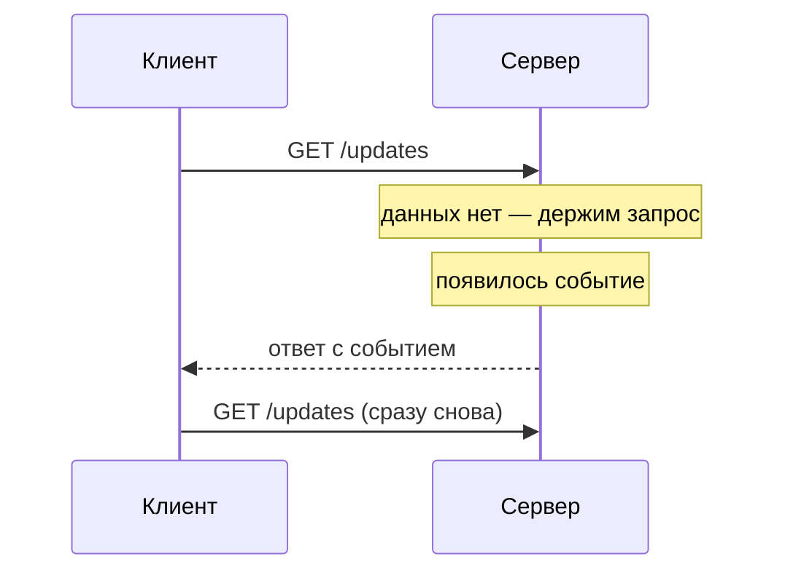

# Как устроен long polling

Long polling (долгий опрос) — приём, которым **эмулируют пуш от сервера поверх
обычного HTTP**. Клиент шлёт запрос, а сервер **не отвечает сразу** — держит
его открытым, пока не появятся данные или не выйдет таймаут.

## Обычный polling vs long polling

- **Обычный polling** — клиент дёргает сервер каждые N секунд: «есть новое?».
  Много пустых запросов, задержка до N секунд.
- **Long polling** — клиент спрашивает и **ждёт**: сервер отвечает сразу,
  когда появилось событие; клиент, получив ответ, тут же шлёт следующий запрос.

## Цикл

1. Клиент шлёт запрос.
2. Есть данные — сервер отвечает сразу; нет — **держит** соединение.
3. Появились данные (или таймаут) — сервер отвечает.
4. Клиент, получив ответ, немедленно шлёт новый запрос — и так по кругу.

## Плюсы и минусы

- **Плюс** — работает везде, где есть обычный HTTP; не нужен WebSocket/SSE,
  проходит через любые прокси.
- **Минус** — накладные расходы: каждый цикл — новый HTTP-запрос со всеми
  заголовками; сервер держит много «висящих» запросов (заняты потоки/ресурсы).
- Задержка меньше, чем у обычного polling, но модель менее эффективна, чем
  SSE/WebSocket.

## Когда актуально

- Как **fallback**, когда SSE/WebSocket недоступны (ограничения окружения).
- Раньше — основа comet/старых чатов до распространения WebSocket и SSE.
  Сейчас для «сервер→клиент» обычно предпочитают SSE.

## Как ответить на интервью

Коротко: long polling — эмуляция пуша поверх обычного HTTP. Клиент шлёт запрос,
сервер не отвечает сразу, а держит его открытым, пока не появятся данные или не
истечёт таймаут; получив ответ, клиент тут же шлёт следующий. Это уменьшает
задержку и пустые опросы по сравнению с обычным polling, но остаётся дороже
SSE/WebSocket — каждый цикл это новый запрос, и сервер держит много висящих
соединений. Сегодня это в основном fallback, когда SSE/WebSocket недоступны.
