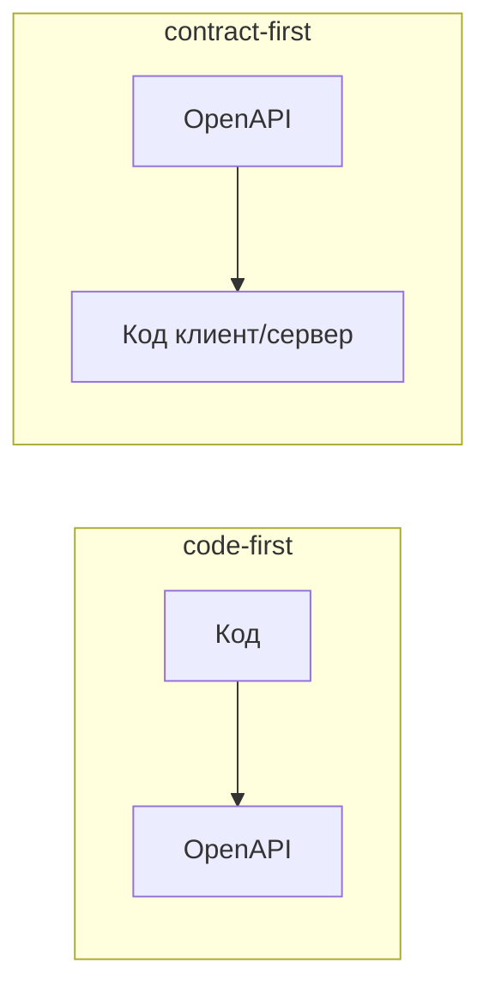

# Code-first и contract-first

Есть два подхода к тому, что появляется раньше — код или спецификация API.
Понимать разницу полезно: от неё зависит, как команды договариваются об API.

## Code-first

Сначала пишут **код** (контроллеры, DTO), а спецификация OpenAPI
**генерируется** из него (в Spring — springdoc-openapi).

- **Плюс**: быстро, ничего лишнего, спецификация всегда соответствует коду.
- **Минус**: контракт — следствие кода, а не наоборот; сложнее согласовать API
  заранее с другими командами, легче внести ломающее изменение незаметно.
- Хорош для небольших/внутренних сервисов, где API ведёт одна команда.

## Contract-first

Сначала пишут **спецификацию** (OpenAPI YAML) — это и есть согласованный
контракт, — а из неё **генерируют** серверные заготовки и клиентов.

- **Плюс**: API проектируется и согласуется до кода; фронт и бэкенд работают
  параллельно от общего контракта; контракт — осознанный артефакт, ломающие
  изменения видны.
- **Минус**: дольше на старте, нужна дисциплина держать спецификацию как
  источник правды.
- Хорош, когда API — публичный или его потребляют несколько команд.

## Что выбрать

- Внутренний сервис одной команды, скорость важнее — **code-first**.
- Публичное API или несколько команд-потребителей, важна стабильность
  контракта — **contract-first**.

## Как ответить на интервью

Коротко: разница в том, что первично. Code-first — сначала код, спецификация
генерится из него (в Spring через springdoc): быстро и всегда синхронно с
кодом, но контракт вторичен и ломающее изменение легко пропустить; хорош для
внутренних сервисов. Contract-first — сначала пишут OpenAPI-спецификацию как
согласованный контракт, а из неё генерируют заготовки: дольше, но API
проектируется заранее, команды работают параллельно и контракт стабильнее;
хорош для публичных API и нескольких потребителей.
