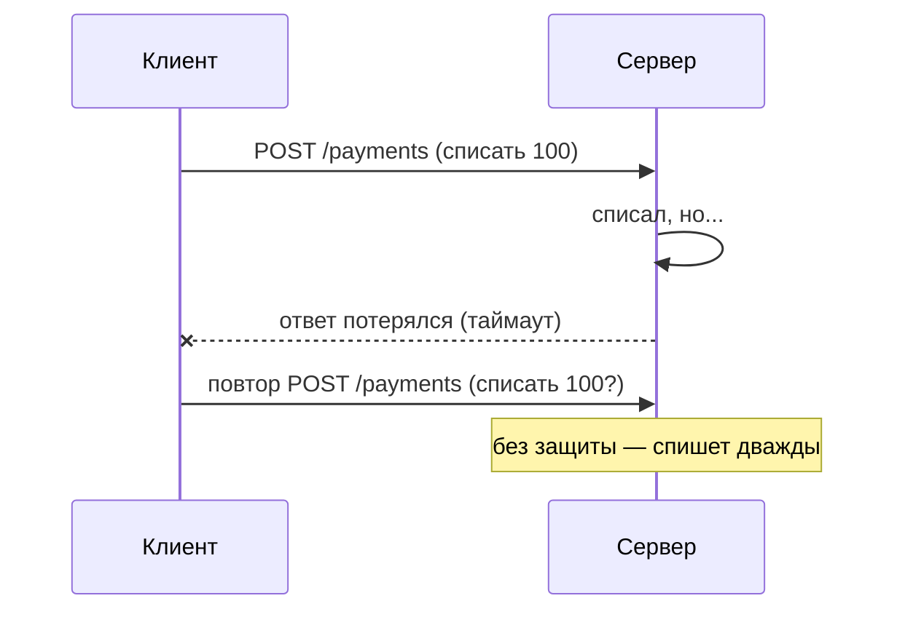

# Идемпотентность и надёжность

В распределённом мире запрос может **потеряться, зависнуть или прийти дважды**
(клиент повторил по таймауту, ретрай на балансировщике). Надёжное API строят
так, чтобы повтор не ломал данные — на этом стоит идемпотентность.

## Что такое идемпотентность

Операция **идемпотентна**, если повтор даёт тот же итог, что и один вызов.

- `GET`, `PUT`, `DELETE` — идемпотентны по природе (заменить/удалить дважды —
  результат тот же).
- `POST` — **не** идемпотентен: два `POST /orders` создадут два заказа.

## Проблема повторов

## Ключ идемпотентности

Классическое решение для небезопасных операций (платежи, создание):

1. Клиент генерирует уникальный **`Idempotency-Key`** и шлёт в заголовке.
2. Сервер запоминает ключ и результат первой обработки.
3. Повтор с тем же ключом → сервер возвращает **сохранённый результат**, не
   выполняя операцию заново.

Ключ хранят в БД/Redis с TTL; проверку и запись делают атомарно (уникальный
индекс/транзакция), иначе гонка двух повторов всё равно продублирует.

## Ретраи и таймауты

- Ретраить безопасно только идемпотентные операции; для остальных — ключ
  идемпотентности.
- **Экспоненциальный backoff + jitter** — чтобы ретраи не легли волной на
  сервис.
- Таймауты обязательны: зависший запрос не должен держать ресурсы вечно.

## Как ответить на интервью

Коротко: в сети запрос может потеряться или прийти дважды, поэтому API делают
устойчивым к повторам. Идемпотентная операция при повторе даёт тот же
результат — `GET`/`PUT`/`DELETE` такие по природе, а `POST` нет. Для опасных
операций вроде платежей клиент шлёт `Idempotency-Key`, сервер запоминает
результат по ключу и на повтор отдаёт сохранённый ответ, не выполняя действие
снова (ключ — в БД/Redis, проверка атомарная). Ретраи — только с backoff и
джиттером, и только там, где это безопасно.
