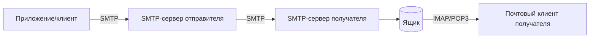

# Как работает почта

SMTP (Simple Mail Transfer Protocol) — протокол **отправки** почты. Он
доставляет письмо от отправителя к почтовому серверу получателя. Забирают
письма из ящика уже другими протоколами — **IMAP/POP3**.

## Кто за что отвечает

- **SMTP** — отправка и пересылка письма между серверами (**push**).
- **IMAP** — чтение писем с сервера, письма остаются на сервере
  (синхронизация между устройствами).
- **POP3** — скачивание писем на устройство (обычно с удалением с сервера),
  старый подход.

Приложению для рассылки писем нужен **SMTP** — оно выступает клиентом
SMTP-сервера.

## Путь письма

Сервер получателя определяется по **MX-записи** в DNS домена адресата.

## Аутентификация и шифрование

- Отправка идёт через **аутентификацию** на SMTP-сервере (логин/пароль или
  токен) — иначе сервер станет открытым релеем для спама.
- Шифрование — **STARTTLS** (апгрейд обычного соединения до TLS) или
  сразу TLS-порт. Типичные порты: 587 (submission + STARTTLS), 465 (TLS),
  25 (между серверами).

## Доставляемость (deliverability)

Чтобы письма не попадали в спам, домену настраивают:

- **SPF** — какие серверы вправе слать почту от имени домена.
- **DKIM** — криптоподпись писем, подтверждающая отправителя.
- **DMARC** — политика, что делать с письмами, не прошедшими SPF/DKIM.

Это уровень инфраструктуры/домена, но backend-разработчику полезно знать, что
«письмо не доходит» часто про них, а не про код.

## Как ответить на интервью

Коротко: SMTP — протокол отправки почты; он доставляет письмо от отправителя к
серверу получателя, а сервер получателя находится по MX-записи в DNS. Читают
почту уже другими протоколами — IMAP (письма остаются на сервере) или POP3
(скачиваются). Приложению для рассылки нужен SMTP: аутентификация обязательна,
чтобы не быть открытым релеем, соединение шифруется через STARTTLS/TLS. За то,
попадают ли письма в спам, отвечают SPF, DKIM и DMARC на уровне домена.
