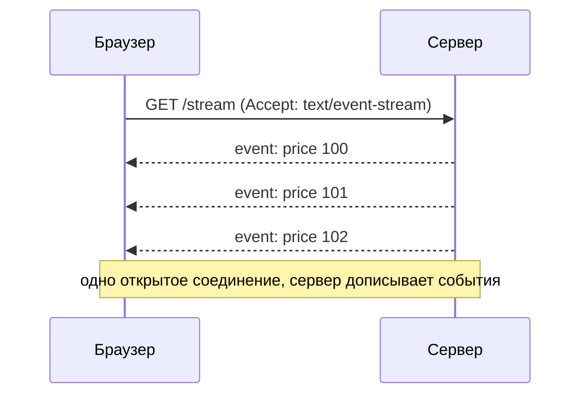

# Что такое SSE

SSE (Server-Sent Events) — способ, которым сервер **непрерывно шлёт события
клиенту по одному HTTP-соединению**, в одну сторону. Это простой ответ на
задачу «сервер должен пушить обновления», когда двусторонний канал не нужен.

## Идея

Клиент открывает обычный `GET`-запрос, а сервер **не закрывает** ответ и по
мере событий дописывает в тело новые строки. Браузер разбирает их как поток
событий.

## Как устроено

- Ответ имеет `Content-Type: text/event-stream` и не завершается.
- Формат события — текстовые строки: `data: ...`, опционально `event:` (тип),
  `id:` (идентификатор), `retry:` (интервал переподключения).
- Это **обычный HTTP** — работает через прокси, кэши, HTTP/2 без особых
  плясок.

## Что даёт из коробки (в браузере)

Браузерный `EventSource`:

- **Автопереподключение** при обрыве — сам восстанавливает поток.
- **`Last-Event-ID`** — при переподключении шлёт id последнего события, сервер
  может **дослать пропущенное**.
- Простой API — по сути подписка на события.

## Ограничения

- **Только одна сторона** (сервер → клиент). Обратно клиент шлёт обычными
  HTTP-запросами.
- Только **текст** (бинарь — через кодирование).
- В HTTP/1.1 браузер ограничивает число одновременных соединений на домен
  (обход — HTTP/2 с мультиплексированием).

!!! note "Честно про опыт"
    В проде не использовал — пробовал на пет-проекте. Говорю про модель:
    односторонний поток поверх обычного HTTP с авто-reconnect.

## Как ответить на интервью

Коротко: SSE — это односторонний поток событий от сервера к клиенту по одному
открытому HTTP-соединению. Клиент делает обычный `GET`, сервер не закрывает
ответ и дописывает события в формате `text/event-stream`. Главный плюс — это
чистый HTTP плюс браузерный `EventSource`, который сам переподключается и через
`Last-Event-ID` позволяет дослать пропущенное. Ограничения: только
сервер→клиент и только текст. Когда нужен именно пуш обновлений (уведомления,
котировки, прогресс) без обратного канала — SSE проще WebSocket.
