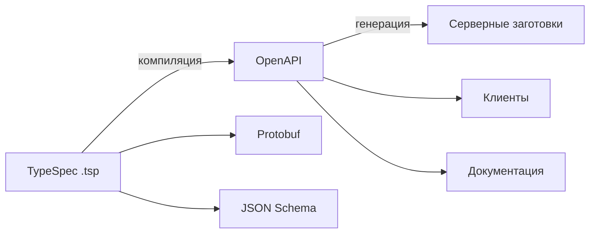

# Генерация и процесс работы

Ценность TypeSpec — в процессе: из одного компактного описания получают
контракты и код для разных сторон. Полезно представлять этот конвейер, даже без
глубокого практического опыта.

## Конвейер

1. Пишешь описание в `.tsp` — модели и операции.
2. Компилятор TypeSpec выдаёт целевые контракты (чаще всего **OpenAPI**).
3. Из OpenAPI обычными генераторами создают клиентов, серверные заготовки,
   документацию.

## Почему это contract-first

Описание TypeSpec — это **контракт**, написанный до/вместо ручного YAML. Оно
единый источник правды: меняешь `.tsp` — перегенерируются спецификация и
зависимые артефакты. Это тот же contract-first, но с более приятным входным
языком.

## Что это даёт команде

- **Единое описание** для нескольких протоколов (REST + gRPC из одного места).
- **Меньше рассинхрона** — клиент, сервер и документация растут из одного
  источника.
- **Переиспользование** моделей и общих кусков между сервисами.

## Границы

- Технология **новая и нишевая** — встречается не везде, экосистема меньше, чем
  у «голого» OpenAPI.
- Добавляет шаг сборки (компиляция `.tsp`), нужен генератор в пайплайне.

!!! note "Честно про опыт"
    Практически в проде не применял. Понимаю конвейер (TypeSpec → OpenAPI →
    код) и идею единого источника контракта; тонкости внедрения в CI глубоко не
    разбирал.

## Как ответить на интервью

Коротко: процесс такой — пишешь описание в `.tsp`, компилятор TypeSpec выдаёт
OpenAPI (а также Protobuf/JSON Schema), а из OpenAPI обычными генераторами
делают клиентов, серверные заготовки и документацию. Это contract-first с
удобным языком вместо ручного YAML: `.tsp` — единый источник правды, из
которого всё перегенерируется, и одно описание может покрыть сразу REST и gRPC.
Минусы — новизна, меньшая экосистема и дополнительный шаг сборки.
