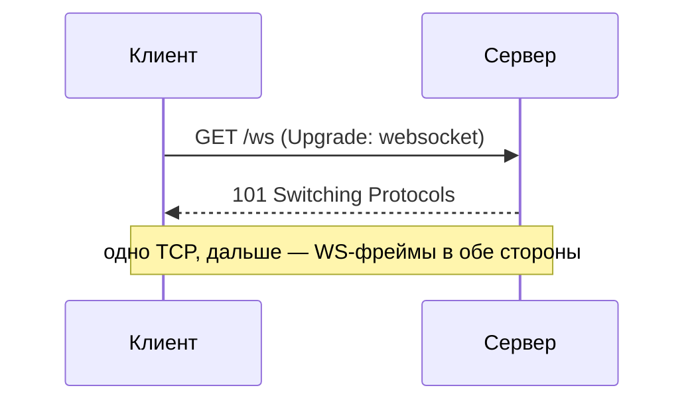

# Установка соединения

WebSocket-соединение начинается как обычный HTTP-запрос и затем **апгрейдится**
до WebSocket. Понимание этого шага объясняет, почему WebSocket работает через
те же порты и прокси, что и HTTP.

## Handshake через Upgrade

1. Клиент шлёт HTTP-запрос `GET` с заголовками:
   - `Upgrade: websocket`
   - `Connection: Upgrade`
   - `Sec-WebSocket-Key: <случайный ключ>`
2. Сервер, если поддерживает, отвечает **`101 Switching Protocols`** и
   подтверждает ключ в `Sec-WebSocket-Accept`.
3. С этого момента по тому же TCP-соединению идёт уже WebSocket-протокол
   (фреймы), а не HTTP.

## Почему через HTTP

- Использует стандартные порты **80/443** — проходит через файрволы и прокси,
  не требует отдельного порта.
- По TLS (`wss://`) — тот же механизм, что HTTPS; трафик шифруется.
- На старте можно проверить `Origin`, куки, токен — то есть провести
  аутентификацию средствами HTTP до апгрейда.

## Фреймы и жизнь соединения

- После handshake сообщения — это **фреймы** (текст/бинарь) с указанием
  границ; не нужно слать HTTP-заголовки на каждое сообщение.
- **Ping/pong** фреймы — проверка живости и удержание соединения (heartbeat).
- **Close** фрейм — корректное закрытие с кодом причины.

## Аутентификация — нюанс

Браузерный WebSocket API не даёт задавать произвольные заголовки, поэтому
`Authorization: Bearer` при открытии из браузера обычно не поставить. Токен
передают куками (соединение шлёт их) или как параметр при подключении/первым
сообщением после открытия.

## Как ответить на интервью

Коротко: WebSocket открывается обычным HTTP-запросом с `Upgrade: websocket`;
сервер отвечает `101 Switching Protocols`, и то же TCP-соединение
переключается на WebSocket-фреймы. Поэтому используются порты 80/443, работает
через прокси, а по `wss://` шифруется как HTTPS. До апгрейда можно
аутентифицировать через куки/Origin. Дальше — обмен фреймами, ping/pong для
удержания и close для закрытия. Тонкость: из браузера нельзя задать
`Authorization`, поэтому токен шлют куками или первым сообщением.
