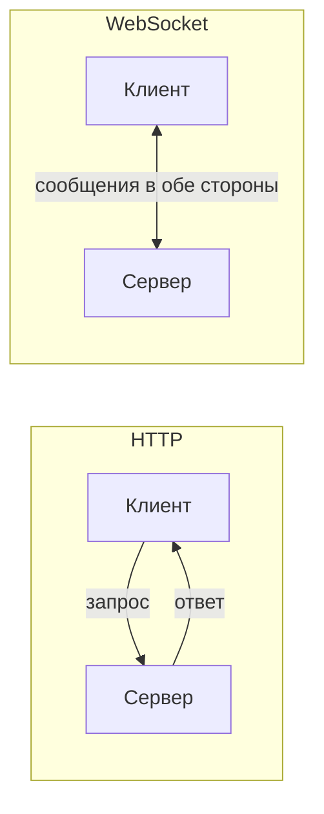

# Что такое WebSocket

WebSocket — протокол **полнодуплексной** связи поверх одного TCP-соединения:
после установки и клиент, и сервер могут слать сообщения в любой момент, не
дожидаясь запроса. Это решает главное ограничение HTTP — там инициатор всегда
клиент.

## Зачем, если есть HTTP

HTTP — «запрос → ответ»: сервер не может сам, по своей инициативе, что-то
прислать. Для «живых» вещей (чат, котировки, уведомления, онлайн-игры) это
неудобно — приходится постоянно опрашивать сервер. WebSocket даёт постоянный
двусторонний канал.

## Ключевые свойства

- **Полный дуплекс** — обе стороны шлют сообщения независимо.
- **Постоянное соединение** — одно TCP держится открытым (не переустанавливаем
  на каждое сообщение).
- **Низкие накладные расходы** — после handshake сообщения идут короткими
  фреймами, без HTTP-заголовков на каждое.
- **Сообщения**, а не поток байт — фреймы с границами, текст или бинарь.

## Начинается как HTTP

Соединение открывается обычным HTTP-запросом с `Upgrade: websocket`, а потом
«переключается» на WebSocket по тому же TCP-порту (обычно 80/443). Поэтому оно
дружелюбно к прокси и файрволам. URL-схема — `ws://` или `wss://` (по TLS).

## Когда использовать

- Чат, живые уведомления, совместное редактирование, трейдинг-котировки.
- **Не нужен** для обычных CRUD-запросов — там дороже и сложнее, чем REST.
- Если данные идут **только от сервера к клиенту** — часто хватает более
  простого SSE.

!!! note "Честно про опыт"
    В проде не поднимал — разбирал и делал на пет-проекте. Говорю про модель:
    дуплекс, постоянное соединение, handshake через Upgrade.

## Как ответить на интервью

Коротко: WebSocket — полнодуплексный канал поверх одного TCP, где сервер может
слать данные сам, не дожидаясь запроса. Это снимает ограничение HTTP, где
инициатор всегда клиент. Соединение открывается обычным HTTP-запросом с
`Upgrade: websocket` и дальше переключается на WebSocket по тому же порту,
поэтому проходит через прокси. Берут его для «живого» — чата, уведомлений,
котировок; для обычных запросов достаточно REST, а если поток нужен только от
сервера — проще SSE.
