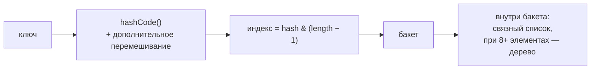

# Map

`Map` хранит пары ключ→значение с уникальными ключами. Это самая используемая
структура данных после списка — и самая спрашиваемая на интервью: «расскажи,
как устроен HashMap» звучит почти на каждом собеседовании.

## Как устроен HashMap

Внутри — массив **бакетов**. Позиция ключа вычисляется из его хеша:



Пошагово при `put(key, value)`:

1. Берётся `key.hashCode()`, старшие биты подмешиваются к младшим
   (защита от плохих хеш-функций).
2. Индекс бакета — остаток от размера массива (побитовое `and`, потому что
   размер всегда степень двойки).
3. Если бакет пуст — узел кладётся туда. Если нет — это **коллизия**: по цепочке
   узлов идёт поиск ключа через `equals`; нашли — значение заменяется,
   не нашли — узел добавляется в цепочку.

При хорошем распределении хешей в бакете 0–1 элемент, и `get`/`put`/`remove`
работают за **O(1)**.

### Load factor и resize

Массив бакетов не резиновый. Когда заполненность превышает **load factor**
(по умолчанию 0.75 — заполнено ¾ ёмкости), массив удваивается, и все элементы
**перераспределяются** по новым бакетам. Это дорогая операция, поэтому при
известном размере ёмкость задают заранее: `new HashMap<>(expectedSize * 4 / 3)`
или просто `HashMap.newHashMap(expectedSize)` (Java 19+).

### Деревья в бакетах

С Java 8: если в одном бакете скапливается **8+** элементов, цепочка
перестраивается в красно-чёрное дерево — поиск в переполненном бакете
деградирует не до O(n), а до O(log n). Это защита от плохих хешей и от
атак с намеренными коллизиями (например, подобранными строковыми ключами
в параметрах HTTP-запроса).

### Мелочи, о которых спрашивают

- Один `null`-ключ разрешён (лежит в нулевом бакете); `null`-значений — сколько
  угодно. Но `get(...) == null` не отличает «нет ключа» от «значение null» —
  для проверки есть `containsKey`.
- Требования к ключам: согласованные `equals`/`hashCode` и **неизменность** —
  изменение поля ключа, участвующего в хеше, «теряет» запись.
- Порядок обхода HashMap не гарантирован и меняется при resize — код,
  зависящий от него, сломается.

## LinkedHashMap: порядок и LRU

`HashMap` + сквозной двусвязный список поверх всех узлов. Даёт тот же O(1),
но с **предсказуемым порядком обхода** — по умолчанию порядок вставки.

Особый режим `accessOrder = true` перемещает элемент в конец при каждом
обращении — получается готовая основа **LRU-кэша**: переопределяем
`removeEldestEntry`, и старые записи вытесняются автоматически. Об этом любят
спрашивать как о связке «структуры данных → практика кэширования».

## TreeMap: всегда отсортирован

Внутри — красно-чёрное дерево (самобалансирующееся двоичное дерево поиска).
Ключи хранятся **отсортированными** — по `Comparable` ключа или переданному
`Comparator`. Всё за **O(log n)**.

Зачем терпеть O(log n) вместо O(1): TreeMap умеет то, что HashMap не умеет
в принципе, — диапазонные и «ближайшие» запросы:

```java
treeMap.firstKey();  treeMap.lastKey();      // минимум и максимум
treeMap.floorKey(42);                         // ближайший ключ <= 42
treeMap.headMap(100); treeMap.subMap(10, 50); // срезы диапазонов
```

Важно: TreeMap сравнивает ключи **только** через `compareTo`/`Comparator`,
`equals` и `hashCode` ключей не использует вообще.

## Сравнение

| | HashMap | LinkedHashMap | TreeMap |
|---|---|---|---|
| `get`/`put` | O(1) | O(1) | O(log n) |
| Порядок обхода | нет | вставки (или доступа) | по сортировке ключей |
| `null`-ключ | да | да | нет (не сравнить) |
| Особое | стандартный выбор | LRU-кэш | диапазонные запросы |

## Полезные методы (Java 8+)

Заменяют шаблонные «проверил — положил»:

```java
map.getOrDefault(key, 0);                       // значение или дефолт
map.putIfAbsent(key, value);                    // положить, если не было
map.computeIfAbsent(userId, id -> new ArrayList<>()).add(order); // мультимапа
map.merge(word, 1, Integer::sum);               // подсчёт частот одной строкой
map.forEach((k, v) -> ...);
```

`computeIfAbsent` и `merge` — самые практичные: группировки и счётчики без
единого `if`.

## Как ответить на интервью

Коротко: HashMap — массив бакетов; ключ → перемешанный `hashCode` → индекс
бакета → внутри бакета поиск по `equals`; коллизии — цепочкой, с Java 8 при
8+ элементах — красно-чёрным деревом. При заполнении на 75% массив удваивается
с перераспределением. Отсюда требования к ключам: корректная пара
`equals`/`hashCode` и неизменность. LinkedHashMap добавляет порядок вставки
и режим LRU; TreeMap держит ключи отсортированными в красно-чёрном дереве —
O(log n), но умеет диапазонные запросы и сравнивает только через
`compareTo`, а не `equals`.
