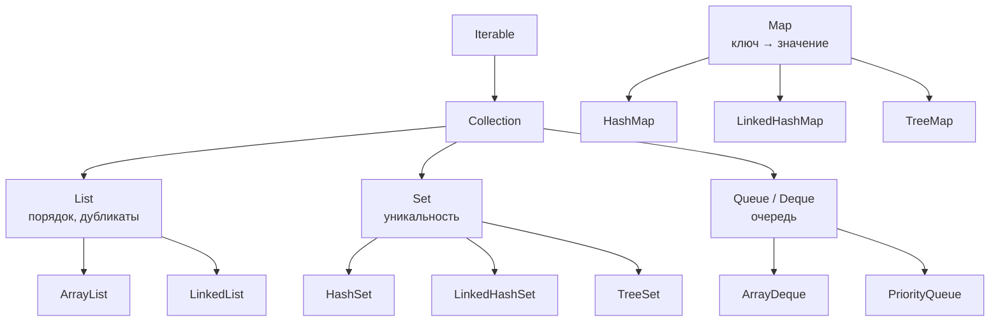

# Обзор коллекций

Коллекции — структуры данных для хранения групп объектов. Java Collections
Framework устроен по принципу «интерфейс отдельно, реализация отдельно»:
код пишется против интерфейса (`List`, `Set`, `Map`), а конкретная реализация
выбирается по требованиям к скорости операций и порядку элементов.

## Иерархия

Три семейства внутри `Collection`:

- **`List`** — упорядоченная последовательность с доступом по индексу,
  дубликаты разрешены.
- **`Set`** — множество уникальных элементов.
- **`Queue`/`Deque`** — очередь: элементы добавляются и забираются с концов.
  `ArrayDeque` — стандартный выбор и для очереди, и для стека
  (класс `Stack` устарел).

## Почему Map — не Collection

Частый вопрос-проверка. `Map` **не наследует** `Collection`: коллекция хранит
отдельные элементы, а `Map` — **пары** ключ→значение, и её контракт
(`get(key)`, `put(key, value)`) не ложится на контракт `Collection`
(`add(element)`, `iterator()`). Иерархии связаны через представления:
`map.keySet()` — это `Set`, `map.values()` — `Collection`,
`map.entrySet()` — `Set<Map.Entry<K, V>>`.

## Как выбирать реализацию

Выбор почти всегда сводится к двум вопросам: **какие операции частые**
и **нужен ли порядок**.

| Реализация | Внутри | Сильные стороны | Порядок |
|---|---|---|---|
| `ArrayList` | массив | доступ по индексу O(1), дешёвое добавление в конец | порядок вставки |
| `LinkedList` | двусвязный список | вставка/удаление по итератору | порядок вставки |
| `HashSet` / `HashMap` | хеш-таблица | `contains`/`get` за O(1) | нет |
| `LinkedHashSet` / `LinkedHashMap` | хеш-таблица + связный список | O(1) + предсказуемый порядок | порядок вставки |
| `TreeSet` / `TreeMap` | красно-чёрное дерево | всегда отсортировано, диапазонные запросы | по компаратору |
| `ArrayDeque` | циклический массив | очередь/стек, O(1) с обоих концов | FIFO/LIFO |
| `PriorityQueue` | двоичная куча | извлечение минимума за O(log n) | по приоритету |

Дефолты на практике: список — `ArrayList`, множество — `HashSet`,
словарь — `HashMap`. Остальное берут, когда есть конкретная причина:
нужен порядок — `Linked*`, нужна сортировка — `Tree*`.

## Что требуют коллекции от элементов

Это сквозная тема, из-за которой коллекции ломаются чаще всего:

- **Хеш-коллекции** (`HashMap`, `HashSet`) полагаются на согласованные
  `equals` и `hashCode` элементов — и на их **неизменность**, пока элемент
  лежит внутри.
- **Сортированные** (`TreeMap`, `TreeSet`) вместо `equals` используют
  `compareTo`/`Comparator` — элементы обязаны быть сравнимыми, а сравнение —
  согласованным с `equals`, иначе поведение становится странным
  (подробнее — в теме про сравнение и сортировку).

## Полезные мелочи API

- `List.of` / `Set.of` / `Map.of` — неизменяемые коллекции; `List.copyOf` —
  неизменяемая копия.
- `Collections.emptyList()` или `List.of()` — возвращать вместо `null`.
- `isEmpty()` вместо `size() == 0`, `containsKey` вместо `get(...) != null`.
- Конструкторы-копии есть у всех реализаций: `new ArrayList<>(set)` —
  стандартный способ конвертации между типами коллекций.
- Обобщённые методы принимают самый широкий интерфейс:
  параметр метода — `List<T>` или даже `Collection<T>`, а не `ArrayList<T>`.

## Как ответить на интервью

Коротко: три семейства — `List` (порядок и дубликаты), `Set` (уникальность),
`Queue` (очередь); `Map` — отдельная иерархия пар ключ→значение, с `Collection`
связана только представлениями `keySet`/`values`/`entrySet`. Выбор реализации —
по частым операциям и потребности в порядке: по умолчанию `ArrayList`,
`HashSet`, `HashMap`; `Linked*` — когда важен порядок вставки, `Tree*` — когда
нужна сортировка. Хеш-коллекциям нужны корректные `equals`/`hashCode`,
сортированным — согласованное с `equals` сравнение.
