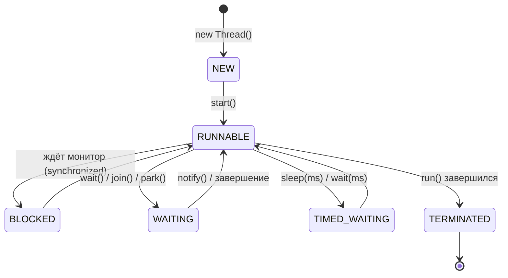

# Основы многопоточности

Поток (thread) — независимая линия выполнения кода внутри процесса. Все потоки
процесса делят одну память (кучу), но у каждого — собственный стек вызовов.
Общая память — это и сила (потоки дёшево обмениваются данными), и источник
всех проблем многопоточности (за общие данные приходится бороться).

Зачем это бэкенду: сервер и есть многопоточная программа. Классическая модель
Tomcat — **поток на запрос**: каждый HTTP-запрос обрабатывается своим потоком
из пула, и весь код сервиса по определению выполняется параллельно множеством
потоков. Писать бэкенд — значит писать многопоточный код, даже не создавая
потоков руками.

## Создание потока

```java
// Runnable — задача; Thread — механизм её выполнения
Runnable task = () -> System.out.println("работаю в " + Thread.currentThread().getName());

Thread t = new Thread(task);
t.start();   // JVM создаёт системный поток, и он выполняет run()
```

Разделение важно концептуально: `Runnable` — **что** делать, `Thread` — **кто**
делает. Наследоваться от `Thread` и переопределять `run()` — устаревший стиль:
он склеивает задачу с исполнителем и съедает единственное наследование.

!!! warning "start() против run()"
    Классика собеседований: `t.run()` — это обычный вызов метода
    **в текущем потоке**, никакой параллельности. Новый поток запускает
    только `t.start()`. Повторный `start()` того же потока —
    `IllegalThreadStateException`: поток одноразовый.

На практике потоки руками почти не создают — задачи отправляют в пулы
(`ExecutorService`), об этом отдельная тема. Но механика ниже — фундамент,
на котором пулы работают.

## Жизненный цикл потока



`RUNNABLE` означает «готов выполняться» — реально ли поток сейчас на ядре
процессора, решает планировщик ОС. Различие `BLOCKED` (ждёт чужой монитор)
и `WAITING` (ждёт события) полезно при чтении thread dump: по состояниям
потоков видно, кто на чём завис.

## Базовые операции

```java
Thread.sleep(1000);      // усыпить ТЕКУЩИЙ поток; процессор не занимает
t.join();                // подождать, пока поток t завершится
Thread.currentThread();  // ссылка на свой поток (имя — бесценно в логах)
t.setDaemon(true);       // демон: JVM не ждёт его при завершении
```

Демоны — фоновые потоки (метрики, обслуживание): JVM завершается, когда
закончились все **обычные** потоки, демонов она бросает на полпути. Поэтому
критичную работу (запись данных) в демонах не делают.

## Прерывание: interrupt

В Java нельзя безопасно «убить» поток снаружи (`stop()` давно запрещён —
он бросал поток посреди операции с испорченными данными). Вместо этого —
**кооперативная** модель: потоку выставляют флаг прерывания, а он сам решает,
когда аккуратно завершиться.

```java
t.interrupt();                    // просьба завершиться: ставит флаг

// внутри потока — два способа заметить просьбу:
while (!Thread.currentThread().isInterrupted()) {   // 1. проверять флаг
    doChunkOfWork();
}

try {
    Thread.sleep(5000);           // 2. блокирующие методы (sleep, wait, join)
} catch (InterruptedException e) {// сами просыпаются с InterruptedException
    Thread.currentThread().interrupt(); // восстановить флаг!
    return;                       // и завершиться
}
```

!!! warning "InterruptedException нельзя глотать"
    Пустой `catch (InterruptedException e) {}` — частый и вредный шаблон:
    просьба о завершении потеряна (исключение **сбрасывает** флаг), и поток
    продолжает работать, игнорируя shutdown. Правильно: либо пробросить
    исключение дальше, либо восстановить флаг `interrupt()` и выйти.
    На этом держится корректная остановка пулов и graceful shutdown приложения.

## Цена потока

Платформенный поток — обёртка над потоком ОС, и он дорог:

- **Память**: каждому потоку резервируется стек (по умолчанию ~1 МБ) —
  10 000 потоков означают гигабайты только на стеки.
- **Переключение контекста**: когда потоков больше, чем ядер, ОС постоянно
  переключает их, и на это уходит ощутимое время.
- **Создание** тоже недёшево — системный вызов.

Отсюда два практических следствия: потоки **переиспользуют** через пулы,
а их количество ограничивают. И отсюда же мотивация виртуальных потоков
Java 21 — «дешёвых» потоков, которых можно создавать миллионами
(разбираются в теме про пулы и асинхронность).

## Как ответить на интервью

Коротко: поток — независимая линия выполнения с собственным стеком и общей
кучей; бэкенд многопоточен по своей природе — поток на запрос. Задача
(`Runnable`) отделена от исполнителя (`Thread`); запускает поток `start()`,
а `run()` — обычный вызов. Остановка — только кооперативная, через
`interrupt()` и корректную обработку `InterruptedException` (не глотать,
восстанавливать флаг). Потоки дороги (стек ~1 МБ, переключения контекста),
поэтому их переиспользуют в пулах.
