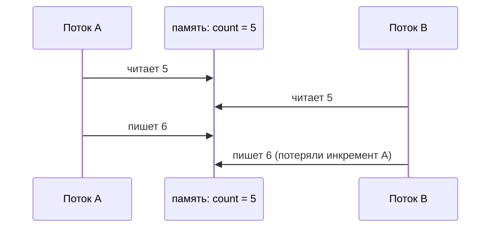

# Проблемы многопоточности

Все проблемы многопоточности растут из одного корня: **несколько потоков
и общее изменяемое состояние**. Уберите любое из двух — и проблем нет.
Эта тема — про то, что именно ломается: гонки, видимость и взаимные блокировки.

## Состояние гонки (race condition)

Гонка — когда результат зависит от того, в каком порядке потокам повезёт
выполниться. Канонический пример — общий счётчик:

```java
class Counter {
    private int count = 0;
    void increment() { count++; }  // выглядит как одна операция...
}
```

`count++` — это **три** операции: прочитать значение, прибавить единицу,
записать обратно. Между ними другой поток может успеть сделать то же самое:



Оба потока прочитали 5 и оба записали 6 — один инкремент пропал. Поэтому два
потока по 1000 инкрементов дают «примерно 1400–2000», причём каждый запуск —
по-разному. Это худшее свойство гонок: они **невоспроизводимы**, тесты
проходят, а в проде под нагрузкой данные тихо портятся.

Обобщение: не потокобезопасна любая операция вида **«проверил — сделал»**
(check-then-act) или **«прочитал — изменил — записал»** (read-modify-write),
если между шагами может вклиниться другой поток:

```java
if (!map.containsKey(key)) {   // между проверкой...
    map.put(key, value);       // ...и записью успевает второй поток
}
```

Лечение — сделать составную операцию **атомарной**: `synchronized`, атомики
(`AtomicInteger.incrementAndGet()`), атомарные методы коллекций
(`putIfAbsent`, `compute`) — инструменты следующих тем.

## Видимость (visibility)

Вторая проблема тоньше: поток может **не увидеть** изменение, сделанное другим
потоком. Вообще:

```java
class Worker {
    private boolean stopped = false;   // нет volatile

    void run() { while (!stopped) doWork(); }
    void stop() { stopped = true; }    // другой поток может крутиться вечно
}
```

Причина — оптимизации, на которых стоит вся производительность железа и JIT:
значение может кэшироваться в регистре или кэше ядра процессора, а JIT вправе
вынести проверку `!stopped` за пределы цикла, раз «в этом потоке поле никто
не меняет». Без явной синхронизации JVM **не обязана** доставлять изменения
другим потокам — и когда доставит, неизвестно.

### Happens-before

Java Memory Model формализует это отношением **happens-before**: запись видна
чтению только тогда, когда между ними есть установленное отношение порядка.
Практически важные источники happens-before:

- запись в `volatile`-поле → последующее чтение этого поля;
- выход из `synchronized`-блока → вход в блок по **тому же** монитору;
- `start()` потока → всё внутри потока; всё внутри потока → возврат из `join()`;
- отправка задачи в `ExecutorService` → её выполнение.

Ключевой вывод: синхронизация решает **обе** проблемы сразу — и атомарность,
и видимость. А `volatile` — только видимость: `volatile int count` не сделает
`count++` атомарным, гонка останется.

## Deadlock: взаимная блокировка

Два потока навсегда ждут друг друга:

```java
// Поток 1: lock(A) -> ждёт B
// Поток 2: lock(B) -> ждёт A
synchronized (accountA) {
    synchronized (accountB) { transfer(...); }   // поток 1
}
synchronized (accountB) {
    synchronized (accountA) { transfer(...); }   // поток 2 — deadlock
}
```

Классический сценарий — перевод денег между счетами: каждый поток захватил
«свой» счёт и ждёт чужой. Приложение не падает — оно **зависает**: запросы
копятся, пул потоков исчерпывается.

Как избегать:

- **Единый порядок захвата** — главный приём: блокировки всегда берутся
  в одном и том же порядке (например, счёт с меньшим id — первым). Цикл
  ожидания становится невозможным.
- Не вызывать чужой код (колбэки, слушатели) под блокировкой.
- `tryLock` с таймаутом вместо вечного ожидания — поток сдаётся и повторяет.
- Диагностика: thread dump (`jstack`) — JVM сама находит и печатает
  «Found one Java-level deadlock» с указанием потоков и мониторов.

## Livelock и starvation

Упоминаются реже, но знать стоит:

- **Livelock** — потоки не заблокированы, но бесконечно «уступают» друг другу
  и не продвигаются (оба отпускают блокировки и повторяют одновременно).
- **Starvation** — потоку систематически не достаётся ресурса: например,
  «нечестная» блокировка всегда достаётся более активным соседям.

## Как ответить на интервью

Коротко: все проблемы — от общего изменяемого состояния. Гонка: составные
операции (`count++`, «проверил — сделал») не атомарны, потоки перемешиваются,
результат невоспроизводимо портится. Видимость: без синхронизации изменение
из одного потока может никогда не дойти до другого — из-за кэшей и оптимизаций
JIT; порядок гарантирует только happens-before (volatile, synchronized,
start/join). Synchronized даёт и атомарность, и видимость; volatile — только
видимость. Deadlock — циклическое ожидание блокировок; лечится единым порядком
их захвата, диагностируется по thread dump.
