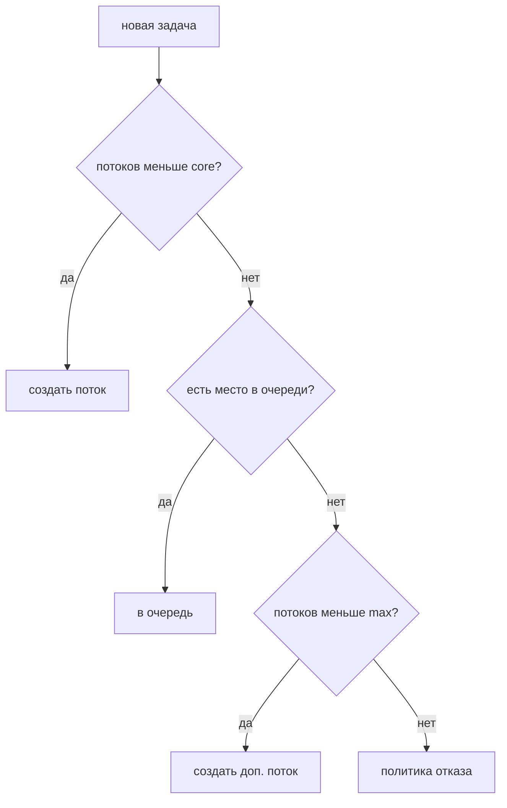

# Пулы потоков и асинхронность

Создавать поток на каждую задачу дорого и опасно (наплыв задач — тысячи
потоков — исчерпание памяти). Пул решает обе проблемы: фиксированный набор
потоков-рабочих разбирает задачи из очереди, потоки переиспользуются,
а параллелизм ограничен сверху.

## ExecutorService

Интерфейс «исполнителя задач» — отделяет *что выполнить* от *как и кем*:

```java
ExecutorService pool = Executors.newFixedThreadPool(8);

pool.execute(() -> process(order));            // fire-and-forget
Future<Report> future = pool.submit(() -> buildReport()); // с результатом
Report report = future.get();                  // блокируется до готовности

pool.shutdown();                               // новые не берём, текущие дорабатываем
pool.awaitTermination(30, TimeUnit.SECONDS);
```

Фабрики `Executors`:

- `newFixedThreadPool(n)` — n потоков, безграничная очередь;
- `newCachedThreadPool()` — потоки под каждую задачу, простаивающие умирают
  через 60 с; опасен при наплыве — количество потоков не ограничено;
- `newSingleThreadExecutor()` — один поток: задачи строго по очереди;
- `newScheduledThreadPool(n)` — отложенные и периодические задачи.

## Как устроен ThreadPoolExecutor

Все фабрики создают `ThreadPoolExecutor`, и его параметры — то, что реально
настраивают в проде: `corePoolSize`, `maximumPoolSize`, очередь, политика
отказа. Логика приёма задачи:



Неочевидное следствие: с **безграничной** очередью (как у fixed-пула) пул
никогда не дорастёт до `maximumPoolSize` — задачи просто копятся в очереди.
Поэтому в проде очередь ограничивают и выбирают **политику отказа**:
`AbortPolicy` (исключение), `CallerRunsPolicy` (задачу выполняет сам
отправитель — естественное торможение потока входящих задач), отбрасывание.

Размер пула зависит от характера задач: для CPU-задач — около числа ядер
(больше нет смысла), для IO-задач (запросы к БД, HTTP) — заметно больше,
потому что потоки в основном ждут. И отдельное правило: **разные типы работы —
разные пулы**, иначе медленные задачи одного типа съедят потоки и остановят
все остальные (это bulkhead-паттерн, он ещё встретится в распределённых системах).

## CompletableFuture

`Future.get()` блокирует — асинхронность на нём заканчивается быстро.
`CompletableFuture` позволяет строить **цепочки продолжений**: «когда
результат будет готов — сделай следующее», без блокировки ожидающего потока.

```java
CompletableFuture<User> userF = CompletableFuture.supplyAsync(() -> loadUser(id), pool);

userF.thenApply(User::getEmail)                    // преобразовать результат
     .thenCompose(email -> sendAsync(email))       // следующий асинхронный шаг
     .exceptionally(ex -> { log.error("...", ex); return null; });

// параллельные вызовы двух сервисов и объединение
var combined = priceF.thenCombine(stockF, (price, stock) -> new Offer(price, stock));
allOf(f1, f2, f3).join();                          // дождаться всех
```

Смысловая параллель со стримами: `thenApply` — как `map`, `thenCompose` — как
`flatMap` (следующий шаг сам асинхронный), `exceptionally`/`handle` — обработка
ошибок цепочки. Типовое применение в бэкенде — **параллельные вызовы
независимых внешних сервисов** с объединением результатов: два вызова по 200 мс
дают 200 мс вместо 400.

Нюанс: методы без суффикса `Async` выполняют продолжение «где придётся»
(часто в потоке, завершившем предыдущий шаг), с суффиксом — в указанном пуле.
Дефолтный пул — общий `ForkJoinPool.commonPool()`, и **блокирующие операции
в нём — плохая идея**: он маленький (по числу ядер) и общий на всю JVM.
Для IO — передавать свой пул.

## Виртуальные потоки (Java 21)

Проблема, которую они решают: в модели «поток на запрос» поток почти всё время
**ждёт** (БД, другие сервисы), но занимает ~1 МБ стека и место в пуле.
Масштаб упирается не в CPU, а в количество платформенных потоков.

Виртуальный поток — лёгкий поток, управляемый JVM, а не ОС. Тысячи виртуальных
потоков выполняются на нескольких платформенных потоках-носителях: когда
виртуальный поток блокируется на IO, JVM **отцепляет** его от носителя,
и носитель выполняет другие виртуальные потоки.

```java
Thread.startVirtualThread(() -> handle(request));
var executor = Executors.newVirtualThreadPerTaskExecutor(); // пул не нужен —
// по виртуальному потоку на задачу, их можно миллионы
```

Следствия:

- Обычный **блокирующий** код (JDBC, RestClient) масштабируется как
  асинхронный — без переписывания на реактивщину и колбэки. Это главная
  ценность: простой императивный стиль + масштаб.
- В Spring Boot включается флагом `spring.threads.virtual.enabled=true` —
  Tomcat обрабатывает каждый запрос в виртуальном потоке.
- Не про скорость CPU-задач: вычисления быстрее не станут, выигрыш — только
  на ожидании IO.
- Известное ограничение: `synchronized`-блок с блокирующим вызовом внутри
  «пришпиливал» (pinning) виртуальный поток к носителю; в новых версиях JDK
  это исправляют, но рекомендация «в горячих местах — ReentrantLock вместо
  synchronized» пока актуальна.

## Как ответить на интервью

Коротко: пул переиспользует потоки и ограничивает параллелизм; внутри
`ThreadPoolExecutor` — core/max потоки, очередь и политика отказа, причём
с безграничной очередью max недостижим. CPU-задачам — потоков по числу ядер,
IO-задачам — больше; разной работе — разные пулы. `CompletableFuture` — цепочки
продолжений без блокировки: `thenApply`/`thenCompose`/`thenCombine`, типовой
кейс — параллельные вызовы внешних сервисов. Виртуальные потоки — дешёвые
потоки JVM: блокирующий код масштабируется без реактивщины; выигрыш на IO,
не на CPU.
