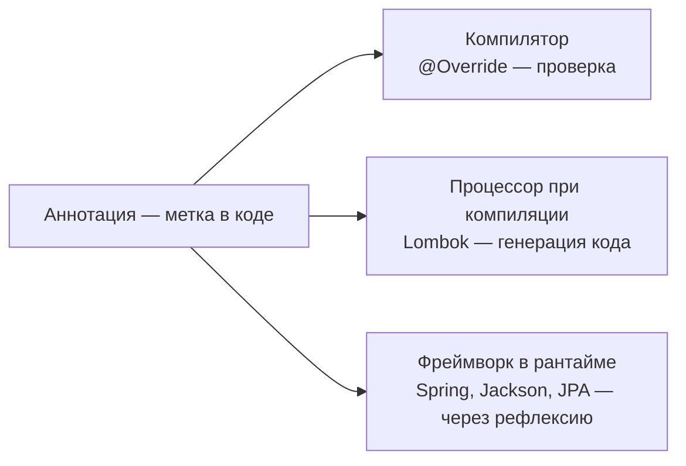

# Аннотации и рефлексия

Эти две темы — фундамент, на котором стоят Spring, Hibernate, Jackson и почти
любой Java-фреймворк. Понимание «как `@Autowired` вообще работает» начинается
здесь.

## Аннотации — это метки, а не магия

Аннотация — метаданные, прикреплённые к классу, методу, полю или параметру.
Ключевая мысль: **сама по себе аннотация не делает ничего**. `@Transactional`
не открывает транзакцию — это просто метка. Работает всегда тот, кто эту метку
**читает**: компилятор, процессор аннотаций или фреймворк в рантайме.



Стандартные аннотации JDK:

- `@Override` — просьба компилятору проверить, что метод переопределяет.
- `@Deprecated` — предупреждение об устаревшем API.
- `@FunctionalInterface` — проверка, что у интерфейса ровно один абстрактный метод.
- `@SuppressWarnings` — подавить конкретное предупреждение компилятора.

## Своя аннотация

```java
@Retention(RetentionPolicy.RUNTIME) // доживает до рантайма — видна рефлексии
@Target(ElementType.METHOD)         // можно ставить только на методы
public @interface Audited {
    String action();                // элемент аннотации: @Audited(action = "...")
}
```

Аннотации описываются **мета-аннотациями**:

- **`@Retention`** — докуда доживает: `SOURCE` (только исходники — `@Override`),
  `CLASS` (в байткоде, но не в рантайме) или `RUNTIME` (видна рефлексии —
  все аннотации Spring именно такие).
- **`@Target`** — куда можно ставить: `TYPE`, `METHOD`, `FIELD`, `PARAMETER`…

Сама по себе `@Audited` — по-прежнему просто метка. Чтобы она заработала, нужен
код, который найдёт помеченные методы и что-то сделает, — и делается это
рефлексией.

## Рефлексия

Рефлексия — API для исследования и использования классов **в рантайме**:
узнать поля и методы, прочитать аннотации, создать объект, вызвать метод,
записать значение в поле — всё по именам-строкам, без знания типов при компиляции.

Точка входа — объект `Class<?>`:

```java
Class<?> clazz = obj.getClass();          // по объекту
Class<?> clazz2 = Order.class;            // по типу
Class<?> clazz3 = Class.forName("com.example.Order"); // по имени-строке

for (Method m : clazz.getDeclaredMethods()) {
    if (m.isAnnotationPresent(Audited.class)) {
        String action = m.getAnnotation(Audited.class).action();
        // нашли помеченный метод — можно вызвать: m.invoke(obj, args)
    }
}

Field f = clazz.getDeclaredField("name");
f.setAccessible(true);                    // доступ даже к private
f.set(obj, "новое значение");
```

`setAccessible(true)` — то самое место, где рефлексия ломает инкапсуляцию:
`private` перестаёт быть преградой. Именно так фреймворки внедряют значения
в приватные поля без сеттеров.

## Как это использует Spring (и не только)

Связка «аннотация + рефлексия» — это и есть механизм фреймворков:

- **Spring** при старте сканирует classpath, находит классы с `@Component`/
  `@Service`, создаёт их экземпляры и внедряет зависимости в поля и конструкторы,
  помеченные `@Autowired`, — всё рефлексией.
- **Jackson** смотрит на поля/геттеры класса (и аннотации вроде
  `@JsonProperty`), чтобы превратить объект в JSON и обратно.
- **Hibernate/JPA** читает `@Entity`, `@Column`, `@Id` и по ним строит
  маппинг на таблицы; значения из БД записывает прямо в поля сущности.
- **JUnit** находит методы с `@Test` и вызывает их.

Отсюда же — известные требования фреймворков: JPA нужен конструктор без
аргументов (Hibernate создаёт объект рефлексией, а поля заполняет после),
а прокси Spring не работают с `final`-методами.

## Цена и границы

- **Медленнее** прямых вызовов: проверки доступа, поиск методов по имени.
  Для фреймворка, который делает это один раз при старте и кэширует, — неважно;
  в горячем цикле бизнес-кода — заметно.
- **Мимо компилятора**: опечатка в имени поля-строки обнаружится только
  в рантайме.
- **Ломает инкапсуляцию** — `setAccessible` открывает любые внутренности.

Поэтому правило простое: рефлексия — инструмент **инфраструктурного** кода
(фреймворков, библиотек, тестовых утилит). В бизнес-логике ей делать нечего —
если хочется рефлексии, обычно не хватает нормальной абстракции.

## Как ответить на интервью

Коротко: аннотация — метаданные, которые сами ничего не делают; работает их
читатель — компилятор (`@Override`), процессор при компиляции (Lombok) или
фреймворк в рантайме (Spring, Jackson, JPA), если retention — `RUNTIME`.
Читают их через рефлексию — API для доступа к классам, полям и методам в
рантайме, включая приватные через `setAccessible`. На этой связке построен
весь Spring: сканирование `@Component`, внедрение в `@Autowired`-поля. Цена
рефлексии — скорость, обход компилятора и инкапсуляции, поэтому её место —
во фреймворках, а не в бизнес-коде.
