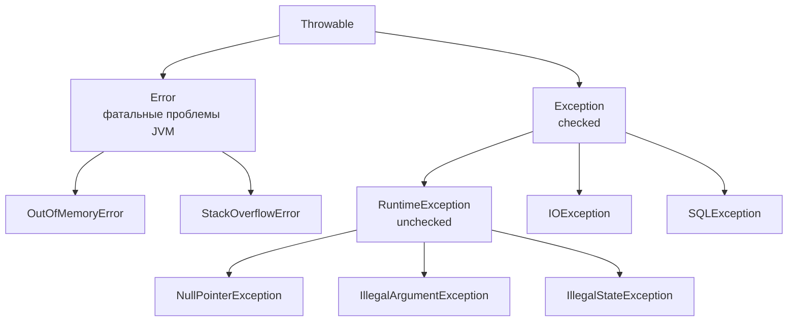

# Исключения

Исключение — механизм сообщить «здесь продолжать нельзя» и передать управление
туда, где с проблемой можно что-то сделать. Альтернатива — коды возврата,
которые легко забыть проверить; исключение забыть нельзя: необработанное,
оно летит вверх по стеку вызовов, пока его не поймают или пока не завершится поток.

## Иерархия



Три ветки с разным смыслом:

- **`Error`** — фатальные проблемы уровня JVM: кончилась память
  (`OutOfMemoryError`), переполнился стек (`StackOverflowError`). Их **не ловят**:
  приложение в этот момент уже в непредсказуемом состоянии, осмысленно
  восстановиться нельзя.
- **`Exception`** (кроме `RuntimeException`) — **checked**: компилятор заставляет
  либо поймать, либо объявить в `throws`.
- **`RuntimeException`** и наследники — **unchecked**: компилятор не требует
  обработки. Обычно это ошибки программиста — `null` там, где его не ждали,
  неверный аргумент, выход за границы массива.

## Checked против unchecked

Идея checked-исключений: если метод может не сработать (файл не открылся,
сеть отвалилась), пусть вызывающий будет обязан про это подумать. На практике
идея не оправдалась: обработать ошибку прямо в месте вызова обычно нечем,
и checked-исключения либо пробрасываются через `throws` по всей цепочке,
либо оборачиваются — код замусоривается, а надёжности не прибавляется.

Современный мейнстрим — **unchecked**: Spring, Hibernate и большинство
современных библиотек бросают только RuntimeException (Spring даже
транслирует `SQLException` в свою unchecked-иерархию `DataAccessException`).
Свои исключения тоже принято наследовать от `RuntimeException`.

На интервью достаточно честной позиции: checked — для ошибок, которые вызывающий
реально может обработать; на практике почти всегда используют unchecked,
а checked из чужих API оборачивают.

## try / catch / finally

```java
try {
    process(file);
} catch (InvalidFormatException e) {   // конкретные — раньше
    log.warn("Файл повреждён: {}", file, e);
} catch (IOException e) {              // общие — позже
    throw new ProcessingException("Не удалось обработать " + file, e);
} finally {
    metrics.increment("files.processed");
}
```

- `catch`-блоки проверяются сверху вниз, поэтому наследники должны стоять
  раньше родителей (иначе — ошибка компиляции: блок недостижим).
- Однотипную обработку объединяет multi-catch:
  `catch (IOException | SQLException e)`.
- `finally` выполняется **всегда** — и при успехе, и при исключении,
  и даже при `return` из `try`.

!!! warning "Исключение или return в finally"
    Если из `finally` вылетит исключение (или там стоит `return`), исходное
    исключение из `try` **молча теряется** — наружу уйдёт только то, что
    произошло в `finally`. Итог: падение с ошибкой закрытия ресурса, а настоящая
    причина исчезла из логов. Правило: в `finally` не бросать и не возвращать.

## try-with-resources

Правильный способ работать с ресурсами (соединения, файлы, потоки) — не ручной
`finally`, а try-with-resources. Работает со всем, что реализует `AutoCloseable`:

```java
try (Connection conn = dataSource.getConnection();
     PreparedStatement ps = conn.prepareStatement(sql)) {
    return ps.executeQuery();
} // close() вызовется автоматически, в обратном порядке объявления
```

Ключевое преимущество помимо краткости: если исключение случилось и в теле,
и при закрытии, наружу летит **основное** исключение из тела, а ошибка закрытия
прикрепляется к нему как *suppressed* (видна в стектрейсе, достаётся через
`getSuppressed()`). Ручной `finally` в этой ситуации терял бы основное.

## Свои исключения

Свои типы заводят, чтобы вызывающий код мог отличать ошибки друг от друга
и чтобы имя говорило о предметной области:

```java
public class OrderNotFoundException extends RuntimeException {
    public OrderNotFoundException(long orderId) {
        super("Заказ не найден: id=" + orderId);
    }
}
```

Правила:

- Наследоваться от `RuntimeException`.
- При оборачивании **всегда передавать причину**:
  `new ProcessingException("...", e)`. Без `cause` стектрейс исходной ошибки
  теряется, и диагностика превращается в угадывание.
- Имя заканчивается на `Exception`, сообщение содержит контекст (id, значения),
  но не секреты.

В Spring-приложениях такие исключения обычно долетают до глобального обработчика
(`@RestControllerAdvice`), который превращает их в HTTP-ответы, — ловить их
в каждом методе не нужно.

## Практики обработки

- **Не глотать.** `catch (Exception e) {}` — худшее, что можно сделать:
  проблема осталась, следов нет. Минимум — залогировать с самим исключением
  (`log.error("...", e)`, а не `e.getMessage()` — иначе пропадёт стектрейс).
- **Логировать или пробрасывать — одно из двух.** Если сделать оба, одна ошибка
  засветится в логах несколько раз на разных уровнях и будет путать при разборе.
- **Ловить как можно уже.** `catch (Exception)` перехватит и NPE из соседней
  строки, замаскировав баг. Широкий catch допустим только на верхней границе —
  в глобальном обработчике, у планировщика, у обработчика сообщений.
- **Бросать как можно раньше** (fail fast): проверить аргументы в начале метода
  и упасть с понятным `IllegalArgumentException` лучше, чем позже получить NPE
  в глубине стека.
- Исключения — для **исключительных** ситуаций, а не для управления потоком:
  «не нашли по id» в нормальном сценарии — это `Optional`, а не исключение.

## Как ответить на интервью

Коротко: `Throwable` делится на `Error` (фатальное, не ловим), checked
`Exception` (компилятор требует обработки) и unchecked `RuntimeException`
(ошибки логики; современный мейнстрим). Ресурсы — только try-with-resources:
он и короче, и не теряет основное исключение. `finally` выполняется всегда,
но бросать из него нельзя — потеряется исходная ошибка. Свои исключения —
unchecked, с сохранением `cause`; не глотать, ловить узко, падать рано.
