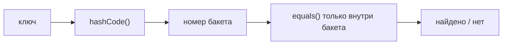

# `Object`, `equals` и `hashCode`

`Object` — корень всей иерархии: любой класс неявно наследует его. Значит,
у каждого объекта в Java есть базовый набор методов:

| Метод | Что делает |
|---|---|
| `equals(Object)` | Логическое равенство. По умолчанию — сравнение ссылок |
| `hashCode()` | Целое число для хеш-структур. По умолчанию — на основе идентичности объекта |
| `toString()` | Строковое представление. По умолчанию — `Класс@hex` |
| `getClass()` | Реальный класс объекта в рантайме |
| `clone()` | Копирование объекта; устаревший механизм, на практике вместо него — конструктор копирования или статическая фабрика |
| `wait()` / `notify()` / `notifyAll()` | Низкоуровневая координация потоков на мониторе объекта (тема многопоточности) |
| `finalize()` | Хук перед сборкой мусора; deprecated, не использовать |

Главные здесь — `equals` и `hashCode`: на них держатся все хеш-коллекции,
и это одна из самых частых тем на интервью.

## `==` против `equals`

- `==` для ссылочных типов сравнивает **ссылки**: тот же ли это объект в памяти.
- `equals` сравнивает **содержимое** — так, как определил автор класса.

```java
String a = new String("java");
String b = new String("java");
a == b;      // false — два разных объекта
a.equals(b); // true — одинаковое содержимое
```

Если `equals` не переопределён, он ведёт себя как `==` — «равен только сам себе».
Для классов-значений (деньги, координаты, DTO) это почти никогда не то,
что нужно, поэтому `equals` переопределяют.

## Контракт `equals`

Переопределённый `equals` обязан удовлетворять пяти свойствам. Это не формальный
список для зубрёжки — каждое свойство защищает коллекции от неочевидных багов:

- **Рефлексивность**: `x.equals(x)` — `true`. Иначе объект нельзя будет найти
  в коллекции, в которой он лежит.
- **Симметричность**: `x.equals(y)` ⇔ `y.equals(x)`. Иначе `list.contains(x)`
  будет давать разные ответы в зависимости от того, кто кого сравнивает.
- **Транзитивность**: если `x = y` и `y = z`, то `x = z`.
- **Согласованность**: пока объекты не менялись, результат не меняется.
- **Сравнение с `null`**: `x.equals(null)` — всегда `false`, а не исключение.

## `hashCode` и его связь с `equals`

Контракт один, но критически важный:

> **Равные по `equals` объекты обязаны возвращать одинаковый `hashCode`.**

Обратное неверно: одинаковый хеш у неравных объектов — это **коллизия**,
нормальная ситуация (значений `int` конечное число, объектов — нет).
Коллизии хеш-структуры разрешают через `equals`.

Зачем вообще хеш? Чтобы искать за O(1). Вот как `HashMap` ищет ключ:



`hashCode` — грубый фильтр, который отсекает почти всё, `equals` — точная
проверка среди немногих кандидатов в одном бакете.

### Что ломается, если переопределить только `equals`

Два логически равных объекта получат разные (дефолтные) хеши, попадут в разные
бакеты — и `map.get(key)` вернёт `null` для ключа, который «есть» в карте.
Компилятор промолчит, простой тест `a.equals(b)` пройдёт. Сломаются только
хеш-коллекции — самый коварный вид ошибки.

!!! warning "Ловушка: изменяемый ключ"
    Если объект лежит в `HashSet`/`HashMap` как ключ, а вы изменили поле,
    участвующее в `hashCode`, — объект остался в **старом** бакете, но поиск
    теперь идёт по **новому** хешу. `contains` вернёт `false`, `remove`
    не удалит, объект «завис» в коллекции. Поэтому ключи делают неизменяемыми.

## `getClass()` или `instanceof` в `equals`

Два стиля проверки типа, и разница между ними — любимый уточняющий вопрос:

```java
// строгий: равны только объекты ровно одного класса
if (o == null || getClass() != o.getClass()) return false;

// мягкий: наследники могут быть равны родителю
if (!(o instanceof Point p)) return false;
```

- `getClass()` гарантирует симметричность автоматически, но объект наследника
  **никогда** не равен объекту родителя — даже если наследник не добавил
  ни одного поля.
- `instanceof` допускает равенство между родителем и наследником, но если
  наследник переопределит `equals` с учётом своих полей, симметричность
  ломается: `parent.equals(child)` — `true`, `child.equals(parent)` — `false`.

Общий вывод: смешивать наследование и `equals` по значению корректно нельзя.
Практическое решение — классы-значения делать `final` (или использовать
`record`), и тогда оба стиля эквивалентны. Существенная деталь из мира JPA:
Hibernate подсовывает прокси-подклассы, у которых `getClass()` отличается
от класса сущности, поэтому для сущностей рекомендуют `instanceof`.

## Как писать правильно

Руками — через `Objects`:

```java
@Override
public boolean equals(Object o) {
    if (this == o) return true;
    if (!(o instanceof Money m)) return false;
    return amount == m.amount && Objects.equals(currency, m.currency);
}

@Override
public int hashCode() {
    return Objects.hash(amount, currency);
}
```

Но руками сейчас пишут редко:

- **`record`** — генерирует `equals`/`hashCode`/`toString` по всем полям.
  Лучший вариант для классов-значений.
- **Lombok** `@EqualsAndHashCode` (входит в `@Data`) — генерирует при компиляции.
- **IDE** — сгенерирует корректную пару за секунду.

Правила без исключений: переопределяются **только парой**, на **одном и том же
наборе полей**, и этот набор — неизменяемые поля.

## Как ответить на интервью

Коротко: `equals` — логическое равенство, `hashCode` — быстрый указатель на
бакет; хеш-структуры сначала ищут бакет по хешу, потом уточняют через `equals`.
Отсюда контракт: равные объекты обязаны иметь равный хеш, поэтому методы
переопределяют только парой и по одним полям. Изменяемое поле в ключе «теряет»
объект в коллекции. `getClass()` строже, `instanceof` терпимее к наследникам,
но безопасно только для `final`-классов и записей.
