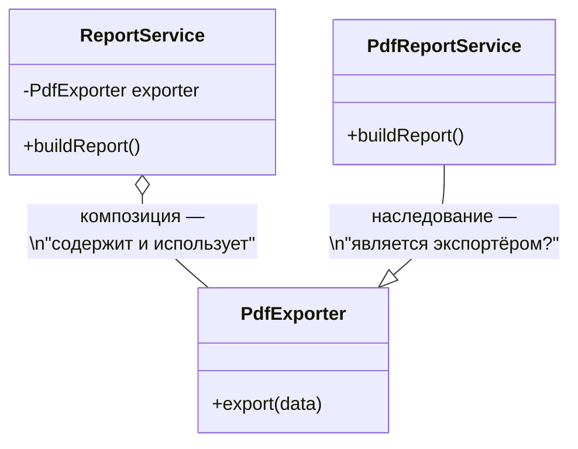

# ООП и наследование

Java — объектно-ориентированный язык: программа состоит из объектов, которые
хранят состояние (поля) и умеют что-то делать (методы). Смысл ООП — управлять
сложностью: большая система разбивается на маленькие части, каждая из которых
отвечает за своё и прячет внутренности от остальных.

## Четыре принципа

### Инкапсуляция

Объект скрывает своё внутреннее устройство и даёт наружу только то, что нужно.
Поля — `private`, доступ — через методы. Это не формальность: пока поле скрыто,
класс может менять своё устройство, не ломая тех, кто им пользуется, и может
контролировать корректность данных.

```java
public class Account {
    private long balance; // никто снаружи не запишет сюда мусор

    public void withdraw(long amount) {
        if (amount <= 0 || amount > balance) {
            throw new IllegalArgumentException("Некорректная сумма");
        }
        balance -= amount;
    }
}
```

Если бы `balance` был `public`, любой код мог бы сделать баланс отрицательным —
и виноватого пришлось бы искать по всему проекту. С инкапсуляцией все правила
изменения баланса живут в одном месте.

### Наследование

Класс может расширить другой класс (`extends`) и получить его поля и методы.
Наследование выражает отношение **«является»**: `Cat extends Animal` — кот
*является* животным.

В Java класс наследует только **один** класс (множественного наследования
классов нет — иначе возникает «проблема ромба»: от кого из двух родителей брать
одинаковый метод). Зато реализовывать можно сколько угодно интерфейсов.

### Полиморфизм

Один и тот же вызов работает по-разному в зависимости от реального типа объекта.
Код пишется против общего типа, а конкретное поведение подставляется в рантайме:

```java
NotificationSender sender = pickSender(user); // Email? Sms? Push?
sender.send(message); // вызывающему коду всё равно, кто именно отправит
```

Это главный механизм расширяемости: чтобы добавить новый способ отправки,
не нужно трогать код, который отправляет, — достаточно добавить новую реализацию.

### Абстракция

Выделение существенного и отбрасывание деталей. Интерфейс `NotificationSender`
с одним методом `send` — это абстракция: он говорит, **что** можно сделать,
и молчит о том, **как**. Инкапсуляция прячет детали внутри класса, абстракция —
проектирует сам «контракт» так, чтобы деталей в нём не было.

## Наследование в деталях

```java
public class Animal {
    protected String name;

    public Animal(String name) {
        this.name = name;
    }

    public String voice() {
        return "...";
    }
}

public class Cat extends Animal {
    public Cat(String name) {
        super(name); // конструктор родителя вызывается всегда, явно или неявно
    }

    @Override
    public String voice() {
        return "Мяу";
    }
}
```

Ключевые моменты:

- Конструкторы **не наследуются**. Первой строкой конструктора всегда идёт вызов
  конструктора родителя — `super(...)`. Если не написать явно, компилятор
  подставит `super()` без аргументов, а если такого конструктора у родителя нет —
  будет ошибка компиляции.
- `protected` — доступ для наследников (и пакета). Так родитель делится
  внутренностями только со «своими».
- `final`-класс нельзя наследовать, `final`-метод нельзя переопределить.

## Переопределение и перегрузка

Их часто путают, но это разные механизмы:

| | Переопределение (override) | Перегрузка (overload) |
|---|---|---|
| Что это | Наследник заменяет реализацию метода родителя | Несколько методов с одним именем, но разными параметрами |
| Сигнатура | Та же | Другая (по параметрам) |
| Когда выбирается метод | В **рантайме**, по реальному типу объекта | При **компиляции**, по типам аргументов |
| Пример | `Cat.voice()` вместо `Animal.voice()` | `print(int)` и `print(String)` |

Правила переопределения:

- Возвращаемый тип — тот же или наследник (ковариантность).
- Модификатор доступа нельзя **сужать** (был `public` — нельзя сделать `protected`).
- Нельзя добавлять новые checked-исключения в `throws`.
- `static`-методы не переопределяются — они **скрываются** (hiding): какой метод
  вызовется, решает тип ссылки, а не объекта.

!!! tip "Всегда ставь `@Override`"
    Аннотация просит компилятор проверить, что метод действительно что-то
    переопределяет. Без неё опечатка в имени или параметрах молча создаст
    *новый* метод, а старый продолжит работать — и такую ошибку можно искать часами.

## Как работает полиморфный вызов

Важно различать **тип ссылки** и **тип объекта**:

```java
Animal a = new Cat("Барсик");
a.voice(); // "Мяу" — метод выбран по типу ОБЪЕКТА (Cat)
```

Компилятор проверяет по типу ссылки (`Animal`), *можно ли* вызвать метод.
А *какая реализация* выполнится — решается в рантайме по реальному классу
объекта. Это называется динамической диспетчеризацией. Поэтому через ссылку
`Animal` нельзя вызвать метод, который есть только у `Cat`, — компилятор
про него «не знает», пока не сделать приведение типа.

## Абстрактный класс и интерфейс

Оба задают контракт, который реализуют наследники, но зоны применения разные:

| | Абстрактный класс | Интерфейс |
|---|---|---|
| Наследование | Только один | Реализовать можно много |
| Состояние (поля) | Да, любые | Только `public static final` константы |
| Конструктор | Есть | Нет |
| Методы с реализацией | Любые | `default` и `static` (с Java 8) |
| Смысл | Общая **основа** для семейства классов | **Способность**, роль: «умеет сравниваться», «умеет закрываться» |

Практическое правило: интерфейс — по умолчанию. Абстрактный класс — когда
у наследников есть общее **состояние** и общий код, который на него опирается
(классический пример — шаблонный метод: родитель задаёт скелет алгоритма,
наследники заполняют шаги).

`default`-методы в интерфейсах появились, чтобы можно было добавлять методы
в существующие интерфейсы, не ломая все их реализации. Так в `Collection`
добавили `stream()`, и все коллекции мира его получили бесплатно.

## Композиция вместо наследования

Наследование — самая **жёсткая** связь между классами: наследник зависит от
внутренностей родителя, изменение родителя может сломать всех детей, а иерархию
потом трудно перестроить. Альтернатива — композиция: не «являться» чем-то,
а **содержать** его и делегировать работу.



`ReportService` не *является* экспортёром PDF — он им *пользуется*. Наследование
здесь связало бы два несвязанных смысла в один класс. Практическое правило:
**наследование — только для настоящего отношения «является»**, во всех остальных
случаях — композиция. Не случайно весь Spring построен на композиции:
зависимости внедряются в поля, а не наследуются.

## Как ответить на интервью

Коротко: ООП — это объекты, скрывающие состояние (инкапсуляция); наследование
выражает «является» и даёт переиспользование; полиморфизм позволяет писать код
против абстракции, а конкретное поведение подставлять в рантайме. Наследование —
жёсткая связь, поэтому там, где нет отношения «является», предпочтительна
композиция. Интерфейс — контракт-способность, абстрактный класс — общая основа
с состоянием.
