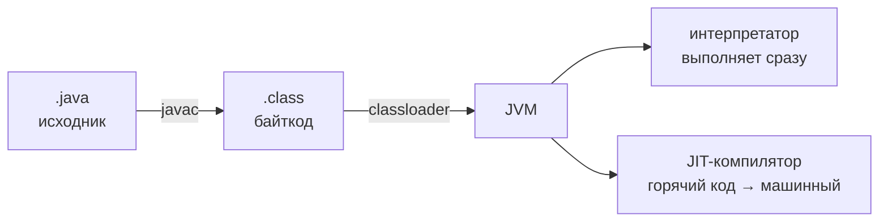

# Устройство JVM

JVM (Java Virtual Machine) — виртуальная машина, которая выполняет байткод.
Благодаря ей один и тот же скомпилированный код работает на любой ОС, где есть
JVM, — это и есть «write once, run anywhere». Здесь — основные компоненты
и путь кода от исходника до выполнения, без погружения во внутренности.

## JDK, JRE, JVM

Три термина, которые важно не путать:

- **JVM** — сама виртуальная машина: выполняет байткод.
- **JRE** — среда выполнения: JVM + стандартная библиотека. Как отдельный
  продукт больше не распространяется.
- **JDK** — комплект разработчика: JRE + компилятор `javac` и инструменты
  (`jstack`, `jcmd`, `jar`...). Для разработки и обычно для прода ставится JDK.

## Путь кода: от .java до процессора



1. **`javac`** компилирует исходники в **байткод** — компактные инструкции
   универсальной стековой машины. Это не машинный код: процессор его выполнять
   не умеет.
2. **Загрузчик классов** подгружает `.class`-файлы в JVM — лениво, при первом
   обращении к классу.
3. **Интерпретатор** начинает выполнять байткод инструкция за инструкцией —
   медленно, зато сразу.
4. **JIT-компилятор** (just-in-time) следит за статистикой: методы, которые
   выполняются часто («горячие»), он компилирует в оптимизированный машинный
   код прямо во время работы. Дальше они выполняются со скоростью нативного кода.

Отсюда важное свойство Java-сервисов — **прогрев**: сразу после старта
приложение работает медленнее, чем через несколько минут под нагрузкой,
потому что горячий код ещё не скомпилирован JIT. Это учитывают при
нагрузочном тестировании (замеры — после прогрева) и при выкатках.

JIT не просто транслирует код, а оптимизирует по реальному поведению:
встраивает маленькие методы (inlining), убирает недостижимые ветки,
девиртуализирует вызовы. Поэтому микробенчмарки «в лоб» лгут — для честных
замеров существует JMH.

## Загрузка классов

Что нужно знать без углубления во внутренности:

- Классы загружаются **лениво** — при первом использовании, тогда же
  выполняется статическая инициализация.
- Загрузчики образуют иерархию: bootstrap (ядро JDK) → platform → application
  (classpath приложения). Запрос сначала **делегируется вверх** — поэтому
  нельзя подменить своим классом `java.lang.String`.
- Практическое следствие иерархии: класс в JVM идентифицируется парой
  «имя + загрузчик». На этом строятся контейнеры и плагинные системы,
  и отсюда же странные `ClassCastException` «класс X не является классом X» —
  один класс, загруженный двумя загрузчиками.
- Знакомые ошибки: `ClassNotFoundException` — класс не нашли в classpath
  в рантайме; `NoClassDefFoundError` — класс был при компиляции, но пропал
  или не смог инициализироваться при выполнении.

## Память: что где живёт

Основные области памяти JVM:

- **Куча (heap)** — все объекты. Общая для всех потоков, за ней следит
  сборщик мусора. Размер ограничен `-Xmx`.
- **Стек (stack)** — у **каждого потока свой**: кадры вызовов методов
  с локальными переменными и параметрами. Примитивы-локалы лежат прямо
  в кадре, объекты — в куче, в кадре только ссылка.
- **Metaspace** — метаданные классов: структура, методы, байткод.
  Заполняется по мере загрузки классов.
- Кэш JIT-кода, память потоков и прочее — вне кучи; поэтому реальное
  потребление памяти процессом всегда больше `-Xmx`.

Две ошибки, привязанные к этим областям:

- **`StackOverflowError`** — переполнен стек потока; почти всегда бесконечная
  рекурсия (в стектрейсе — повторяющийся цикл вызовов).
- **`OutOfMemoryError: Java heap space`** — куча кончилась: утечка или
  честно не хватает `-Xmx` (разбирается в теме про память и GC).

## Что стоит знать про флаги

Минимальный набор, который встречается в каждом проде:

```bash
java -Xms512m -Xmx2g -jar app.jar   # начальный и максимальный размер кучи
```

В контейнерах вместо абсолютных значений используют процент от лимита
контейнера — `-XX:MaxRAMPercentage=75` (подробнее — в разделе про Docker).
Диагностические инструменты JDK, которые полезно назвать: `jstack`
(thread dump), `jmap`/`jcmd` (heap dump и статистика), `jstat` (GC-статистика).

## Как ответить на интервью

Коротко: `javac` компилирует исходники в байткод, JVM выполняет его —
сначала интерпретатором, а горячие методы JIT компилирует в машинный код,
поэтому Java-сервису нужен прогрев. Классы загружаются лениво иерархией
загрузчиков с делегированием вверх. Память: куча — объекты (общая, под GC),
стек — кадры вызовов (свой у потока), Metaspace — метаданные классов;
`StackOverflowError` — рекурсия, `OutOfMemoryError` — кончилась куча.
JDK = JVM + библиотека + инструменты разработчика.
