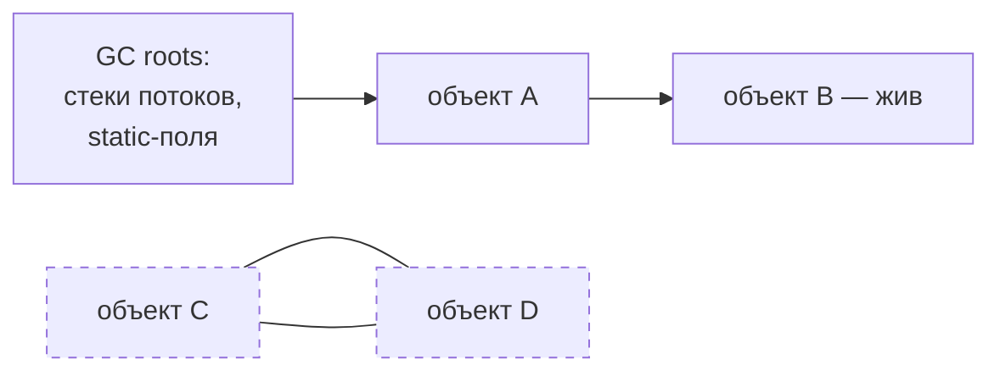

# Память и сборка мусора

В Java память освобождается автоматически: сборщик мусора (GC) находит
объекты, до которых больше никому нет дела, и удаляет их. Разработчику
не нужно вызывать `free`, но нужно понимать, **как GC решает, что объект
мусор**, — потому что утечки памяти в Java всё равно возможны, и OOM
в проде — реальный сценарий.

## Как GC находит мусор

GC не считает ссылки. Он идёт от **GC roots** — заведомо живых точек:
локальные переменные всех работающих потоков, статические поля классов,
JNI-ссылки. Всё, что **достижимо** от корней по цепочкам ссылок, — живое;
всё остальное — мусор, каким бы «нужным» оно ни казалось.

Важное следствие: два объекта, ссылающиеся друг на друга, но недостижимые
от корней (C и D на схеме), — мусор. Циклические ссылки для GC не проблема.

И обратное следствие — суть всех «утечек» в Java: **объект жив, пока на него
есть путь от корней**. «Я обнулил свою ссылку, а объект не собрался» означает
одно: есть ещё какая-то ссылка — из статической коллекции, кэша, слушателя,
`ThreadLocal`.

## Поколения: как устроена куча

Куча делится на поколения, потому что верна **поколенческая гипотеза**:
большинство объектов умирают молодыми (DTO запроса, промежуточные строки,
итераторы — живут миллисекунды), а пережившие первое время живут долго.

- **Young generation** — сюда (в область eden) попадают новые объекты.
  Заполнился eden — **минорная сборка**: выжившие переносятся в survivor-области,
  мёртвые (почти все) исчезают бесплатно. Минорные сборки часты и быстры.
- **Old generation** — объекты, пережившие несколько минорных сборок,
  переезжают сюда. Old собирается реже и дороже (**мажорная/полная сборка**).

Практический смысл: создавать короткоживущие объекты в Java **дёшево** —
они умирают в eden, не дожив до дорогой сборки. Бояться аллокаций
и «оптимизировать» переиспользованием объектов обычно не нужно.

## Stop-the-world и современные сборщики

Часть работы GC требует **остановить все потоки приложения** —
stop-the-world-пауза. Эволюция сборщиков — это история сокращения пауз:

- **G1** — сборщик по умолчанию: делит кучу на регионы, убирает сначала самые
  «мусорные» (garbage first), держит паузы в целевых пределах
  (обычно десятки миллисекунд). Стандартный выбор для бэкенда.
- **ZGC / Shenandoah** — низколатентные: почти вся работа параллельно
  с приложением, паузы меньше миллисекунды даже на огромных кучах.
  Выбор для сервисов, чувствительных к хвостовым задержкам.
- Serial и Parallel — старые/нишевые: маленькие утилиты или батчи,
  где важна пропускная способность, а паузы неважны.

Для интервью достаточно: знать про паузы, знать что дефолт — G1, и что
выбор сборщика — компромисс между пропускной способностью и задержками.
Внутренности алгоритмов знать не требуется.

## Утечки памяти в Java

Утечка по-джавовски — не «потерянный» блок памяти, а **ссылка, которую забыли
отпустить**: объект достижим, GC обязан его хранить, а приложению он больше
не нужен. Типовые источники:

- **Статические коллекции и кэши без выселения** — `static Map`, куда кладут
  и никогда не удаляют. Самый частый случай.
- **`ThreadLocal` в пулах потоков** — поток из пула живёт вечно, и его
  ThreadLocal-значения вместе с ним, если не вызывать `remove()`.
- **Слушатели и колбэки** — подписался и не отписался.
- **Долгоживущие объекты, держащие короткоживущие** — например, внутренний
  (не static) класс несёт скрытую ссылку на внешний объект.

## Диагностика OOM

`OutOfMemoryError: Java heap space` — куча исчерпана. Порядок разбора:

1. **Снять heap dump** — снимок всей кучи. Заранее ставится флаг
   `-XX:+HeapDumpOnOutOfMemoryError` (дамп снимется сам в момент OOM),
   вручную — `jcmd <pid> GC.heap_dump`.
2. **Открыть анализатором** (Eclipse MAT, VisualVM): смотреть, какие объекты
   занимают кучу (гистограмма) и **кто их держит** — пути до GC roots.
   Утечка обычно видна как одна коллекция на сотни мегабайт.
3. **Посмотреть динамику по метрикам**: если занятая куча после каждой сборки
   монотонно растёт — утечка; если потребление честное (большие батчи, кэши
   по делу) — не хватает `-Xmx`, и это решается ресурсами, а не кодом.

Смежные OOM, о которых полезно знать: `Metaspace` (бесконтрольная генерация
классов), `unable to create native thread` (слишком много потоков — лимит ОС,
не кучи).

## Что ещё спрашивают

- **`System.gc()`** — просьба, а не команда; JVM вправе игнорировать.
  В прикладном коде не используется.
- **`finalize()`** — deprecated и удаляется из платформы; освобождение
  ресурсов — это try-with-resources, а не GC.
- **Ссылки разной силы**: `WeakReference` не мешает сборке объекта
  (на слабых ссылках построен `WeakHashMap` — кэш, не создающий утечек);
  `SoftReference` собирается при нехватке памяти.

## Как ответить на интервью

Коротко: GC определяет живость достижимостью от GC roots — циклы не проблема,
а «утечка» — это забытая ссылка (статические кэши, ThreadLocal в пулах,
слушатели). Куча поколенческая: новые объекты умирают в eden дёшево, выжившие
стареют в old, который собирается редко и дорого. Сборки требуют
stop-the-world-пауз; дефолтный G1 держит их малыми, ZGC — для чувствительных
к задержкам сервисов. OOM разбирается heap dump'ом: смотрим, что занимает
память и кто это держит; монотонный рост после сборок — утечка, честное
потребление — мало `-Xmx`.
