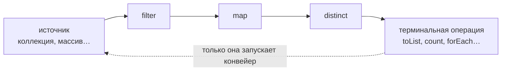

# Устройство и операции стримов

Стрим — это **конвейер обработки** элементов, а не структура данных: он ничего
не хранит, а описывает последовательность преобразований от источника
к результату.

```java
List<String> names = orders.stream()          // источник
        .filter(o -> o.getTotal() > 1000)     // промежуточные операции
        .map(Order::getCustomerName)
        .distinct()
        .sorted()
        .toList();                            // терминальная операция
```



## Ленивость: главное, что нужно понять

Операции делятся на два вида:

- **Промежуточные** (`filter`, `map`, `flatMap`, `sorted`, `distinct`,
  `limit`, `peek`) — возвращают новый стрим и **ничего не выполняют**.
  Они лишь достраивают описание конвейера.
- **Терминальные** (`toList`, `collect`, `forEach`, `count`, `reduce`,
  `findFirst`, `anyMatch`) — запускают конвейер и выдают результат.

Пока терминальной операции нет — **не происходит ничего**:

```java
orders.stream()
      .map(o -> { audit(o); return o; }); // audit НЕ вызовется ни разу
```

Классическая ошибка «стрим отработал, а результата нет» — это именно она:
цепочка без терминальной операции, или побочные эффекты в `peek`/`map`,
которые никто не запустил.

Ленивость — не причуда, а оптимизация: элементы проходят конвейер **по одному
до конца**, и короткозамкнутые операции останавливают обработку раньше:

```java
// пройдёт ровно столько элементов, сколько нужно для первых трёх результатов
stream.filter(expensiveCheck).limit(3).toList();
```

## Основные операции

Промежуточные:

```java
.filter(o -> o.isActive())        // отбор по условию
.map(Order::getCustomer)          // преобразование 1 -> 1
.flatMap(o -> o.getItems().stream()) // 1 -> много: разворачивает вложенные коллекции
.sorted(Comparator.comparing(...))
.distinct()                       // уникальные (по equals)
.limit(10) / .skip(20)            // срезы
```

`map` против `flatMap` — частый вопрос: `map` кладёт в стрим результат как один
элемент (получится `Stream<List<Item>>`), `flatMap` разворачивает вложенные
стримы в один плоский `Stream<Item>`.

Терминальные:

```java
.toList()                          // самый частый финал
.collect(Collectors.toSet())
.count()
.anyMatch(o -> o.getTotal() > 1_000_000)  // true/false, короткозамкнутая
.findFirst()                       // Optional<T> — может ничего не найтись
.reduce(BigDecimal.ZERO, BigDecimal::add) // свёртка в одно значение
.forEach(...)                      // действие; для записи в БД и т.п. лучше цикл
```

## Коллекторы

`Collectors` превращают стрим в коллекции и агрегаты:

```java
// список -> словарь
Map<Long, Order> byId = orders.stream()
        .collect(Collectors.toMap(Order::getId, o -> o));
// ловушка: при дублирующихся ключах toMap кидает IllegalStateException;
// решение — третий аргумент: toMap(keyFn, valFn, (a, b) -> b)

// группировка
Map<Status, List<Order>> byStatus = orders.stream()
        .collect(Collectors.groupingBy(Order::getStatus));

// группировка с агрегацией
Map<Status, Long> countByStatus = orders.stream()
        .collect(Collectors.groupingBy(Order::getStatus, Collectors.counting()));

// склейка строк
String csv = names.stream().collect(Collectors.joining(", "));
```

`groupingBy` + вторичный коллектор (`counting`, `mapping`, `summingLong`)
покрывает большинство «SQL-подобных» задач по коллекциям в памяти.

## Правила и ловушки

- **Стрим одноразовый**: повторная терминальная операция на том же стриме —
  `IllegalStateException: stream has already been operated upon or closed`.
  Нужно дважды — создайте стрим заново от источника.
- **Не изменяйте источник** внутри операций стрима — результат непредсказуем
  (как CME при итерировании). Стрим читает, результат собирает коллектор.
- **`peek` — для отладки**, а не для бизнес-логики: он ленивый и может
  не выполниться (например, после `count()`, который умеет считать без обхода).
- Стримы примитивов — `IntStream`, `LongStream` — избегают боксинга:
  `mapToLong(Order::getTotal).sum()`, `IntStream.range(0, n)`.

## Параллельные стримы

`.parallelStream()` разбивает работу по ядрам через общий `ForkJoinPool`.
Звучит как бесплатное ускорение, но в бэкенде почти не используется:

- выигрыш появляется только на **больших объёмах** с **дорогой** обработкой
  на элемент; на типичных сотнях элементов накладные расходы съедают всё;
- пул общий на всю JVM — блокирующие операции (запросы к БД, HTTP) в нём
  голодают и тормозят чужие параллельные стримы;
- в сервере параллелизм уже есть — запросы обрабатываются в разных потоках.

Честная позиция: «знаю, что есть, по умолчанию не применяю; если применять —
только к CPU-интенсивной обработке больших массивов данных, с замерами».

## Стрим или цикл

Стрим выигрывает, когда код — это «отфильтровать → преобразовать → собрать»:
читается как описание результата. Цикл лучше, когда есть сложные побочные
эффекты, ранние выходы из нескольких условий, проверяемые исключения внутри
(в лямбдах они мучительны). Критерий один — читаемость, а не мода.

## Как ответить на интервью

Коротко: стрим — ленивый конвейер: промежуточные операции только строят
цепочку, выполняет её терминальная; без неё не выполнится ничего. Элементы
идут через конвейер по одному, короткозамкнутые операции (`limit`, `anyMatch`,
`findFirst`) обрывают обработку раньше. `map` — один к одному, `flatMap` —
разворачивает вложенность; `groupingBy`/`toMap` закрывают агрегации
(у `toMap` — ловушка дублей ключей). Стрим одноразовый. Параллельные стримы —
только для CPU-тяжёлых больших данных, не для IO.
