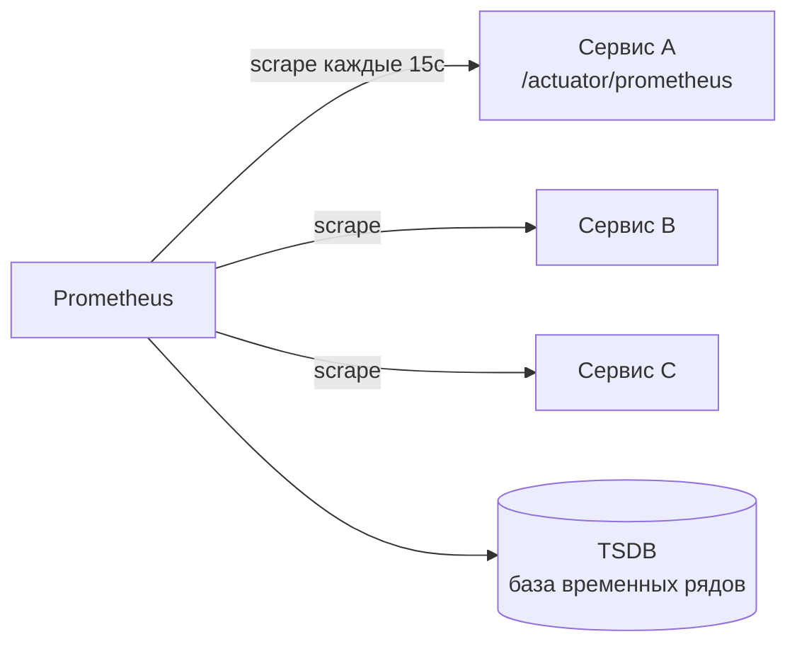

# Как работает Prometheus

**Prometheus** — самая распространённая система сбора метрик. Он хранит числовые
показатели во времени и умеет по ним считать запросы и алерты. Для junior-а важно
понимать его модель: **pull-сбор**, база временных рядов и метки.

## Модель: Prometheus сам тянет метрики (pull)

Ключевая особенность — **pull**: не сервисы шлют метрики в Prometheus, а **Prometheus
сам периодически ходит** по списку сервисов и забирает метрики с их эндпоинта (у
Spring-сервиса это `/actuator/prometheus`). Такой опрос называется **scrape**, идёт он
раз в несколько секунд.



Плюс pull-модели: Prometheus заодно видит **живость** — если сервис не ответил на scrape,
это само по себе сигнал, что он недоступен. Список целей Prometheus берёт из конфига или
через **service discovery** (например, автоматически находит поды в Kubernetes).

Для короткоживущих задач, которые не успеть опросить, есть **Pushgateway** — туда job
пушит метрику сам, а Prometheus забирает уже с него. Но это исключение, основной режим —
pull.

## Что внутри: временные ряды и метки

Prometheus хранит данные как **временные ряды (time series)** — последовательность пар
«время → значение» в своей базе (**TSDB**). Каждый ряд однозначно определяется **именем
метрики и набором меток (labels)**:

```
http_server_requests_seconds_count{uri="/orders", status="200"}
http_server_requests_seconds_count{uri="/orders", status="500"}
```

Это **две разные метрики-ряда** — они отличаются меткой `status`. Метки позволяют потом
резать данные как угодно: только по эндпоинту `/orders`, только по ошибкам `5xx`, по
конкретному инстансу. Именно на метках держится вся гибкость запросов.

## Экспортеры

Само приложение отдаёт метрики через Actuator. Но метрики нужны и с того, что метрик не
отдаёт: с базы, с ОС, с nginx. Для этого есть **экспортеры (exporters)** — маленькие
процессы-переходники: `node_exporter` отдаёт метрики машины (CPU, диск, память),
`postgres_exporter` — метрики базы. Prometheus опрашивает их так же, как обычный сервис.

## Как ответить на интервью

Коротко: Prometheus — система сбора метрик, работает по модели **pull**: он сам
периодически ходит по сервисам и забирает метрики с их эндпоинта (scrape), а не сервисы
ему шлют. Плюс такой модели — заодно видно живость: не ответил на опрос, значит
недоступен. Данные он хранит как **временные ряды** в своей базе TSDB, и каждый ряд
задаётся именем метрики плюс набором **меток** — по меткам потом режешь данные (по
эндпоинту, по статусу, по инстансу). Список целей берёт из конфига или через service
discovery, в Kubernetes сам находит поды. С того, что само метрик не отдаёт (ОС, база),
метрики снимают **экспортеры**. Для коротких задач есть Pushgateway, но основной режим —
pull.
