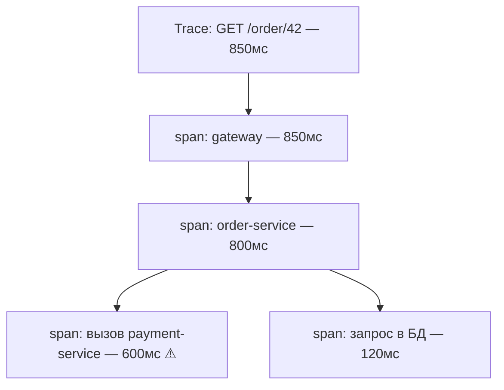

# Трейсинг запросов

В распределённой системе один запрос пользователя проходит через несколько сервисов:
шлюз → сервис заказов → сервис оплат → база. Если запрос тормозит или падает, по
метрикам и логам одного сервиса **непонятно, где именно** в цепочке проблема.
**Распределённый трейсинг** решает это — он прослеживает **весь путь запроса** через все
сервисы.

## Trace и span

Трейсинг описывает запрос двумя понятиями:

- **Trace (трейс)** — весь путь одного запроса через систему, от начала до конца;
- **Span (спан)** — один шаг внутри этого пути: обработка в конкретном сервисе, вызов
  соседнего сервиса, запрос в базу. У спана есть имя, время начала и длительность.

Трейс — это **дерево спанов**: у каждого спана есть родитель, вложенность показывает, кто
кого вызвал. По длительностям спанов сразу видно, **на каком шаге ушло время**.

Здесь сразу ясно: почти всё время съел вызов `payment-service` — туда и смотреть.

## Trace ID и проброс контекста

Чтобы спаны из **разных сервисов** собрались в один трейс, каждому запросу присваивают
**trace ID** — общий идентификатор на весь путь. Дальше работает **проброс контекста
(context propagation)**: сервис, вызывая соседний, **передаёт trace ID** (обычно в
HTTP-заголовках). Так каждый следующий сервис знает, что он — часть того же трейса, и
добавляет свои спаны под тем же ID.

- на входе запроса генерируется trace ID (если его ещё нет);
- при вызове другого сервиса ID уходит в заголовке;
- принимающий сервис продолжает тот же трейс.

В итоге систему обходит один общий ID, по которому потом собирается вся картина.

## Связь с логами: correlation ID

Тот же trace ID кладут в **логи** каждого сервиса (обычно через MDC, см.
[Что и как логировать](../logging/what-to-log.md)). Тогда это **correlation ID** — по
одному идентификатору можно вытащить логи **со всех сервисов** по конкретному запросу.
Это и есть склейка столпов: из трейса видно, **где** медленно, а по correlation ID
поднимаешь логи именно того запроса на нужном сервисе и видишь, **почему**.

## Зачем это именно в распределённой системе

В монолите путь запроса и так в одном процессе — трейсинг почти не нужен. Ценность
появляется, когда сервисов много:

- видно **сквозную латентность** и её разбивку по сервисам — где узкое место;
- видно **точку отказа** в цепочке — какой сервис вернул ошибку;
- видно **фактические зависимости** — кто кого реально вызывает под нагрузкой.

## Как ответить на интервью

Коротко: распределённый трейсинг прослеживает путь одного запроса через все сервисы —
это то, чего не хватает, когда запрос идёт через цепочку и непонятно, где затормозило.
Весь путь — это **trace**, а каждый шаг (обработка в сервисе, вызов соседа, запрос в
базу) — **span**; трейс это дерево спанов, и по их длительностям видно, на каком шаге
ушло время. Чтобы спаны из разных сервисов собрались вместе, запросу дают общий
**trace ID** и пробрасывают его при вызовах — обычно в HTTP-заголовках, это context
propagation. Тот же ID кладут в логи как **correlation ID**, и тогда по одному
идентификатору поднимаешь логи по этому запросу со всех сервисов. Смысл именно в
распределёнке: видно сквозную латентность с разбивкой по сервисам и точку отказа в
цепочке. Сам с трейсингом в проде не работал, изучал — но идея trace/span и проброса
контекста мне понятна.
