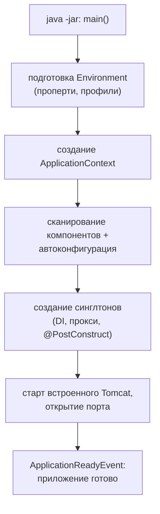

# Запуск и жизненный цикл приложения

Что происходит между `java -jar app.jar` и «приложение принимает запросы»,
где встроить свой код при старте и как приложение корректно останавливается.

## Что происходит при старте

`SpringApplication.run()` разворачивает приложение по шагам:



Порядок объясняет знакомые эффекты: ошибки конфигурации и несозданные бины
валят приложение **до** открытия порта — сломанный сервис не примет
ни одного запроса; а долгий старт — это обычно создание бинов
(миграции БД, прогревы, подключения к внешним системам).

## Куда встроить код при старте

Выполнить что-то после поднятия контекста — три штатных способа:

```java
// 1. CommandLineRunner / ApplicationRunner — бин, вызываемый после старта
@Component
public class DataSeeder implements CommandLineRunner {
    public void run(String... args) { ... }        // контекст уже готов
}

// 2. Слушатель события готовности
@EventListener(ApplicationReadyEvent.class)
public void onReady() { ... }                      // порт уже открыт

// 3. @PostConstruct — на уровне конкретного бина, при его создании
```

Разница важна: `@PostConstruct` выполняется **в процессе** создания бинов
(другие бины могут быть ещё не готовы), runner'ы — после сборки всего
контекста, `ApplicationReadyEvent` — когда приложение уже принимает трафик.
Тяжёлую работу (миграции, прогревы) лучше вешать на runner/событие,
а не на `@PostConstruct` случайного бина.

## События жизненного цикла

Spring публикует события по ходу старта (`ApplicationStartedEvent`,
`ApplicationReadyEvent`, `ApplicationFailedEvent`) — и это тот же механизм
`ApplicationEventPublisher`/`@EventListener`, что доступен приложению для
своих событий. Слушатели по умолчанию синхронные; `@Async` на слушателе
делает обработку фоновой.

## Graceful shutdown

Остановка важнее старта: при выкатке под нагрузкой нельзя ронять запросы,
которые уже выполняются.

- Сигнал остановки (SIGTERM от Kubernetes/Docker) запускает закрытие
  контекста.
- С `server.shutdown=graceful` Boot сначала **перестаёт принимать новые
  запросы**, дожидается завершения текущих (в пределах
  `spring.lifecycle.timeout-per-shutdown-phase`, по умолчанию 30 с),
  и только потом гасит контекст.
- Затем в обратном порядке зависимостей вызываются `@PreDestroy`-колбэки:
  закрываются пулы, коннекторы, executor'ы.

Связка с Kubernetes: оркестратор сначала убирает под из балансировки,
потом шлёт SIGTERM; graceful shutdown гарантирует, что уже принятые
запросы доживут до ответа. `kill -9` (SIGKILL) всего этого лишает —
поэтому таймауты graceful-периода должны быть согласованы с
`terminationGracePeriodSeconds`.

## Actuator: health и readiness

Стандартный способ сообщать о своём состоянии — Actuator:

- `/actuator/health` — агрегированное здоровье (БД доступна, диск не полон...);
- отдельные группы **liveness** («процесс жив, не перезапускай») и
  **readiness** («готов принимать трафик») — под соответствующие пробы
  Kubernetes. Разница принципиальна: неготовность временно выводит под
  из балансировки, а провал liveness — перезапускает контейнер.

## Как ответить на интервью

Коротко: старт — это Environment → контекст → сканирование
и автоконфигурация → создание синглтонов → открытие порта →
`ApplicationReadyEvent`; ошибки валят приложение до приёма трафика.
Код при старте — `CommandLineRunner` или слушатель `ApplicationReadyEvent`
(а `@PostConstruct` — только про инициализацию конкретного бина).
Остановка: `server.shutdown=graceful` — перестать принимать новые запросы,
дождаться текущих, вызвать `@PreDestroy`; согласуется с SIGTERM
и пробами Kubernetes, где liveness — «жив», readiness — «готов к трафику».
