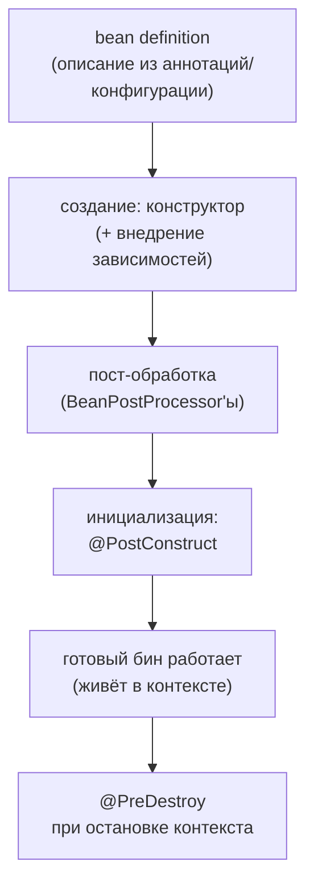

# Жизненный цикл бина

Бин проходит путь от описания до готового к работе объекта — и Spring даёт
точки, куда можно встроить свой код. Знать наизусть все стадии не нужно;
нужно понимать общую последовательность и три практических крючка.

## Путь бина



1. **Определение**: контейнер собирает bean definitions из сканирования
   и `@Bean`-методов.
2. **Создание**: вызывается конструктор, зависимости внедряются
   (конструкторные — прямо в нём, сеттерные/полевые — после).
3. **Пост-обработка**: по бину проходят `BeanPostProcessor`'ы — механизм,
   которым Spring реализует свою «магию». Именно здесь бин может быть
   **подменён прокси** — так работают `@Transactional`, `@Async`,
   `@Cacheable`, Security-аннотации.
4. **Инициализация**: вызываются init-колбэки (`@PostConstruct`).
5. **Работа**: бин живёт в контексте и обслуживает вызовы.
6. **Разрушение**: при остановке контекста — `@PreDestroy` (только
   у синглтонов: prototype-бины контейнер после создания не отслеживает).

## Практические крючки

**`@PostConstruct`** — метод вызывается после того, как все зависимости
внедрены. Сюда — инициализацию, которой нужны зависимости: прогрев кэша,
валидация конфигурации, регистрация в реестре.

```java
@Service
public class RatesCache {
    private final RatesClient client;
    private Map<String, BigDecimal> rates;

    public RatesCache(RatesClient client) { this.client = client; }

    @PostConstruct
    void warmUp() { rates = client.loadAll(); }   // зависимости уже на месте
}
```

Почему не в конструкторе? В конструкторе гарантированы только конструкторные
зависимости, объект ещё не прошёл пост-обработку (прокси ещё не навешаны),
а вызов переопределяемых методов из конструктора — ловушка и в чистой Java.

**`@PreDestroy`** — освобождение ресурсов при graceful shutdown: закрыть
соединения, дописать буферы, отписаться от внешних систем.

**`BeanPostProcessor`** — свой код для **каждого** бина контекста
(до/после инициализации). Прикладному коду нужен редко, но это ответ
на вопрос «как Spring навешивает прокси»: контейнер прогоняет каждый бин
через цепочку постпроцессоров, и один из них заменяет бин на прокси,
если видит `@Transactional` и подобные.

Альтернативы `@PostConstruct`/`@PreDestroy` — интерфейсы `InitializingBean`/
`DisposableBean` и атрибуты `initMethod`/`destroyMethod` у `@Bean` (для
библиотечных классов). Аннотации предпочтительны: не привязывают класс
к Spring API.

## Порядок и ленивость

- Порядок создания определяется **графом зависимостей**: зависимость всегда
  создаётся раньше зависящего. Управлять порядком вручную (`@DependsOn`)
  нужно редко — обычно это признак скрытой зависимости.
- Синглтоны создаются **энергично на старте** — поэтому ошибки конфигурации
  валят приложение при запуске, а не на первом запросе. Это фича:
  сломанное приложение не поднимется и не примет трафик.
- `@Lazy` откладывает создание до первого обращения — точечный инструмент
  (тяжёлый редко используемый бин, разрыв цикла), не дефолт.

## Как ответить на интервью

Коротко: бин проходит создание (конструктор + внедрение зависимостей),
пост-обработку `BeanPostProcessor`'ами — где Spring подменяет бин прокси для
`@Transactional` и подобных, — инициализацию `@PostConstruct`, работу
и `@PreDestroy` при остановке. `@PostConstruct` — для инициализации,
которой нужны зависимости; `@PreDestroy` — для освобождения ресурсов.
Синглтоны создаются энергично на старте (ошибки конфигурации видны сразу),
порядок диктует граф зависимостей, `@Lazy` — точечное исключение.
