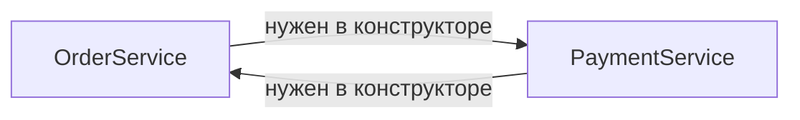

# Разрешение зависимостей

Когда контейнер видит в конструкторе параметр `OrderRepository`, он должен
найти **ровно один** подходящий бин. Здесь живут два классических сюжета
интервью: неоднозначность (несколько кандидатов) и циклические зависимости.

## Несколько бинов одного типа

Spring ищет кандидата **по типу**. Если бинов такого типа два —
на старте упадёт `NoUniqueBeanDefinitionException`:
контейнер не угадывает, а требует указания.

```java
public interface Notifier { ... }

@Component class EmailNotifier implements Notifier { ... }
@Component class SmsNotifier implements Notifier { ... }

// Внедрение Notifier — ошибка: two beans found
```

Способы разрешить неоднозначность:

- **`@Qualifier`** — указать, какой именно бин нужен:

```java
public OrderService(@Qualifier("emailNotifier") Notifier notifier) { ... }
```

- **`@Primary`** — пометить бин «кандидатом по умолчанию»; используется,
  когда без уточнений, `@Qualifier` его перебивает.
- **Имя параметра**: если имя параметра совпадает с именем бина
  (`Notifier emailNotifier`), Spring использует его как подсказку —
  работает, но хрупко, лучше явный `@Qualifier`.
- **Внедрить всех**: `List<Notifier>` или `Map<String, Notifier>`
  (имя бина → бин) — идиома «все реализации стратегии», очень частая
  в реальном коде: обработчики, валидаторы, конвертеры.

Необязательная зависимость: `ObjectProvider<T>` (`getIfAvailable()`) —
чище, чем `@Autowired(required = false)`.

## Циклические зависимости

`A` зависит от `B`, `B` — от `A`. Контейнер должен создать оба,
но каждый требует другого готовым:



**С конструкторным внедрением цикл неразрешим** — Spring падает на старте
с `BeanCurrentlyInCreationException` и понятной диаграммой цикла.
Исторически Spring умел разруливать циклы для сеттерного/полевого внедрения
(через раннюю ссылку на недостроенный бин), но со Spring Boot 2.6 циклы
**запрещены по умолчанию** — и это осознанное решение, а не ограничение.

Что делать — по нарастанию честности:

1. **Разорвать цикл дизайном** — правильный ответ. Цикл почти всегда значит,
   что классы поделены неверно: у `A` и `B` есть общая ответственность,
   которую нужно вынести в третий класс `C`, от которого зависят оба.
   Либо один из вызовов заменить на **событие**
   (`ApplicationEventPublisher`) — убрать прямую зависимость.
2. **`@Lazy` на одной из зависимостей** — внедрится прокси, реальный бин
   создастся при первом вызове; цикл технически разомкнут, но дизайн-проблема
   осталась.
3. Флаг `spring.main.allow-circular-references=true` — вернуть старое
   поведение; костыль для миграции легаси, не решение.

На интервью ценится именно первая часть: цикл — сигнал о дизайне,
а `@Lazy` — обезболивающее.

## Как ответить на интервью

Коротко: зависимости разрешаются по типу; два кандидата — ошибка старта
`NoUniqueBeanDefinitionException`, решается `@Qualifier` (явный выбор),
`@Primary` (дефолт) или внедрением всех реализаций `List`/`Map` — идиома
для стратегий. Циклические зависимости с конструкторным внедрением
неразрешимы — `BeanCurrentlyInCreationException` на старте (с Boot 2.6
циклы запрещены и для сеттеров). Правильное лечение — рефакторинг: вынести
общую часть в третий бин или заменить вызов событием; `@Lazy` — быстрый
обход, оставляющий кривой дизайн.
