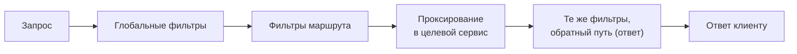

# Фильтры

Фильтры — рабочая логика шлюза: всё, что происходит с запросом между
приёмом и проксированием (и с ответом на обратном пути). Идея та же, что
у сервлетных фильтров, но исполнение реактивное.

## Модель: цепочка вокруг проксирования



- **Фильтры маршрута** — указаны в конкретном маршруте.
- **Глобальные фильтры** — применяются ко всем маршрутам (свои — бином
  `GlobalFilter`; встроенные глобальные делают само проксирование).
- Каждый фильтр может изменить запрос/ответ, пропустить дальше или
  **оборвать** цепочку, сразу ответив клиенту (так работают auth-фильтры
  и rate limiter).

## Готовые фильтры

Ходовой набор из коробки:

| Фильтр | Что делает |
|---|---|
| `StripPrefix=1` | срезать первый сегмент пути (`/api/x` → `/x`) |
| `PrefixPath`, `RewritePath` | добавить/переписать путь (regex) |
| `AddRequestHeader`, `AddResponseHeader` | добавить заголовок |
| `RemoveRequestHeader` | убрать (например, внутренние заголовки снаружи) |
| `Retry` | повторить неудачный запрос (метод/статусы/число попыток) |
| `CircuitBreaker` | предохранитель + fallback-ответ |
| `RequestRateLimiter` | ограничение частоты (обычно Redis token bucket) |
| `SetStatus`, `RedirectTo` | ответить статусом/редиректом |

Пример связки «надёжность на периметре»:

```yaml
filters:
  - name: Retry
    args: { retries: 2, methods: GET, statuses: BAD_GATEWAY }
  - name: CircuitBreaker
    args: { name: ordersCb, fallbackUri: forward:/fallback/orders }
  - name: RequestRateLimiter
    args:
      redis-rate-limiter.replenishRate: 100    # токенов в секунду
      redis-rate-limiter.burstCapacity: 200
```

Важные оговорки: `Retry` — только для идемпотентных запросов (повтор POST
может продублировать операцию); rate limiter требует ключа (по пользователю,
по IP — `KeyResolver`) и Redis для распределённого счёта.

## Свой фильтр

```java
@Component
public class AuthGatewayFilter implements GlobalFilter, Ordered {

    @Override
    public Mono<Void> filter(ServerWebExchange exchange, GatewayFilterChain chain) {
        String token = exchange.getRequest().getHeaders().getFirst(HttpHeaders.AUTHORIZATION);
        if (token == null) {
            exchange.getResponse().setStatusCode(HttpStatus.UNAUTHORIZED);
            return exchange.getResponse().setComplete();      // оборвать цепочку
        }
        ServerWebExchange mutated = exchange.mutate()
            .request(r -> r.header("X-User-Id", extractUserId(token)))
            .build();
        return chain.filter(mutated);                          // дальше по цепочке
    }

    @Override
    public int getOrder() { return -1; }                       // порядок в цепочке
}
```

Особенности реактивного API: вместо `HttpServletRequest` —
`ServerWebExchange` (иммутабельный: изменения — через `mutate()`),
вместо возврата из метода — `Mono<Void>`, и **никаких блокирующих вызовов
внутри** (об этом — в теме про реактивность).

Типовой паттерн периметра, который стоит описать на интервью: шлюз
валидирует JWT, кладёт данные пользователя во **внутренние заголовки**
(`X-User-Id`), а входящие снаружи такие же заголовки — срезает
(`RemoveRequestHeader`), чтобы их нельзя было подделать.

## Как ответить на интервью

Коротко: фильтры — цепочка обработки вокруг проксирования: маршрутные
и глобальные, каждый может изменить запрос/ответ или оборвать цепочку.
Из коробки — переписывание путей и заголовков, `Retry` (только
идемпотентные!), `CircuitBreaker` с fallback, `RequestRateLimiter` поверх
Redis. Свой фильтр — `GlobalFilter` с `ServerWebExchange` и `Mono`,
без блокирующих вызовов. Классический паттерн — аутентификация
на периметре: проверить JWT, пробросить identity внутренними заголовками,
срезав их от внешних клиентов.
