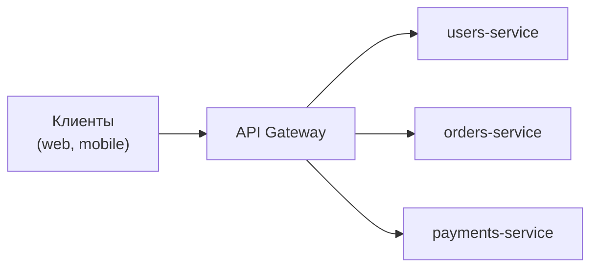

# Зачем нужен шлюз

API Gateway — сервис на входе в систему: единая точка, через которую
внешние клиенты ходят ко всем внутренним сервисам. Spring Cloud Gateway —
реализация этого паттерна в Spring-экосистеме.

## Проблема без шлюза

Микросервисов много; если фронтенд ходит в каждый напрямую:

- клиент должен знать **адреса всех сервисов** и следить за их переездами;
- **сквозные задачи дублируются**: аутентификация, CORS, rate limiting,
  логирование пришлось бы повторять в каждом сервисе;
- нельзя менять внутреннюю нарезку сервисов, не ломая клиентов;
- внешняя поверхность атаки — каждый сервис торчит наружу.

## Что даёт шлюз

Один входной адрес; шлюз **маршрутизирует** запросы по внутренним сервисам
и централизует сквозное:

- **Маршрутизация**: `/api/users/**` → users-service; внутренняя топология
  скрыта, сервисы можно перекраивать.
- **Безопасность на периметре**: проверка JWT в одном месте; внутренние
  сервисы не доступны снаружи вообще.
- **Сквозные политики**: rate limiting, CORS, таймауты, ретраи,
  circuit breaker — конфигурацией шлюза, а не кодом каждого сервиса.
- **Кросс-функциональность**: единые логи доступа, метрики, трейс-заголовки.
- Технические удобства: TLS-терминация, канареечные веса, модификация
  запросов/ответов.

Шлюз — это **reverse proxy с логикой уровня приложения**: от nginx его
отличает знание Spring-мира (интеграция с Security, discovery, конфигурацией)
и программируемость на Java.

## Что шлюзом быть не должно

Зрелая часть ответа — границы паттерна:

- **Без бизнес-логики.** Шлюз маршрутизирует и применяет политики;
  логика — в сервисах. Шлюз с логикой превращается в распределённый монолит
  и бутылочное горлышко команд.
- **Единая точка отказа**: шлюз обязан быть максимально простым, быстрым
  и горизонтально масштабированным — упал шлюз, упало всё.
- Не замена service mesh: межсервисный трафик (east-west) обычно ходит
  напрямую или через mesh; шлюз — про внешний (north-south).

## Spring Cloud Gateway конкретно

- Строится на **реактивном стеке** (WebFlux/Netty) — шлюз почти не считает,
  а в основном ждёт ответов сервисов, поэтому неблокирующая модель с малым
  числом потоков ему идеальна (подробнее — в теме про реактивность).
- Конфигурация маршрутов — yml или Java DSL; фильтры — готовые и свои.
- Альтернативы, которые полезно назвать: nginx/HAProxy (ниже уровнем,
  быстрее, без Java-логики), Kong, Envoy-based шлюзы, облачные API Gateway.

## Как ответить на интервью

Коротко: шлюз — единая входная точка перед микросервисами: маршрутизирует
запросы по сервисам, скрывая топологию, и централизует сквозные задачи —
аутентификацию на периметре, rate limiting, CORS, таймауты/ретраи, логи
и метрики. Иначе всё это дублировалось бы в каждом сервисе, а клиенты
знали бы все адреса. Границы паттерна: без бизнес-логики, максимально
простой и масштабированный (единая точка отказа). Spring Cloud Gateway —
реактивная (WebFlux/Netty) реализация с маршрутами в конфигурации
и фильтрами.
