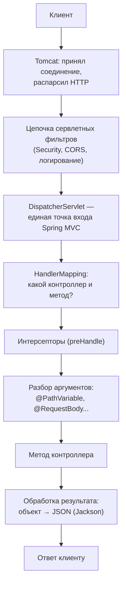

# Путь запроса

«Что происходит с HTTP-запросом от порта до твоего метода контроллера» —
один из любимых вопросов на интервью по Spring. Здесь — вся цепочка.

## Общая картина

## По шагам

1. **Tomcat** (встроенный контейнер сервлетов) принимает соединение,
   парсит байты в HTTP-запрос и передаёт его в сервлетный конвейер. Поток
   из пула Tomcat несёт запрос через всю цепочку — «thread per request».
2. **Сервлетные фильтры** — стандарт Servlet API, работают **до** Spring MVC:
   вся цепочка Spring Security — это фильтры, здесь же CORS, сжатие,
   логирование. Фильтр может завершить запрос, не пустив его дальше
   (401 от Security).
3. **`DispatcherServlet`** — сердце Spring MVC: единственный сервлет,
   на который замаплены все запросы (`/*`). Это паттерн Front Controller:
   одна точка входа, дальше — маршрутизация внутри Spring.
4. **HandlerMapping** находит обработчик: по пути, HTTP-методу, заголовкам
   выбирается метод контроллера (`GET /orders/{id}` →
   `OrderController.get`). Маппинги построены на старте из аннотаций
   `@RequestMapping`/`@GetMapping`.
5. **Интерсепторы** (`preHandle`) — спринговый аналог фильтров, но уже
   со знанием, какой метод будет вызван.
6. **Разбор аргументов**: для каждого параметра метода свой resolver —
   `@PathVariable` из пути, `@RequestParam` из query, `@RequestBody` —
   тело через Jackson, и т.д.
7. **Вызов метода контроллера** — наконец твой код.
8. **Обработка результата**: для `@RestController` возвращённый объект
   сериализуется в JSON (`HttpMessageConverter`/Jackson) и уезжает в ответ.
   Исключения по пути ловятся и превращаются в HTTP-ошибки
   (`@ExceptionHandler`/`@ControllerAdvice`).

## Что здесь спрашивают

**«Чем фильтр отличается от интерсептора?»** Фильтр — Servlet API,
работает до `DispatcherServlet`, видит только запрос/ответ; интерсептор —
Spring MVC, работает после маршрутизации и знает, какой контроллер будет
вызван. Security живёт в фильтрах — поэтому запрос может быть отклонён
раньше, чем Spring MVC вообще его увидит.

**«Где тут многопоточность?»** Каждый запрос обрабатывает отдельный поток
из пула Tomcat (по умолчанию 200). Контроллеры и сервисы — синглтоны,
которые одновременно выполняются многими потоками — отсюда требование
stateless. Пока метод ждёт БД, поток заблокирован — это то место, которое
чинят виртуальные потоки (`spring.threads.virtual.enabled=true`).

**«Что такое DispatcherServlet?»** Front Controller: один сервлет принимает
всё и делегирует. Именно он связывает мир Servlet API с миром аннотаций
Spring MVC.

## Как ответить на интервью

Коротко: Tomcat парсит HTTP и гонит запрос через сервлетные фильтры
(там живёт Security) к `DispatcherServlet` — единой точке входа Spring MVC.
Тот через HandlerMapping находит метод контроллера по пути и HTTP-методу,
пропускает запрос через интерсепторы, resolver'ы собирают аргументы
(`@PathVariable`, `@RequestBody` через Jackson), вызывается метод,
результат сериализуется обратно в JSON, исключения превращаются в
HTTP-ответы. Всё это выполняет один поток из пула Tomcat на запрос —
поэтому бины stateless, а блокирующие ожидания чинят виртуальными потоками.
