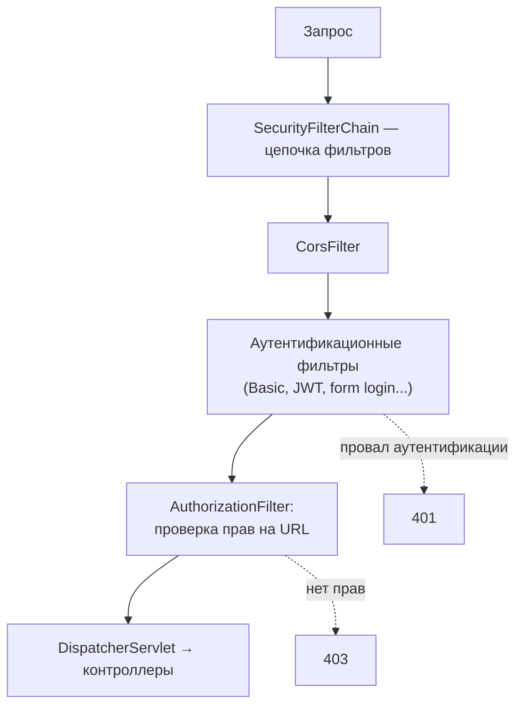

# Как устроен Spring Security

Spring Security — это **цепочка сервлетных фильтров** перед приложением.
Понимание этой простой вещи объясняет всё остальное: где происходит
аутентификация, почему запрос может не дойти до контроллера, откуда берётся
«текущий пользователь» и почему проблемы Security часто выглядят как
проблемы порядка фильтров.

## Общая картина



Все запросы проходят через `SecurityFilterChain` — упорядоченный набор
фильтров, каждый со своей ролью: CORS, защита от CSRF, аутентификация
разными способами, работа с сессией, авторизация. Запрос, не прошедший
проверку, отклоняется **до** Spring MVC — поэтому `@ControllerAdvice`
ошибок Security не ловит (у них свои обработчики —
`AuthenticationEntryPoint` для 401 и `AccessDeniedHandler` для 403).

## Ключевые объекты

- **`Authentication`** — объект «кто это»: principal (имя/пользователь),
  credentials, коллекция **authorities** (права/роли). До аутентификации —
  запрос на вход, после — подтверждённая личность.
- **`SecurityContext`** / **`SecurityContextHolder`** — хранилище текущего
  `Authentication`, привязанное к потоку (ThreadLocal). Любой код может
  спросить `SecurityContextHolder.getContext().getAuthentication()` —
  так работают `@AuthenticationPrincipal` в контроллерах и `@PreAuthorize`.
- **`AuthenticationManager`** — «проверь эти учётные данные»: делегирует
  провайдерам (`DaoAuthenticationProvider` — по паролю из БД, JWT-декодер...).
- **`UserDetailsService`** — «загрузи пользователя по имени»: единственный
  интерфейс, который обычно реализуют руками — достать пользователя из
  своей БД.

Механика одинакова для любого способа входа: фильтр извлекает из запроса
учётные данные → `AuthenticationManager` их проверяет → готовый
`Authentication` кладётся в `SecurityContext` → дальше по цепочке запрос
идёт «аутентифицированным».

## Конфигурация

Современный стиль — бин `SecurityFilterChain` (старый `WebSecurityConfigurerAdapter` удалён):

```java
@Bean
SecurityFilterChain security(HttpSecurity http) throws Exception {
    return http
        .csrf(csrf -> csrf.disable())                    // для stateless API
        .sessionManagement(s -> s.sessionCreationPolicy(STATELESS))
        .authorizeHttpRequests(auth -> auth
            .requestMatchers("/api/public/**").permitAll()
            .requestMatchers("/api/admin/**").hasRole("ADMIN")
            .anyRequest().authenticated())
        .oauth2ResourceServer(o -> o.jwt(withDefaults())) // JWT-аутентификация
        .build();
}
```

Порядок `requestMatchers` важен: правила проверяются сверху вниз,
первое совпавшее побеждает — специфичные пути объявляются раньше общих.

## Почему «добавил стартер — всё закрылось»

`spring-boot-starter-security` в classpath включает автоконфигурацию
с дефолтом «безопасно из коробки»: **все** эндпоинты требуют
аутентификации, включается form login и Basic со сгенерированным паролем
в логах. Это осознанный принцип secure by default: открытость настраивается
явно, а не наоборот.

## Как ответить на интервью

Коротко: Spring Security — цепочка сервлетных фильтров до Spring MVC:
фильтры аутентификации извлекают учётные данные и через
`AuthenticationManager` (+ `UserDetailsService` для загрузки пользователя)
превращают их в `Authentication`, который кладётся в `SecurityContextHolder`
(ThreadLocal); дальше `AuthorizationFilter` проверяет права на URL.
Не прошёл — 401/403 ещё до контроллеров, поэтому и обработчики ошибок
у Security свои. Конфигурация — бин `SecurityFilterChain` с правилами
по путям (порядок правил важен); дефолт стартера — всё закрыто.
