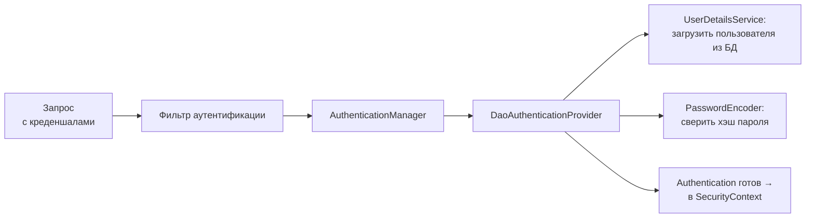

# Аутентификация

Аутентификация отвечает на вопрос «**кто ты?**» — проверка личности.
Не путать с авторизацией («что тебе можно?») — это следующий шаг.
Здесь — как Spring Security проверяет личность и где что настраивается.

## Путь аутентификации по паролю

Классический сценарий — логин и пароль против своей БД:



Что реализуется руками — обычно только `UserDetailsService`:

```java
@Service
public class DbUserDetailsService implements UserDetailsService {
    public UserDetails loadUserByUsername(String username) {
        AppUser user = userRepository.findByUsername(username)
            .orElseThrow(() -> new UsernameNotFoundException(username));
        return User.withUsername(user.getUsername())
            .password(user.getPasswordHash())
            .roles(user.getRole())
            .build();
    }
}
```

Остальное собирает Spring: `DaoAuthenticationProvider` загрузит пользователя,
сверит пароль через `PasswordEncoder` и построит `Authentication`.

## Пароли: только хэши

`PasswordEncoder` обязателен — пароли **никогда** не хранятся открытым
текстом. Стандарт — **BCrypt**: медленный адаптивный хэш со встроенной
солью; медленность — фича (перебор дорог), соль защищает от радужных
таблиц, одинаковые пароли дают разные хэши. `BCryptPasswordEncoder` —
дефолтный выбор; сверка — `encoder.matches(raw, hash)`.

## Способы аутентификации запросов

Проверка личности происходит **на каждом запросе** — вопрос лишь в том,
что предъявляется:

- **Сессия** (form login): личность проверена один раз при входе, дальше
  предъявляется кука `JSESSIONID`, а `Authentication` восстанавливается
  из сессии на сервере.
- **HTTP Basic**: логин-пароль в заголовке каждого запроса; годится для
  внутренних/служебных API поверх TLS.
- **Bearer-токен (JWT)**: токен в `Authorization: Bearer ...`; фильтр
  ресурс-сервера валидирует подпись и строит `Authentication` из claims —
  без состояния на сервере. Стандарт для API (разобран в теме про токены).
- **OAuth2/OIDC** — вход через внешнего провайдера (отдельная тема).

В одном приложении может быть **несколько `SecurityFilterChain`** под
разные части API (`securityMatcher("/api/**")` — JWT, остальное — форма) —
цепочка выбирается по первому совпавшему матчеру.

## Текущий пользователь в коде

После аутентификации личность доступна везде:

```java
@GetMapping("/me")
public ProfileDto me(@AuthenticationPrincipal Jwt jwt) {   // или UserDetails
    return profileService.byUserId(jwt.getSubject());
}
```

Плюс `Authentication` как параметр метода или
`SecurityContextHolder.getContext().getAuthentication()` в любом слое.
Помнить про ThreadLocal-природу: в другом потоке (`@Async`)
контекст по умолчанию пуст.

## События входа

Провал аутентификации — `AuthenticationException` → 401 через
`AuthenticationEntryPoint`. Успех/провал публикуются как события
(`AuthenticationSuccessEvent`...) — удобная точка для аудита
и блокировки перебора (плюс rate limiting на эндпоинте логина).

## Как ответить на интервью

Коротко: аутентификация — «кто ты»; в Spring Security её выполняет
фильтр + `AuthenticationManager`: для паролей `DaoAuthenticationProvider`
загружает пользователя через твой `UserDetailsService` и сверяет хэш через
`PasswordEncoder` (BCrypt — медленный, с солью; открытых паролей не бывает).
Результат — `Authentication` в `SecurityContextHolder`, доступный через
`@AuthenticationPrincipal`. Способы предъявления личности: сессия с кукой,
Basic, Bearer/JWT для stateless API; под разные части API — разные
`SecurityFilterChain`.
