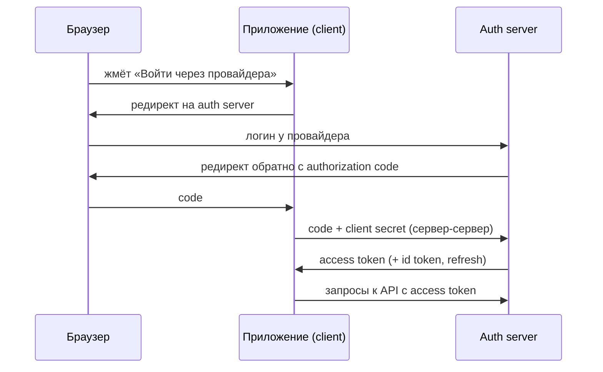

# OAuth2 и внешние провайдеры

OAuth2 — протокол **делегирования доступа**: как приложению получить
доступ к ресурсам пользователя (или подтверждение его личности) у внешнего
провайдера, не узнавая его пароль. «Войти через Google/GitHub» — это оно.

## Роли в протоколе

- **Resource owner** — пользователь.
- **Client** — твоё приложение, которому нужен доступ.
- **Authorization server** — сервер авторизации: аутентифицирует
  пользователя и выдаёт токены (Google, Keycloak, корпоративный SSO).
- **Resource server** — API, принимающее токены (твой бэкенд из темы
  про JWT — именно эта роль).

## Authorization Code Flow — основной сценарий

Ключевая идея двухшаговости: пароль пользователь вводит **только
у провайдера**; через браузер летает одноразовый **code**, а обмен code
на токены происходит **сервер-сервер** с client secret — токен не светится
в браузерной истории. Для SPA и мобильных клиентов без секрета
обязателен **PKCE** — динамический секрет на один обмен.

Прочие флоу — кратко: **Client Credentials** — сервис-сервис без
пользователя (машинные интеграции); implicit и password — устаревшие,
знать что «не использовать».

## OIDC: аутентификация поверх OAuth2

Чистый OAuth2 — про **доступ** («можно читать календарь»), не про личность.
**OpenID Connect** — слой поверх: добавляет **id token** (JWT с данными
пользователя: `sub`, email, имя) и стандартный `/userinfo`. «Вход через...» —
это OIDC. Разница OAuth2/OIDC — популярный уточняющий вопрос: OAuth2 —
авторизация доступа, OIDC — аутентификация личности поверх него.

## В Spring: две разные роли — две конфигурации

Spring Security покрывает обе стороны, и их важно не путать:

- **`oauth2Login()`** (+ `spring-boot-starter-oauth2-client`) — приложение
  как **client**: «войти через провайдера». Конфигурация — registration
  провайдера (client-id, secret, scopes); Spring сам ведёт весь флоу,
  результат — залогиненный пользователь в сессии.
- **`oauth2ResourceServer()`** — приложение как **resource server**:
  принимать Bearer-токены, выданные auth server'ом. Конфигурация —
  `issuer-uri`, откуда тянутся ключи проверки подписи.

Типовая микросервисная схема: отдельный auth server (Keycloak или
корпоративный SSO) выдаёт токены; фронт получает их через authorization
code + PKCE; все бэкенды — resource server'ы, проверяющие JWT локально.

## Как ответить на интервью

Коротко: OAuth2 — делегирование доступа без передачи пароля: роли —
пользователь, client (приложение), authorization server (выдаёт токены),
resource server (API, принимающее их). Основной флоу — authorization code:
логин у провайдера → одноразовый code через браузер → обмен на токены
сервер-сервер (для SPA — PKCE). OIDC — слой аутентификации поверх OAuth2
с id token; «вход через Google» — это OIDC. В Spring две роли — две
конфигурации: `oauth2Login()` для входа через провайдера,
`oauth2ResourceServer()` для приёма JWT.
