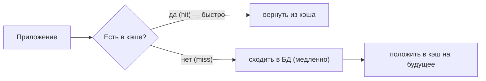

# Стратегии кэширования, плюсы и минусы

**Кэш** — быстрое промежуточное хранилище (обычно в памяти, например Redis), куда
кладут часто запрашиваемые данные, чтобы не дёргать каждый раз медленный источник
(БД, внешний сервис). Разберём, зачем это нужно, какие есть стратегии и чем за это
платят.

## Зачем вообще кэшировать

Идея простая: обращение к БД — это диск, сеть, вычисления. Обращение к кэшу в
памяти — на порядки быстрее. Если данные читают часто, а меняются редко — держим их
в кэше и отдаём оттуда.



- **Cache hit** — данные нашлись в кэше (быстро).
- **Cache miss** — в кэше нет, идём в источник.

## Стратегии кэширования

Различаются тем, **кто и когда** кладёт данные в кэш и как обновляет.

### Cache-Aside (ленивое кэширование) — самая частая

Приложение само управляет кэшем:

1. читаем — сначала смотрим в кэш;
2. если нет (miss) — читаем из БД, **кладём в кэш**, возвращаем;
3. при изменении данных — **удаляем** (инвалидируем) запись из кэша.

```java
User get(Long id) {
    User u = cache.get(id);
    if (u == null) {              // miss
        u = db.findById(id);
        cache.put(id, u);         // положили на будущее
    }
    return u;
}
```

- **Плюс:** в кэш попадает только то, что реально запрашивают.
- **Минус:** первый запрос всегда медленный (miss); риск устаревших данных, если
  забыли инвалидировать.

### Read-Through

Похоже на cache-aside, но походом в БД при miss заведует **сам кэш** (через
библиотеку), а не приложение. Приложение всегда обращается только к кэшу, а он сам
подгружает из БД. Меньше кода в приложении.

### Write-Through (сквозная запись)

При записи данные пишутся **сразу и в кэш, и в БД** (синхронно).

- **Плюс:** кэш всегда актуален, не устаревает.
- **Минус:** запись медленнее (пишем в два места).

### Write-Behind / Write-Back (отложенная запись)

При записи пишем **в кэш сразу**, а в БД — **позже**, пачкой, асинхронно.

- **Плюс:** очень быстрая запись.
- **Минус:** риск **потерять данные**, если кэш упадёт до того, как сбросил их в БД.
  Сложнее. Применяют осторожно.

## Устаревание данных: TTL и вытеснение

- **TTL (time to live)** — запись живёт в кэше ограниченное время, потом удаляется.
  Простой способ не держать устаревшие данные вечно.
- **Вытеснение (eviction)** — когда кэш заполнен, старые записи вытесняются. Частая
  политика — **LRU** (удаляем то, к чему дольше всего не обращались).

## Плюсы и минусы кэширования в принципе

**Плюсы:**

- **Скорость** — чтение из памяти вместо БД, ответы быстрее.
- **Меньше нагрузка на БД** — часть запросов не доходит до неё, БД выдерживает больше.
- **Масштабируемость** — дешевле обслуживать пики нагрузки.

**Минусы (и о них важно сказать на собесе):**

- **Устаревшие данные (stale)** — кэш может отдавать старое значение после изменения в
  БД. Согласованность становится «итоговой».
- **Инвалидация — это сложно.** Знаменитая шутка: «в программировании две сложные
  вещи — инвалидация кэша и придумывание имён». Легко забыть сбросить кэш и отдавать
  неверные данные.
- **Лишняя сложность** — ещё один компонент, который может упасть, который надо
  мониторить и настраивать.
- **Расход памяти** — кэш стоит денег и места.
- **Специфические проблемы** — cache stampede (лавина запросов при истечении),
  холодный старт. Подробнее — [проблемы кэширования](../../data/redis/caching-problems.md)
  в основном конспекте.

**Вывод:** кэш — не «включить везде», а осознанный компромисс. Он хорош там, где
читают часто, меняют редко, и **короткое устаревание допустимо** (каталог, профиль,
справочники). Где нужна строгая свежесть (баланс счёта) — кэшируют осторожно или не
кэшируют.

## Что запомнить

- Кэш — быстрое хранилище в памяти для часто читаемых данных; hit — нашли, miss —
  идём в источник.
- Стратегии: **cache-aside** (приложение само, самая частая), read-through,
  **write-through** (пишем сразу в оба, всегда свежо, но медленнее), write-behind
  (в БД отложенно, быстро, но риск потери).
- Свежесть держат через **TTL** и вытеснение (**LRU**).
- Плюсы: скорость, разгрузка БД. Минусы: устаревшие данные, **сложная инвалидация**,
  лишняя сложность и память.
