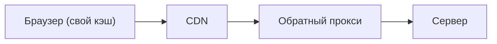
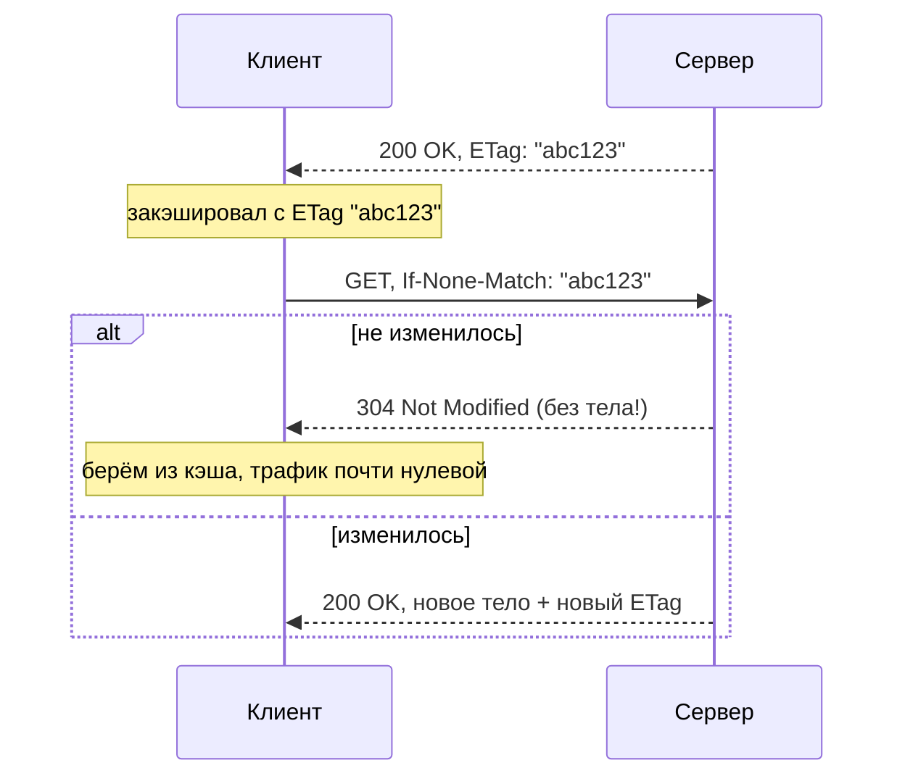

# Кэширование в REST (HTTP)

В REST кэширование встроено в сам HTTP: сервер через **заголовки ответа** говорит,
можно ли кэшировать ответ и насколько. Это позволяет не гонять один и тот же запрос к
серверу повторно — ответ берётся из кэша браузера, CDN или прокси. Разберём механику.

## Где живут HTTP-кэши

Ответ может кэшироваться на нескольких уровнях между клиентом и сервером:



Если ответ есть в кэше на любом из уровней — он вернётся оттуда, не доходя до
сервера. Меньше нагрузки и быстрее отклик.

## Что кэшируется

Кэшируют в основном **`GET`** (и `HEAD`) — безопасные методы, которые только читают.
`POST`/`PUT`/`DELETE` меняют данные, их не кэшируют. Это прямое следствие
[идемпотентности и безопасности методов](../rest/http-idempotency.md).

## Заголовок `Cache-Control` — главный

Сервер в ответе указывает правила кэширования:

```
Cache-Control: max-age=3600        # можно кэшировать 3600 секунд
Cache-Control: no-store            # не кэшировать вообще (чувствительные данные)
Cache-Control: no-cache            # кэшировать, но перед выдачей проверять на сервере
Cache-Control: private             # только браузер, не общие кэши (CDN/прокси)
Cache-Control: public              # можно кэшировать где угодно
```

- **`max-age`** — сколько секунд ответ считается «свежим»; пока не истёк — берётся из
  кэша без обращения к серверу.
- **`no-store`** — совсем не хранить (для приватных данных).
- **`private` / `public`** — можно ли кэшировать в общих кэшах или только в браузере.

## Валидация: `ETag` и `Last-Modified`

Когда `max-age` истёк, не обязательно качать данные заново — можно **спросить у
сервера, не изменились ли они**. Для этого есть два механизма.

**`ETag`** — сервер отдаёт «отпечаток» версии ресурса:



Клиент при повторном запросе шлёт `If-None-Match: "abc123"`. Если ресурс не менялся,
сервер отвечает **`304 Not Modified` без тела** — экономится трафик, клиент берёт из
кэша. Если менялся — присылает новое тело.

**`Last-Modified`** — то же самое, но по дате изменения: сервер шлёт `Last-Modified`,
клиент потом — `If-Modified-Since`, в ответ либо `304`, либо новое тело.

## Как это в Spring

Spring умеет проставлять эти заголовки:

```java
return ResponseEntity.ok()
        .cacheControl(CacheControl.maxAge(1, TimeUnit.HOURS))
        .eTag("abc123")
        .body(data);
```

## Что запомнить

- В REST кэширование задаётся **заголовками HTTP**; кэшируют в основном `GET`.
- **`Cache-Control`** — главный заголовок: `max-age` (сколько свежо), `no-store` (не
  хранить), `private`/`public` (где можно).
- Когда срок истёк — **валидация** через **`ETag`** (`If-None-Match`) или
  `Last-Modified` (`If-Modified-Since`): если не изменилось — **`304 Not Modified`**
  без тела.
- Кэши живут в браузере, CDN, обратном прокси — ответ может не дойти до сервера.
