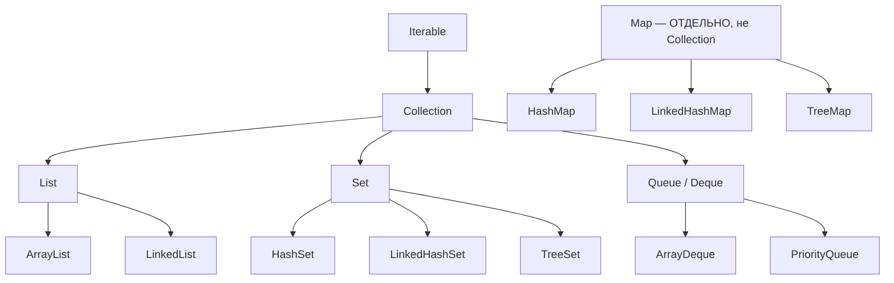
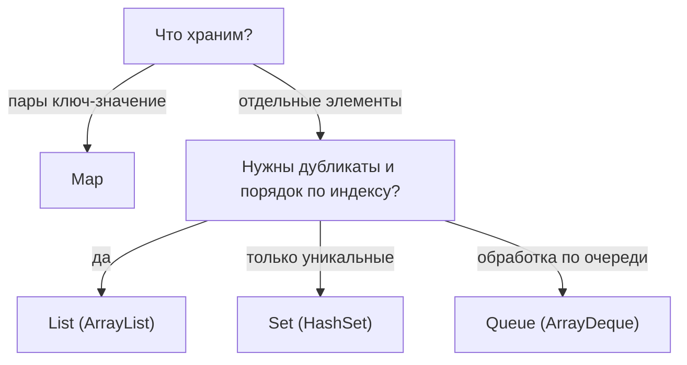

# Иерархия коллекций Java

Java Collections Framework — это набор интерфейсов и их реализаций для хранения групп
объектов. Все они выстроены в иерархию, и понимание её структуры помогает выбрать
нужную коллекцию и уверенно отвечать на вопросы. Главное, что надо усвоить: **`Map`
стоит особняком** и не является `Collection`.

## Две отдельные ветки

Фреймворк делится на **две независимые вершины**:

- **`Iterable` → `Collection`** — коллекции отдельных элементов (списки, множества,
  очереди).
- **`Map`** — пары «ключ → значение», это **отдельная** ветка, не наследует
  `Collection`.

## `Collection` и её три вида

`Collection` — общий интерфейс для групп элементов. От него идут три главных вида:

### `List` — упорядоченный список с индексами

Элементы идут **по порядку**, есть доступ по индексу, **дубликаты разрешены**.

- **`ArrayList`** — на основе массива; быстрый доступ по индексу, самый частый выбор.
- **`LinkedList`** — связный список; быстрая вставка/удаление в начале, но медленный
  доступ по индексу.

### `Set` — множество без дубликатов

**Уникальные** элементы, дубликаты не хранятся.

- **`HashSet`** — без порядка, самый быстрый (на основе `HashMap`).
- **`LinkedHashSet`** — хранит порядок вставки.
- **`TreeSet`** — хранит элементы отсортированными (на основе дерева).

### `Queue` / `Deque` — очередь

Элементы для обработки **в определённом порядке** (обычно FIFO — «первый пришёл,
первый вышел»).

- **`ArrayDeque`** — двусторонняя очередь, эффективная реализация стека и очереди.
- **`PriorityQueue`** — очередь с приоритетом (первым выходит наименьший/наибольший).

## `Map` — отдельная ветка

`Map` хранит **пары «ключ → значение»**, ключи уникальны. Это **не** `Collection` —
у неё свои методы (`put`, `get`), а не `add`. Частая ошибка на собесе — сказать, что
`Map` наследует `Collection`; это не так.

- **`HashMap`** — без порядка, быстрый (см. [как устроен `HashMap`](hashmap-internals.md)).
- **`LinkedHashMap`** — хранит порядок вставки.
- **`TreeMap`** — ключи отсортированы.

(Подробное сравнение — в вопросе [`HashMap` vs `TreeMap` vs
`LinkedHashMap`](map-implementations.md).)

## Как быстро выбрать

## Что запомнить

- Две ветки: **`Iterable` → `Collection`** (элементы) и **`Map`** (пары ключ-значение,
  **отдельно**, не `Collection`).
- `Collection` → **`List`** (порядок + индексы + дубли), **`Set`** (уникальные),
  **`Queue`/`Deque`** (очередь).
- Типовые реализации: `ArrayList`/`LinkedList`, `HashSet`/`LinkedHashSet`/`TreeSet`,
  `ArrayDeque`/`PriorityQueue`, `HashMap`/`LinkedHashMap`/`TreeMap`.
- Частая ловушка: **`Map` не наследует `Collection`**.
