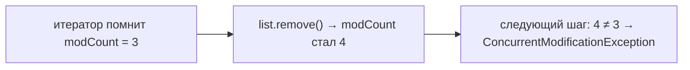

# Fail-fast и `ConcurrentModificationException`

Это про ситуацию, когда мы **перебираем коллекцию и одновременно её меняем**.
Обычные коллекции (`ArrayList`, `HashMap` и т.д.) такое не прощают — они сразу
бросают `ConcurrentModificationException`. Поведение «заметил проблему — сразу
упал» называется **fail-fast** («падать быстро»).

## Где это происходит

Классический пример — удаление внутри цикла `for-each`:

```java
List<String> list = new ArrayList<>(List.of("a", "b", "c"));
for (String s : list) {
    if (s.equals("b")) {
        list.remove(s);   // ConcurrentModificationException!
    }
}
```

`for-each` под капотом использует **итератор**. Итератор запоминает, сколько раз
коллекцию меняли (счётчик `modCount`). Когда мы вызываем `list.remove()` напрямую,
счётчик меняется «мимо» итератора. На следующем шаге итератор видит расхождение и
бросает исключение — он больше не уверен, что перебор корректен.



Важно: слово «Concurrent» в названии сбивает с толку. Это **не только** про потоки.
Ошибка возникает даже в **одном** потоке, если менять коллекцию во время перебора.
В нескольких потоках она тоже может выскочить — если один поток перебирает, а
другой меняет.

## Как делать правильно

**Вариант 1 — удалять через сам итератор.** У итератора есть свой `remove()`, он
меняет коллекцию «изнутри» и обновляет счётчик:

```java
Iterator<String> it = list.iterator();
while (it.hasNext()) {
    if (it.next().equals("b")) {
        it.remove();   // ок, безопасно
    }
}
```

**Вариант 2 — `removeIf`** (короче и понятнее):

```java
list.removeIf(s -> s.equals("b"));
```

**Вариант 3 — собрать в новый список**, а не менять исходный во время обхода.

## Что запомнить

- **fail-fast** — коллекция бросает `ConcurrentModificationException`, если её
  изменили во время перебора итератором.
- Это защита от незаметных багов, а не потокобезопасность.
- Не меняй коллекцию в `for-each`. Используй `iterator.remove()` или `removeIf`.
- У потокобезопасных коллекций (`CopyOnWriteArrayList`, `ConcurrentHashMap`) итератор
  **fail-safe** — он не падает, но может не увидеть последних изменений.
