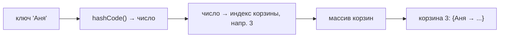
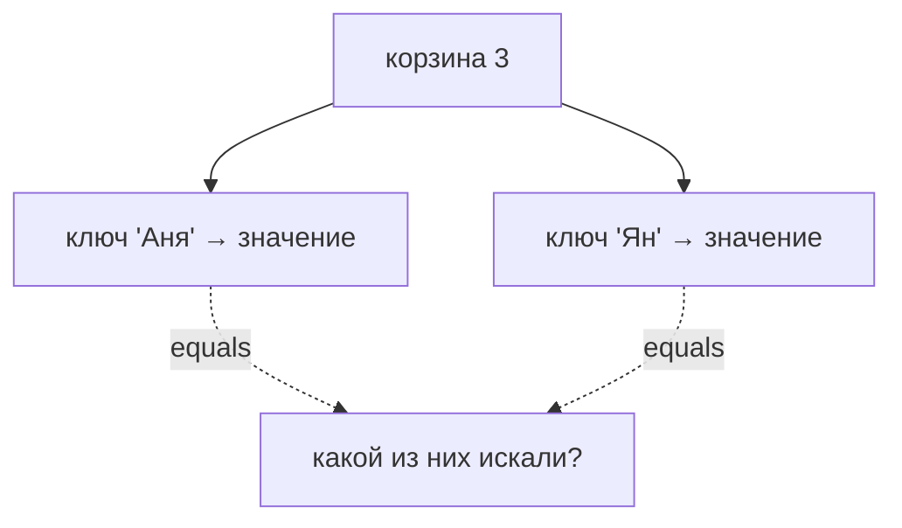

# Как устроен `HashMap` изнутри

`HashMap` хранит пары «ключ → значение» и умеет очень быстро находить значение по
ключу — почти мгновенно, не перебирая всё подряд. Разберём в общих чертах, за счёт
чего это работает.

## Идея: массив корзин

Внутри `HashMap` — обычный **массив**. Каждая ячейка массива называется
**корзиной** (bucket). Когда мы кладём пару `put(key, value)`, `HashMap` решает,
в какую корзину её положить, вот так:

1. Берёт `key.hashCode()` — число-отпечаток ключа.
2. Превращает это число в **индекс корзины** (грубо — остаток от деления на размер
   массива).
3. Кладёт пару в эту корзину.

Поиск `get(key)` идёт так же: посчитали хэш → нашли корзину → внутри неё нашли
нужный ключ. Мы сразу прыгаем в нужную ячейку массива, а не идём по всем
элементам — поэтому быстро.

## Коллизии: когда в одну корзину попадает несколько ключей

Корзин ограниченное число, а ключей может быть много — поэтому разные ключи
иногда попадают в **одну** корзину. Это называется **коллизия**. Тогда в корзине
лежит не один элемент, а несколько — списком.

Чтобы понять, какой из них нужен, `HashMap` сравнивает ключи внутри корзины через
`equals()`. Отсюда правило из вопроса про [`equals` и
`hashCode`](../java-core/equals-hashcode.md): хэш выбирает корзину, `equals`
находит элемент внутри.

Если в одной корзине скопилось слишком много элементов (по умолчанию 8), список
внутри превращается в **сбалансированное дерево** — так поиск внутри перегруженной
корзины остаётся быстрым, а не превращается в перебор длинного списка.

## Расширение (resize)

Когда карта заполняется примерно на **75%** от размера массива (это называется
*load factor*), она **увеличивает массив вдвое** и заново раскладывает все
элементы по новым корзинам. Это нужно, чтобы корзины не переполнялись и поиск
оставался быстрым. Расширение — операция дорогая, поэтому если заранее знаешь
примерный размер, лучше задать его в конструкторе `new HashMap<>(1000)`.

## Что важно запомнить

- Внутри — массив корзин; корзину выбирает `hashCode()` ключа.
- Одинаковый хэш → одна корзина → там несколько элементов сравниваются по `equals`.
- При заполнении на ~75% массив расширяется вдвое (resize).
- В среднем `get`/`put` работают за **O(1)** — почти мгновенно; в худшем случае
  (много коллизий) хуже, но дерево внутри корзины это смягчает.
- `HashMap` **не потокобезопасен** и **не хранит порядок** элементов.
