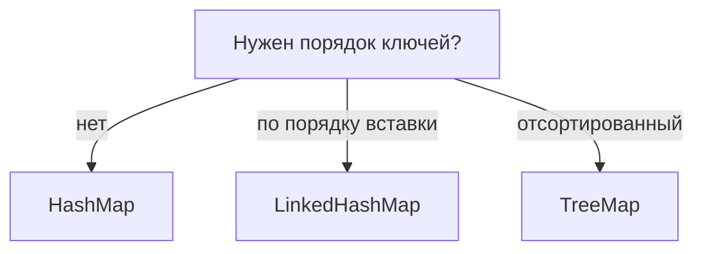

# `HashMap` vs `TreeMap` vs `LinkedHashMap`

Все три — это `Map`, то есть хранилища пар «ключ → значение» с одинаковым набором
методов (`put`, `get`, `remove`). Разница — в **порядке** элементов и в **скорости**.
Выбор между ними — частый вопрос на собесе.

## Коротко о каждом

- **`HashMap`** — самый быстрый, но **порядок элементов не гарантирован**.
  Внутри массив корзин (см. [как устроен `HashMap`](hashmap-internals.md)).
  Операции в среднем за O(1).
- **`LinkedHashMap`** — то же, что `HashMap`, плюс помнит **порядок вставки**.
  При обходе элементы идут в том порядке, в котором их клали. Чуть больше памяти
  (хранит связи между элементами), скорость почти как у `HashMap`.
- **`TreeMap`** — хранит ключи **отсортированными** (по natural order или по
  переданному `Comparator`). За сортировку платим скоростью: операции за O(log n).
  Внутри — сбалансированное дерево, а не массив корзин.

## Таблица сравнения

| | `HashMap` | `LinkedHashMap` | `TreeMap` |
|---|---|---|---|
| Порядок | никакого | порядок вставки | отсортированный |
| Скорость `get`/`put` | O(1) | O(1) | O(log n) |
| `null` как ключ | можно | можно | нельзя |
| Когда брать | по умолчанию | нужен порядок вставки | нужны отсортированные ключи |

## Когда что выбирать

- **`HashMap`** — выбор по умолчанию, когда порядок не важен. 90% случаев.
- **`LinkedHashMap`** — когда важно сохранить порядок, в котором добавляли (например,
  чтобы вывести в том же порядке). Ещё на нём легко сделать LRU-кэш.
- **`TreeMap`** — когда нужны ключи **по порядку**: перебрать по возрастанию, найти
  «ближайший больший/меньший», взять диапазон ключей.

!!! tip "Простое правило"
    По умолчанию бери `HashMap`. Нужен порядок добавления — `LinkedHashMap`.
    Нужна сортировка ключей — `TreeMap`.
