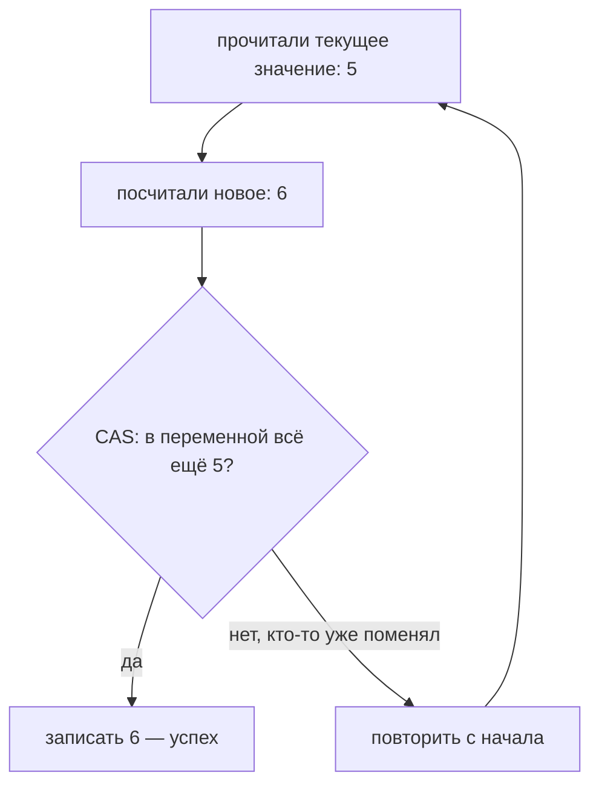

# Атомарные классы и CAS

Атомарные классы (`AtomicInteger`, `AtomicLong`, `AtomicReference`) позволяют
безопасно менять переменную из нескольких потоков **без блокировок** — и это
быстро. В их основе лежит механизм **CAS**. Разберём, как это работает.

## Зачем они нужны

Вспомним проблему из [гонок](threads-basics.md): `counter++` — это три действия
(прочитать, прибавить, записать), и два потока могут затереть увеличение друг
друга. Обычное решение — `synchronized`, но блокировка означает, что потоки стоят в
очереди. Для простого счётчика это дороговато.

`AtomicInteger` решает ту же задачу без замка:

```java
AtomicInteger counter = new AtomicInteger(0);

counter.incrementAndGet();   // атомарно: +1 и вернуть результат, без гонки
```

Никакого `synchronized`, но два потока не затрут друг друга.

## Что такое CAS (Compare-And-Swap)

CAS — «сравни и поменяй» — это специальная **инструкция процессора**, которая одним
неделимым действием делает:

> «Если в переменной **сейчас** лежит ожидаемое значение — запиши новое. Если нет —
> ничего не делай и скажи, что не получилось.»

То есть CAS = «поменяй значение, но только если его никто не трогал с тех пор, как я
прочитал». Атомарность гарантирует сам процессор.



## Как на CAS строится `incrementAndGet`

Внутри `incrementAndGet` — цикл «прочитал → посчитал → попробовал записать через
CAS»:

1. прочитать текущее значение (например, 5);
2. посчитать новое (6);
3. CAS: «если там всё ещё 5 — запиши 6». Успех — выходим;
4. если кто-то успел поменять значение — CAS не сработал, **повторяем с шага 1**.

Такой подход называют **оптимистичным**: мы не блокируем никого заранее, а
действуем и проверяем в конце, что нам не помешали. Если помешали — просто
пробуем снова.

## Плюсы, минусы и когда брать

- **Плюс:** быстрее блокировок, потоки не стоят в очереди.
- **Минус:** годится для **одной** переменной. Если нужно согласованно менять
  несколько полей вместе — нужна блокировка.
- **Минус:** при **очень** высокой конкуренции CAS может часто «промахиваться» и
  крутить повторы вхолостую.

Брать атомарные классы стоит для **счётчиков, флагов, накопителей** — там, где
меняется одно значение. Для сложной логики с несколькими переменными —
[`synchronized`/`Lock`](synchronization.md).

## Что запомнить

- Атомарные классы меняют переменную без блокировок.
- В основе — **CAS**: «поменяй, только если значение не изменилось с момента чтения»,
  иначе повтор.
- Это оптимистичный подход: быстро, но подходит для одной переменной.
