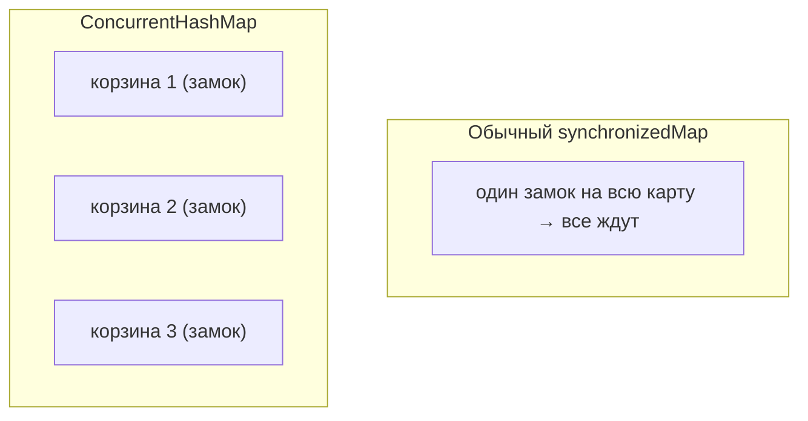

# Как устроен `ConcurrentHashMap`

`ConcurrentHashMap` — это `HashMap`, которым можно **безопасно пользоваться из
нескольких потоков** одновременно. Главный вопрос: как он делает это быстро, не
блокируя всю карту на каждый чих. Разберём идею.

## Проблема обычного `HashMap`

Обычный `HashMap` **не потокобезопасен**: если два потока одновременно пишут, можно
испортить внутреннюю структуру (в старых версиях доходило даже до зацикливания при
resize). Значит, из нескольких потоков его менять нельзя.

Старое решение — `Collections.synchronizedMap()` или `Hashtable` — оборачивает
**всю** карту в один замок. Но тогда потоки толкаются в одну дверь: пока один
пишет, все остальные (даже читатели) стоят. Медленно.

## Идея `ConcurrentHashMap`: блокировать не всю карту, а кусочек

`ConcurrentHashMap` не берёт один общий замок на всю карту. Вместо этого он
блокирует только **ту корзину** (bucket), в которую сейчас идёт запись. Потоки,
пишущие в **разные** корзины, друг другу не мешают и работают параллельно.



Дополнительно:

- **Чтение (`get`) обычно вообще без блокировок** — читать можно параллельно с кем
  угодно. Это возможно за счёт `volatile`-полей: читатель всегда видит актуальные
  данные.
- Блокируется только запись и только на маленький участок.
- `null` в качестве ключа или значения **запрещён** (в отличие от `HashMap`) — чтобы
  не путать «нет ключа» и «значение null» при конкурентном доступе.

## Атомарные операции

У `ConcurrentHashMap` есть методы, которые делают «проверить и вставить» одним
неделимым действием — это удобно и безопасно в многопоточке:

```java
map.putIfAbsent(key, value);              // вставить, только если ключа ещё нет
map.computeIfAbsent(key, k -> load(k));   // посчитать и вставить, если нет
map.merge(key, 1, Integer::sum);          // атомарно увеличить счётчик
```

Без них пришлось бы писать `if (!map.containsKey) map.put(...)` — а между `if` и
`put` мог влезть другой поток. Атомарные методы эту гонку исключают.

## Что запомнить

- `ConcurrentHashMap` — потокобезопасная замена `HashMap`.
- Не блокирует всю карту: запись блокирует только **отдельную корзину**, чтение
  обычно **без блокировок** — отсюда высокая скорость под нагрузкой.
- `null`-ключи и `null`-значения запрещены.
- Для «проверить и вставить» используй `putIfAbsent` / `computeIfAbsent` / `merge`.
