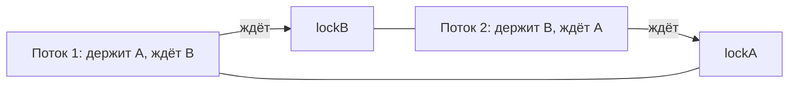

# Deadlock (взаимная блокировка)

**Deadlock** — ситуация, когда два (или больше) потока навсегда застряли, потому
что каждый ждёт то, что держит другой. Оба стоят, программа висит. Разберём, как
это получается и как не допустить.

## Как возникает

Классический сценарий: два потока берут **два замка, но в разном порядке**.

```java
// Поток 1
synchronized (lockA) {
    synchronized (lockB) { ... }   // ждёт lockB
}

// Поток 2
synchronized (lockB) {
    synchronized (lockA) { ... }   // ждёт lockA
}
```

Если поток 1 успел взять `lockA`, а поток 2 — `lockB`, то:

- поток 1 держит `lockA` и ждёт `lockB` (а его держит поток 2);
- поток 2 держит `lockB` и ждёт `lockA` (а его держит поток 1).

Никто не отпустит свой замок, пока не получит второй — и оба стоят вечно.



Житейская аналогия: два человека за столом, каждому нужны обе вилки, но один взял
левую, другой правую — и оба ждут вторую.

## Как избежать

**1. Брать замки всегда в одном порядке.** Если оба потока берут сначала `lockA`,
потом `lockB` — deadlock невозможен. Это самый частый и надёжный приём.

```java
// оба потока: сначала A, потом B
synchronized (lockA) {
    synchronized (lockB) { ... }
}
```

**2. Брать замок с таймаутом** через `ReentrantLock.tryLock(timeout)` — если не
удалось взять за отведённое время, отпустить всё и попробовать снова, а не висеть.

**3. Держать замок как можно короче** и по возможности **не брать два замка сразу**.

**4. Использовать более высокоуровневые средства** (`ConcurrentHashMap`, атомарные
классы, очереди) — они часто позволяют вообще обойтись без ручных замков.

## Что запомнить

- Deadlock — потоки навсегда ждут замки друг друга.
- Главная причина — **разный порядок** взятия нескольких замков.
- Главное лекарство — **единый порядок** взятия замков + короткие блокировки.
- `tryLock` с таймаутом позволяет не зависнуть насмерть.
