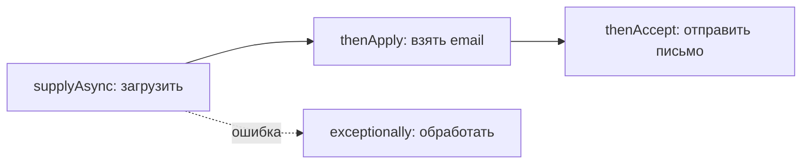

# `ExecutorService`, пулы потоков и `CompletableFuture`

Создавать по потоку на каждую задачу — дорого и опасно (потоки — тяжёлый ресурс).
Вместо этого используют **пул потоков**: заранее готовую бригаду потоков, которая
разбирает задачи из очереди. Управляет этим `ExecutorService`. А
`CompletableFuture` позволяет удобно **выстраивать цепочки** асинхронных операций.

## Зачем пул потоков

Проблема ручного `new Thread()` на каждую задачу:

- создание потока — дорогая операция (память, ресурсы ОС);
- если задач тысячи, создастся тысяча потоков → система захлебнётся.

Пул решает это: создаём, скажем, 10 потоков **один раз**, и они по очереди
разбирают задачи из очереди. Поток отработал задачу — берёт следующую, а не
умирает.


## `ExecutorService`

Это и есть управляющий пулом. Создают через `Executors`:

```java
ExecutorService pool = Executors.newFixedThreadPool(10);

pool.submit(() -> System.out.println("задача"));   // отдать задачу
Future<Integer> f = pool.submit(() -> 42);          // с результатом

pool.shutdown();   // корректно завершить, когда всё сделано
```

Основные виды пулов:

- **`newFixedThreadPool(n)`** — ровно n потоков. Самый частый выбор.
- **`newCachedThreadPool()`** — создаёт потоки по мере надобности, переиспользует
  свободные. Хорош для множества коротких задач.
- **`newSingleThreadExecutor()`** — один поток, задачи идут строго по очереди.

!!! tip "В Spring это `@Async`"
    В Spring-приложениях пул обычно настраивают через `TaskExecutor`, а задачи
    помечают `@Async` — Spring сам отдаёт их в пул.

## `CompletableFuture` — цепочки операций

Обычный `Future` неудобен: `get()` блокирует поток. `CompletableFuture` позволяет
описать «сделай A, потом с результатом сделай B» **без блокировки** — код сам
выполнится, когда данные будут готовы.

```java
CompletableFuture
    .supplyAsync(() -> loadUser(id))        // 1. загрузить пользователя
    .thenApply(user -> user.getEmail())     // 2. взять email из результата
    .thenAccept(email -> sendMail(email));  // 3. отправить письмо
```

Полезные методы:

- `supplyAsync(...)` — запустить задачу с результатом в пуле.
- `thenApply(...)` — преобразовать результат, когда он будет готов.
- `thenCompose(...)` — соединить с **другой** асинхронной операцией.
- `thenCombine(...)` — дождаться **двух** задач и объединить их результаты.
- `exceptionally(...)` — обработать ошибку в цепочке.



Главная идея: `CompletableFuture` описывает **что делать с результатом, когда он
появится**, вместо того чтобы стоять и ждать через `get()`. Так несколько операций
складываются в удобную неблокирующую цепочку.

## Что запомнить

- Не создавай потоки вручную на каждую задачу — используй **пул**.
- `ExecutorService` + `Executors.newFixedThreadPool(n)` — стандартный способ.
- `CompletableFuture` — для цепочек и комбинаций асинхронных задач без блокирующего
  `get()`.
