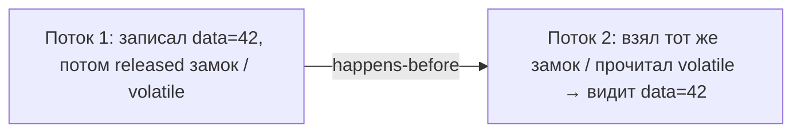

# Happens-before и Java Memory Model на пальцах

Это про **видимость** изменений между потоками — вторую большую проблему
многопоточки (первая — [гонки](threads-basics.md)). Java Memory Model (JMM) — набор
правил, которые говорят, **когда один поток гарантированно увидит то, что записал
другой**. Ключевое правило называется **happens-before**.

## В чём проблема

Ради скорости поток может держать **свою копию** переменной в кэше процессора и не
спешить показывать изменения другим. Плюс компилятор и процессор имеют право
**переставлять** инструкции местами, если для одного потока это незаметно. В итоге:

```java
boolean ready = false;
int data = 0;

// Поток 1
data = 42;
ready = true;

// Поток 2
if (ready) {
    System.out.println(data);   // может напечатать 0, а не 42!
}
```

Казалось бы, если `ready == true`, то `data` уже 42. Но без специальных гарантий
поток 2 может увидеть `ready == true`, а `data` — ещё старое `0`. Потому что нет
правила, обязывающего показать изменения именно в этом порядке.

## Что такое happens-before

**happens-before** — это гарантия: «если действие A *happens-before* действие B, то
всё, что сделал A, **видно** в B, и порядок соблюдён». Проще говоря, это правило,
которое соединяет два потока и заставляет один увидеть результаты другого.



## Откуда берётся happens-before

Не нужно помнить весь список — достаточно знать главные случаи, которые создают эту
гарантию:

- **`synchronized`** — то, что поток сделал до выхода из `synchronized`-блока, видно
  другому потоку, когда он войдёт в блок по **тому же** замку.
- **`volatile`** — запись в `volatile`-переменную видна всем, кто потом её прочитает;
  причём видно и всё, что было записано **до** неё.
- **`Thread.start()`** — поток видит всё, что было сделано до его запуска.
- **`Thread.join()`** — после `join()` видно всё, что успел сделать завершившийся
  поток.
- Атомарные классы и большинство средств из `java.util.concurrent`.

То есть happens-before возникает не сам по себе, а когда ты используешь **средства
синхронизации**. Починим пример выше через `volatile`:

```java
volatile boolean ready = false;   // теперь запись ready видна вместе с data
```

Запись в `volatile ready = true` гарантирует, что поток 2, увидев `ready == true`,
увидит и `data == 42`.

## Что запомнить

- JMM отвечает на вопрос «когда изменения одного потока видны другому».
- Без синхронизации таких гарантий **нет**: можно увидеть устаревшее значение или
  переставленный порядок.
- **happens-before** — правило «A видно в B». Его создают `synchronized`, `volatile`,
  `start`/`join`, атомики и `java.util.concurrent`.
- Практический вывод: делишь данные между потоками — используй эти средства, не
  надейся на «оно и так увидит».
