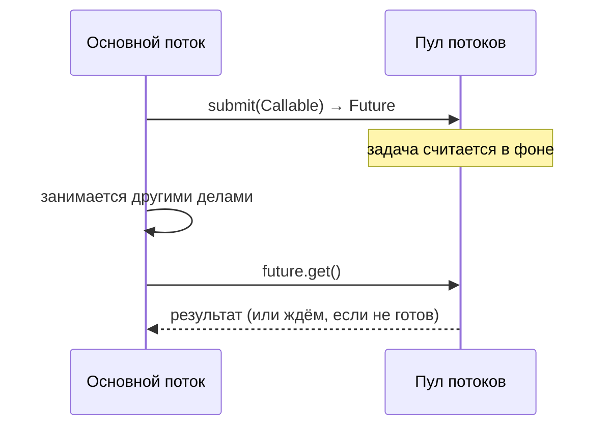

# `Runnable` vs `Callable`; что такое `Future`

Это три связанных понятия про «задачу, которую выполнит поток». `Runnable` и
`Callable` — это **сама задача**, а `Future` — **ручка к результату**, который
появится позже. Разберём по порядку.

## `Runnable` — задача без результата

`Runnable` — задача, которая что-то делает, но **ничего не возвращает** и не умеет
бросать проверяемые исключения.

```java
Runnable task = () -> System.out.println("что-то сделал");
```

Внутри один метод `run()`. Подходит, когда результат не нужен (записать в лог,
отправить письмо).

## `Callable` — задача с результатом

`Callable` — почти то же, но **возвращает значение** и может бросить проверяемое
исключение.

```java
Callable<Integer> task = () -> {
    // посчитали что-то тяжёлое
    return 42;
};
```

Внутри метод `call()`, который возвращает результат. Подходит, когда задача должна
что-то **вернуть**.

| | `Runnable` | `Callable<V>` |
|---|---|---|
| Метод | `run()` | `call()` |
| Возвращает | ничего | значение типа `V` |
| Может бросать checked-исключение | нет | да |

## `Future` — обещание результата

Когда мы отдаём `Callable` на выполнение, результат появится **не сразу** — задача
ещё считается. `Future` — это «расписка»: объект, через который можно **позже**
забрать результат.

```java
ExecutorService pool = Executors.newFixedThreadPool(2);

Future<Integer> future = pool.submit(() -> 42);   // задача пошла считаться

// ... тем временем можно заниматься другим ...

Integer result = future.get();   // здесь ждём и забираем результат
```

Что умеет `Future`:

- `get()` — получить результат; если ещё не готов — **подождать**.
- `get(timeout)` — подождать ограниченное время.
- `isDone()` — готово ли уже.
- `cancel()` — попытаться отменить задачу.



Минус классического `Future` — `get()` **блокирует**: поток стоит и ждёт. Более
удобный вариант, где можно навешивать «что сделать, когда будет готово», — это
[`CompletableFuture`](executor-completablefuture.md).

## Что запомнить

- `Runnable` — задача без результата (`run()`).
- `Callable` — задача с результатом и правом бросить исключение (`call()`).
- `Future` — ссылка на результат, который появится позже; `get()` его забирает и при
  необходимости ждёт.
