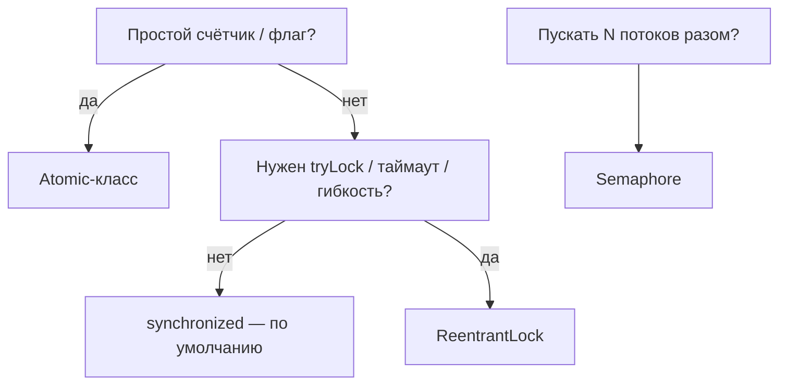

# Механизмы синхронизации: `synchronized`, `Lock`, `Semaphore`, атомарные

Когда несколько потоков лезут к общим данным, нужно навести порядок, чтобы не было
[гонок](threads-basics.md). Для этого в Java есть несколько инструментов — от
простого `synchronized` до атомарных классов. Разберём, что когда брать.

## `synchronized` — базовая блокировка

Самый простой способ. Гарантирует, что **в блок кода в один момент войдёт только
один поток**. Остальные ждут, пока он выйдет.

```java
private final Object lock = new Object();
private int counter = 0;

public void increment() {
    synchronized (lock) {   // сюда пройдёт только один поток за раз
        counter++;
    }
}
```

Под капотом каждый объект имеет **монитор** (замок). `synchronized` берёт этот
замок на входе и отпускает на выходе — в том числе если вылетело исключение.
Можно вешать на метод (`public synchronized void ...`) или на блок.

Плюсы: просто, надёжно. Минусы: негибко — нельзя «попробовать взять замок и уйти,
если занят», нельзя ждать с таймаутом.

## `Lock` / `ReentrantLock` — гибкая блокировка

То же самое, но с возможностями, которых нет у `synchronized`:

```java
private final Lock lock = new ReentrantLock();

public void increment() {
    lock.lock();
    try {
        counter++;
    } finally {
        lock.unlock();   // ОБЯЗАТЕЛЬНО в finally, иначе замок не отпустится
    }
}
```

Что даёт сверх `synchronized`:

- `tryLock()` — попробовать взять замок и, если занят, не ждать.
- `tryLock(timeout)` — подождать ограниченное время.
- возможность прервать ожидание.

Минус: `unlock()` надо не забыть вызвать вручную в `finally`. `synchronized` этого
не требует.

## `Semaphore` — пропустить не одного, а N

`Semaphore` — как турникет с ограниченным числом «пропусков». Он разрешает войти
**не более чем N потокам** одновременно. Нужен, когда ресурс можно делить, но
ограниченно — например, «не больше 5 одновременных обращений к внешнему API».

```java
private final Semaphore semaphore = new Semaphore(5);   // максимум 5 разом

public void callApi() throws InterruptedException {
    semaphore.acquire();   // взять пропуск (если все заняты — ждать)
    try {
        // не больше 5 потоков здесь одновременно
    } finally {
        semaphore.release();   // вернуть пропуск
    }
}
```

(«Mutex», о котором иногда спрашивают, — это по сути `Semaphore` на одного или тот
же `Lock`: замок, который держит ровно один поток.)

## Атомарные классы — без блокировок

Для простых операций со счётчиками/флагами блокировка избыточна. `AtomicInteger`,
`AtomicLong`, `AtomicReference` делают операции **атомарно** и без замков — за счёт
специальной инструкции процессора (см. [атомарные классы и CAS](atomics-cas.md)).

```java
private final AtomicInteger counter = new AtomicInteger();

public void increment() {
    counter.incrementAndGet();   // атомарно, без synchronized
}
```

Быстрее блокировок, но подходят только для **одной** переменной, а не для «группы
действий, которые должны идти вместе».

## Что когда брать



- **`synchronized`** — по умолчанию, когда просто «пусть будет один поток за раз».
- **`ReentrantLock`** — когда нужна гибкость (`tryLock`, таймаут).
- **`Semaphore`** — когда можно пускать несколько, но ограниченно.
- **Atomic** — для одиночных счётчиков и флагов, максимально быстро.
