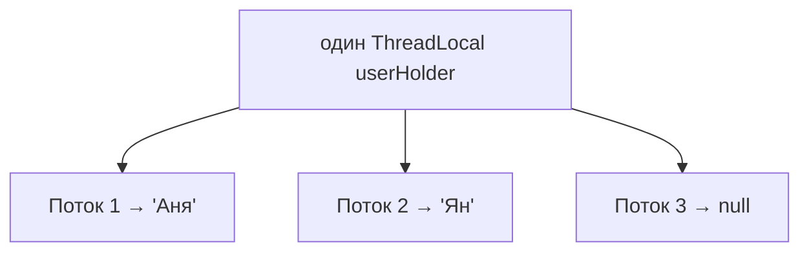

# `ThreadLocal`: своя переменная у каждого потока

`ThreadLocal` — это переменная, у которой **у каждого потока своя отдельная копия**.
Потоки не видят значения друг друга, хотя обращаются к одному и тому же объекту
`ThreadLocal`. Это способ хранить данные «на время работы потока», не передавая их
через параметры.

## Как это работает

Обычная переменная — общая для всех потоков. `ThreadLocal` — наоборот: каждый поток
кладёт и читает **своё** значение.

```java
ThreadLocal<String> userHolder = new ThreadLocal<>();

userHolder.set("Аня");           // этот поток запомнил "Аня"
String user = userHolder.get();  // этот поток получит "Аня"
                                 // другой поток тут увидит своё (или null)
```



Технически значения хранятся **внутри самого объекта потока** — поэтому они и
изолированы.

## Зачем это нужно и где в Spring

`ThreadLocal` удобен, когда какие-то данные относятся ко **всей обработке текущего
запроса**, и таскать их параметром через все методы неудобно. В вебе один HTTP-запрос
обычно обрабатывается одним потоком, поэтому «данные текущего потока» = «данные
текущего запроса».

Spring активно использует `ThreadLocal` внутри:

- **`SecurityContextHolder`** — кто сейчас залогинен (текущий пользователь) хранится
  в `ThreadLocal`, поэтому из любого места кода можно узнать, кто делает запрос.
- **Транзакции** — Spring держит текущее соединение/транзакцию в `ThreadLocal`, чтобы
  весь код внутри `@Transactional` работал с одной и той же транзакцией.
- **`RequestContextHolder`** — доступ к текущему запросу.

## Главная опасность: пулы потоков

Тут кроется частая ошибка. В вебе потоки **переиспользуются** из пула: обработал
поток один запрос — вернулся в пул и возьмёт следующий. Если положить что-то в
`ThreadLocal` и **не убрать**, то следующий запрос, попавший на тот же поток,
**увидит чужие данные**.


Поэтому правило: после использования **обязательно чистить** `ThreadLocal`, обычно
в `finally`:

```java
try {
    userHolder.set(currentUser);
    // ... обработка ...
} finally {
    userHolder.remove();   // убрать за собой, иначе утечёт в следующий запрос
}
```

Незачищенный `ThreadLocal` в пуле — это ещё и потенциальная **утечка памяти**:
значение держится, пока живёт поток пула (а он живёт долго).

## Что запомнить

- `ThreadLocal` — своя копия переменной у каждого потока.
- Удобен для «данных текущего запроса»; Spring хранит так текущего пользователя и
  транзакцию.
- В пулах потоков **обязательно** вызывай `remove()` в `finally` — иначе чужие
  данные и утечки памяти.
