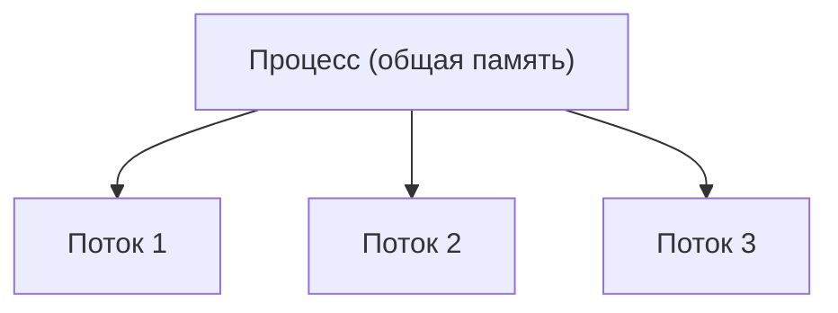
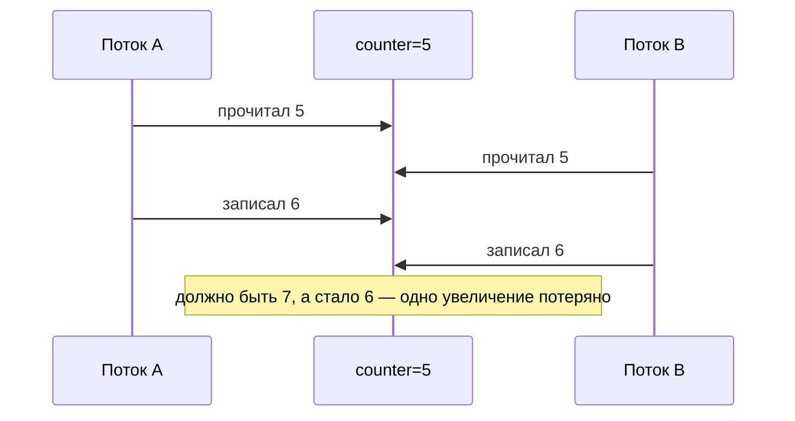

# Многопоточность: процессы, потоки, race condition, visibility

Многопоточность — это когда программа делает несколько дел **одновременно**.
Разберём базовые понятия: чем поток отличается от процесса, какие у потока
состояния и какие две главные проблемы возникают, когда потоки лезут к общим
данным.

## Процесс и поток

- **Процесс** — это запущенная программа со **своей** отдельной памятью. Два
  процесса не видят память друг друга.
- **Поток** — это отдельная «нить выполнения» **внутри** процесса. Потоков в одном
  процессе может быть много, и они **делят общую память** процесса.

Именно из-за общей памяти потоки такие полезные (легко обмениваться данными) и
одновременно опасные (два потока могут испортить одни и те же данные).



## Как создать поток

```java
// Способ 1: передать Runnable (предпочтительно)
Thread t = new Thread(() -> System.out.println("работаю в потоке"));
t.start();   // запустить; start(), а не run()!

// Способ 2: унаследоваться от Thread (реже)
```

Важно: запускают поток через `start()`, а не `run()`. `run()` просто выполнит код в
**текущем** потоке, а `start()` заведёт **новый**.

## Состояния потока

Поток за жизнь проходит несколько состояний:

- **NEW** — создан, но ещё не запущен.
- **RUNNABLE** — выполняется или готов выполняться.
- **BLOCKED / WAITING** — ждёт (блокировку, другой поток, сигнал).
- **TIMED_WAITING** — ждёт с таймаутом (`sleep`, `wait(timeout)`).
- **TERMINATED** — завершился.

## Проблема 1: race condition (гонка)

**Race condition** — когда результат зависит от того, **в каком порядке** потоки
успели поработать с общими данными. Классика — счётчик:

```java
int counter = 0;

// два потока делают это одновременно 1000 раз:
counter++;   // на самом деле три действия: прочитать, +1, записать
```

`counter++` выглядит как одно действие, но внутри их три: прочитать, прибавить,
записать. Два потока могут **прочитать одно и то же** старое значение, оба
прибавить и записать — и одно увеличение потеряется.



Лечится синхронизацией — чтобы «прочитать-прибавить-записать» шло целиком, без
вмешательства (см. [механизмы синхронизации](synchronization.md)).

## Проблема 2: visibility (видимость)

Второй, менее очевидный враг. Ради скорости каждый поток может держать **свою
копию** переменной (в кэше процессора). Тогда один поток поменял значение, а
другой этого **не видит** — читает старое.

```java
boolean running = true;   // один поток ставит false, но другой может не заметить

while (running) { ... }   // может крутиться вечно, видя старое true
```

То есть проблема не только «кто первый записал», но и «а увидит ли другой поток
изменение вообще». Решают это `volatile`, синхронизация и правило
[happens-before](happens-before.md).

## Что запомнить

- Процесс — своя память; поток — нить внутри процесса, память общая.
- Общая память = удобно, но опасно.
- **Race condition** — результат зависит от порядка потоков (пример: `counter++`).
- **Visibility** — изменение одного потока может быть не видно другому.
- Обе проблемы решаются синхронизацией и `volatile`.
